# Krukraft — Active Phase Tracker

Use this file as the single source of truth for active implementation state.

 ## Plan Snapshot

Parent Plan: `Figma DS alignment`

> [!info] Current Phase
> `Shared-library mapping kickoff`

> [!success] Completed
> The previous DS-first migration baseline is complete and now acts as the frozen implementation starting point
> The reference-driven DS alignment plan using Primer + Atlassian + Radix Themes is complete and now acts as the foundation-contract baseline
> The DS visual foundation pass is complete and now acts as the frozen visual baseline for route work
> The discover `/resources` visual pilot is complete and now acts as the latest public-route baseline
> Dashboard-v2 stabilization remains frozen
> Public marketplace perf baseline remains intact

> [!warning] Active
> The canonical Figma source file is now locked, the first repo-side doc drift pass is closed, `Button` / `Input` / `SearchInput` foundation component sets are now normalized to the locked size contract, `Card` and `Surface` are landed as the current shared-library shell proof points, `Dropdown` now has verified light/dark foundation study boards, and the supporting `state/selected-*` semantic trio is now present in the canonical file; the `Badge vs Chip` contract decision is now locked too, so the next mandatory step is continuing shared-library coverage with `Badge` first, then reopening composed shared chrome on top of the landed shell family

> [!todo] Next Up
> Reopen shared-library coverage in impact order: `Badge`, `FormSection` / `DataPanelTable`, then the optional `Dropdown` component-set promotion decision

> [!abstract] Partial
> The previous theme refresh, route rollout audits, legacy DS cleanup, marketplace search-shell audit, and hero-search cleanup plan are complete; this new plan is a documentation/alignment pass that should not silently reopen runtime route work.

## Status Board

| Track            | Status   | Note                                                                                     |
| ---------------- | -------- | ---------------------------------------------------------------------------------------- |
| Reference Audit  | Kept     | Primer, Atlassian, and Radix Themes stay as the locked reference stack for the new visual pass |
| DS Baseline      | Frozen   | the previous DS-first migration baseline is complete and should be reused, not repeated |
| Foundation Align | Kept     | the completed reference-driven plan already locked token/component/chrome boundaries |
| Visual Foundation | Frozen   | completed visual baseline stays in force; do not reopen primitive work implicitly |
| Discover         | Frozen   | `/resources` listing-mode shell + fail-soft states landed and passed close-out audit    |
| Theme Refresh    | Complete | brief, playbook, Figma review page, approved surface baseline, cleanup slice, and first runtime slices all passed close-out audit |
| Figma DS Alignment | Active | canonical Figma source, repo registry, and DS inventory need to be realigned before claiming Figma parity |
| Route Rollout Audit | Complete | the first proof route (`dashboard navigation + library`) passed runtime verification and the optional rollout audit closed cleanly |
| Legacy DS Cleanup | Complete | `secondary -> quiet`, outline inventory, and search-shell decision closed cleanly |
| Admin / Settings Rollout Audit | Complete | `/dashboard/settings`, `/admin/users`, `/admin/settings`, and `admin/resources` passed runtime proof |
| Marketplace Search Shell Audit | Complete | `/resources`, resource detail, category, and support shells passed; preview shells remain intentional dev-only exceptions |
| Marketplace Hero Search Audit | Complete | discover mode proved `HeroSurface` is live while `HeroSearch variant="hero"` has no runtime mount |
| Marketplace Hero Search Deprecation Cleanup | Complete | hero-only search branch, preview file, bones captures, and story references were removed while live discover/listing/navbar search proofs stayed intact |
| Dashboard-v2     | Frozen   | stable enough to pause; continue only after another explicit reprioritization change     |
| Public perf base | Kept     | existing `/resources` perf and streaming baseline stays in force during DS migration work |

## Progress

Figma DS alignment
`[█████████░] 89%`

```mermaid
flowchart TB
  subgraph Frozen
    D1[DS baseline + reference alignment<br/>Frozen]
    D2[DS visual foundation baseline<br/>Frozen]
  end

  subgraph Baseline
    T0[Theme refresh plan<br/>Complete]
  end

  subgraph Previous
    R1[Route inventory and rollout order<br/>Done]
    R2[First route proof audit<br/>Done]
    R3[Dashboard avatar menu remediation<br/>Done]
    R4[Route rollout decision<br/>Done]
  end

  subgraph Previous2
    L1[Legacy DS inventory<br/>Done]
    L2[Secondary to quiet normalization<br/>Done]
    L3[Outline inventory<br/>Done]
    L4[Search shell review<br/>Done]
    L5[Cleanup decision<br/>Done]
  end

  subgraph Previous3
    A1[Admin/settings route inventory<br/>Done]
    A2[First proof-route audit<br/>Done]
    A3[Rollout decision<br/>Done]
  end

  subgraph Previous4
    M1[Marketplace search route inventory<br/>Done]
    M2[Marketplace search proof audit<br/>Done]
    M3[Marketplace search rollout decision<br/>Done]
  end

  subgraph Previous5
    H1[Hero route inventory<br/>Done]
    H2[Discover-mode proof audit<br/>Done]
    H3[Hero ownership decision<br/>Done]
  end

  subgraph Current
    F1[Canonical Figma source lock<br/>In progress]
    F2[Inventory diff and docs drift audit<br/>Planned]
    F3[Foundation parity closure<br/>Planned]
    F4[Shared DS library mapping pass<br/>In progress]
    F5[Product exemplar + verification close-out<br/>Planned]
  end

  D1 --> D2 --> T0 --> R1 --> R2 --> R3 --> R4 --> L1 --> L2 --> L3 --> L4 --> L5 --> A1 --> A2 --> A3 --> M1 --> M2 --> M3 --> H1 --> H2 --> H3 --> F1 --> F2 --> F3 --> F4 --> F5
```

## Daily Workflow

Before starting:
- Read `Current Phase`
- If `Next Up` has a mandatory item, pick exactly one and move it to `In Progress`
- If `Next Up` says the current parent plan is complete, stop and wait for an explicit new plan or reprioritization

Before closing:
- Update `In Progress`
- Update `Next Up`
- Update the progress percentage to match the real phase / plan status
- Fill `Session Close-Out Template`

Rules:
- Keep exactly one `Current Phase`
- Keep `Next Up` to at most 3 items
- Move anything not being worked right now into `Deferred`
- If a phase status changes, update this file in the same session
- If the parent plan status changes, update `Plan Snapshot`, `Current Status Inside Parent Plan`, and `Phase Map` in the same session
- Do not mark work complete in chat until the relevant phase/plan state here is updated
- If this file has an active parent plan, do not recommend or start `Deferred` work as the next step unless the user explicitly changes priorities
- When suggesting follow-up work, state whether it is `in-plan` or `out-of-plan` before recommending it
- If the user says `Next Up`, answer from the active plan's `Next Up` block first and keep the recommendation inside the active plan unless the user explicitly asks to reprioritize
- If a phase or parent plan is actually complete, update the percentage, phase status, and `Next Up` state to show that it is complete instead of fabricating more required work
- After a parent plan is complete, move any extra ideas into `Deferred` or clearly optional follow-up notes; do not keep the same plan artificially active
- When a parent plan or remediation slice is complete and verification passed, stage and commit that finished slice in the same session by default
- Do not close a completed plan or remediation slice while related tracked changes are still uncommitted, unless the user explicitly says not to commit yet

---

## Current Phase

### Name
Shared-library mapping kickoff

### Parent Plan
Figma DS alignment

### Current Status Inside Parent Plan
- The previous `Krukraft theme refresh plan`, `Theme route-level rollout audit`, `Legacy DS usage cleanup`, `Admin / Settings rollout audit`, `Marketplace search shell audit`, and `Marketplace hero search deprecation cleanup` are complete and act as frozen inputs
- This new plan exists because the current repo references and the Figma file currently under review no longer describe the same DS surface area
- Approved baseline carried into this plan:
  - neutral posture: `Paper B`-derived cool-paper light set
  - primary accent: `#5144ED`
  - support accents: `Rust #E77661` and `Sand #E1C9A9`
  - surface baseline: `inset-led shell + quiet border + radius 8`
- Runtime slices already landed before this alignment plan opened:
  - `Button family`
  - `Input / Search family`
- Current audit evidence established:
  - the canonical Figma source-of-truth file is now explicitly locked to `koZEgVUfQhNEQmXISNQx56` (`Krukraft Theme Lab Source-of-Truth`)
  - the reviewed Figma file currently contains foundations for typography, color, spacing/radius, `Button`, and `Input / Search`, not the full DS library footprint represented in code
  - repo inventory drift already existed at plan start: `Surface` was live in code before it had canonical Figma coverage or truthful mapping rows
  - a first-pass inventory diff snapshot now lives in `figma-component-map.md` and classifies the current canonical coverage into `mapped and current`, `code exists, figma missing`, `figma exists, code missing`, and `doc drift`
  - the first repo-side doc drift pass is now closed enough to trust the registry again: stale `mapped-manual` claims from the older file were demoted to truthful `pending-figma` / `legacy` rows, and `Surface` now appears in the code inventory doc
  - the `Input` / `SearchInput` foundation parity pass is now landed in the canonical file via reusable light/dark component sets for the base field shell family
  - `Card` is now landed as the first shared-library shell block in the canonical file via `Card / Size` and `Card / Size / Dark`
  - `Dropdown` now has verified `Dropdown / Foundations / Light` and `Dropdown / Foundations / Dark` study boards in the canonical file for trigger context, open shell, selected rows, submenu edges, and destructive rows
  - the canonical Figma file now contains a distinct `neutral/surface` primitive and `bg/surface` semantic alias, so `Surface` is no longer just a panel label inside the neutrals study board
  - `Surface` now has verified `Surface / Foundations / Light` and `Surface / Foundations / Dark` boards in the canonical file, each with a `Surface / Variant / Source` block and a dedicated hierarchy study card
  - the current `Surface` block is intentionally not full token parity yet; the remaining narrow token gaps are explicit: no semantic `border/subtle`, no semantic `bg-muted`, no `radius/12` token, and no `space/20` token
  - the tested light palette in `Theme Lab` frame `464:545` is now promoted into the live Figma primitive variables for `primary`, `Rust`, `Sand`, `neutral/*`, and `neutral/ink*`; dark-mode values were intentionally left unchanged
  - the tested dark palette in `Theme Lab` frame `477:479` is now promoted into the live Figma primitive variables for `primary`, `Rust`, `Sand`, `neutral/*`, and `neutral/ink*`; the canonical dark primitives board mirrors those values too
- This plan must separate four classes of status cleanly:
  - `mapped and current`
  - `code exists, figma missing`
  - `figma exists, code missing`
  - `doc drift`
- Explicitly out of scope for the first phase:
  - route-level runtime redesign
  - reopening completed marketplace/dashboard rollout plans
  - treating product-bound exemplars as foundation-library work before the foundation slice is locked

### Goal
Lock one canonical Figma source of truth, align repo-side DS references with reality, and then close the gap between Figma foundations/library coverage and the code inventory in a deliberate order.

### Why this is the current phase
- The Figma file now being used for review does not match the file recorded in repo-side DS mapping docs
- The reviewed Figma file appears to be a foundation-first lab rather than the full DS library implied by repo inventory docs
- The canonical file and first repo-side doc drift pass are now locked enough to move forward without pretending the broader library is already mapped
- The `Input` / `SearchInput` parity slice is now complete enough to use as the second reusable foundation block after `Button`
- `Card`, `Dropdown`, and `Surface` now establish the current shared shell family, so the next highest-signal gap is the non-interactive `Badge` surface before reopening composed shared chrome
- `Badge vs Chip` decision is now locked from repo usage evidence:
  - `Badge` = non-interactive semantic/status label
  - `Chip` = interactive filter/removable/navigation token surface
  - `Badge` belongs inside the shared-library pass as its own remapping target
  - route-owned interactive chip patterns should migrate toward `Chip`, not continue expanding `Badge`

### Definition of Done
- [ ] Repo references point to the same canonical Figma file
- [ ] `src/design-system/README.md` inventory matches code reality
- [ ] Repo-vs-Figma inventory diff exists and every DS item is classified as `mapped and current`, `code exists, figma missing`, `figma exists, code missing`, or `doc drift`
- [ ] Foundation variables and component families (`Button`, `Input`, `SearchInput`, color, typography, spacing, radius) are aligned between Figma and runtime contracts
- [ ] Shared DS components have an explicit current status in `figma-component-map.md` instead of silent gaps
- [ ] Product-bound DS exports are handled in a separate exemplar pass rather than mixed into the foundation/library pass
- [ ] `09-todos.md` reflects the real phase and progress percentage for this alignment plan

### Phase Map

| Phase | Name | Status | Notes |
| --- | --- | --- | --- |
| 0 | Canonical source lock | done | `koZEgVUfQhNEQmXISNQx56` is now the canonical DS source-of-truth file and repo references must follow it |
| 1 | Inventory diff + docs drift pass | done | canonical-file snapshot landed, stale mapping claims were downgraded, and obvious inventory drift was corrected |
| 2 | Foundation parity pass | done | `Input / State` and `SearchInput / State` light/dark component sets now exist in the canonical file as first-pass reusable foundations |
| 3 | Shared DS library mapping pass | in progress | `Card` is landed as the first shell proof point; continue aligning reusable DS primitives/composed surfaces in impact order, with `Badge` as the non-interactive label surface and `Chip` as the interactive token surface after the locked `Badge vs Chip` decision |
| 4 | Product exemplar + verification close-out | pending | treat product-bound exports separately, then close the alignment plan with updated references/checks |

---

## Current Goal

Open and execute a new `Figma DS alignment` parent plan without reopening completed runtime rollout work. Start by locking the canonical Figma file and producing a code-vs-Figma inventory diff the repo can trust.

Current recommendation order:
1. Lock the canonical Figma file and update repo references if the source-of-truth file changed
2. Produce the DS inventory diff and mark all current `doc drift`
3. Close the foundation slice (`Button`, `Input`, `SearchInput`, tokens) before broadening to the rest of the library
4. Tackle shared DS library surfaces in impact order
5. Keep product-bound exemplars in a separate final pass

---

## In Progress

- [x] Open a new parent plan for `Figma DS alignment`
- [x] Lock the canonical Figma source file in repo references
- [x] Produce the repo-vs-Figma inventory diff and classify `doc drift`
- [x] Close repo-side `doc drift` from the first diff snapshot
- [x] Turn `Input` and `SearchInput` study coverage into canonical reusable foundation component sets
- [x] Start the shared-library mapping pass with the first high-impact holdouts
- [x] Land `Card` as the first shared-library shell block in the canonical file
- [x] Land `Dropdown` / popover shell study boards in the canonical file with verified light/dark shell posture
- [x] Normalize canonical `Button`, `Input`, and `SearchInput` foundation component sets to the locked runtime size contract
- [x] Land `Surface` as the shared-library shell bridge before reopening `FormSection` and `DataPanelTable`
- [ ] Start `Badge` as an explicit shared-library remapping target after the foundation pass
- [x] Add `Chip` to the shared-library plan through an explicit `Badge vs Chip` contract decision
- [ ] Start `Chip` as a shared-library surface candidate after `Card`, `Dropdown`, and `Surface`

---

## Next Up

- [ ] Start `Badge` studies/components as the non-interactive semantic label surface after `Surface` establishes the broader shared-library chrome
- [ ] Reopen `FormSection` and `DataPanelTable` on top of the landed `Surface` shell
- [ ] Decide whether `Dropdown` stays a study-board reference or is promoted into a reusable component-set mapping during shared-library close-out

---

## Blocked / Waiting

- [ ] None right now

Use this section only for real blockers:
- missing env / credentials
- failing CI unrelated to the current task
- unclear product decision
- waiting on design / business confirmation

---

## Deferred

### Discover / Browse
- [ ] Audit discover/search/filter/creator-profile fallbacks for usable-but-consistent loading states after the DS migration direction is stable

### Dashboard / Perf
- [ ] Revisit route-level perf passes beyond the current rollback baseline only one route at a time
- [ ] Recheck whether `membership`, `settings`, `creator/profile`, or the public creator storefront need additional runtime perf work after visual/runtime feel review
- [ ] Re-open earnings perf only if runtime feel proves it is still a hotspot after rollback baseline

### Public Route / Loading Follow-ups
- [ ] Finish route-family fallback cleanup on public routes so hard refreshes on `/resources` and similar pages stay inside family-specific or neutral shells
- [ ] Verify dashboard/admin hard refreshes no longer show the global app-root fallback before their family loading shells under repeated refresh stress

### Brand / Platform
- [ ] Re-run perf measurements after major listing/detail/search changes and update thresholds intentionally
- [ ] Recheck preview/production LCP after major marketplace image or layout changes
- [ ] Verify favicon and OG logo propagation through `/brand-assets/*` in production browsers and crawlers
- [ ] Recheck that the trimmed first-party brand asset set still covers every metadata/favicon surface

### Ops / Config
- [ ] Replace `XENDIT_SECRET_KEY` test key in production environment
- [ ] Verify `DIRECT_URL` is present and correct for Prisma CLI / migration workflows in production
- [ ] Keep post-deploy warm targets aligned with perf smoke and browser verification coverage

---

## Verification Baseline

Run these before claiming the active reference-audit or DS alignment slice is complete:

- `npm run storybook:smoke` when the plan touches DS primitives, DS components, or their stories
- `npm run typecheck`
- `npm run lint`
- `npm run tokens:audit` when token docs, token files, or token contracts change
- `npm run context:check` when the tracker, DS ownership wording, or agent context changes materially

---

## Current Baseline Notes

### Dashboard
- `/dashboard/*` is now the canonical dashboard family.
- `(dashboard-lite)` stays retired.
- Active runtime perf baseline keeps the original frozen core at:
  - nav prefetch uplift
  - creator/resources timing cleanup
- plus one new deliberate learner-account follow-up:
- `/dashboard/settings` now streams its sections behind an in-page `Suspense` boundary again instead of awaiting the full combined payload before first in-page HTML
- `/dashboard/settings` now renders a real interactive settings surface inside that streamed shell, and the canonical settings route/API no longer accept a page-level language preference
- `/dashboard/membership` now renders its intro shell before the membership payload resolves and streams the summary cards plus plan-status panel behind a route-matched in-page fallback instead of awaiting the full account payload before any in-page content

### Verification
- Warm local `creator-workspace.spec.ts` passed `8/8` after rollback cleanup and short flake stabilization.
- Treat that suite as the main dashboard regression gate unless a task clearly needs a narrower surface.
- Runtime feel recheck on 2026-04-14 still confirms the dashboard family suite passes, and the public follow-up that remained after that pass is now green too:
  - `tests/e2e/navigation-shells.spec.ts` passes for `/resources` ↔ `/dashboard/library`
  - `tests/e2e/navigation-sentinels.spec.ts` passes for the public account dropdown contract
- Public account-menu parity pass now mirrors the dashboard IA/UI on the marketplace header, including the redesigned `Membership` entry and creator links, and the follow-up stabilization work closed the remaining public `/resources` auth-viewer and library cold-entry proof failures on the active baseline.
- The `/dashboard/settings` pass is now also green against:
  - `tests/e2e/settings-theme.spec.ts`
  - `tests/e2e/navigation-sentinels.spec.ts` (`dashboard avatar menu reaches home membership and settings`)
  - `tests/e2e/creator-workspace.spec.ts` (`dashboard account surfaces clear the dashboard overlay after shell readiness`)
- The `/dashboard/membership` pass is green against:
  - `tests/e2e/dashboard-membership.spec.ts`
  - `tests/e2e/creator-workspace.spec.ts` (`dashboard account surfaces clear the dashboard overlay after shell readiness`)
  - `tests/e2e/navigation-shells.spec.ts`
- One-pass local reruns still surfaced the older public sentinel and creator cold-entry flake classes during this work session, but those failures happened outside the membership route contract itself

### Git / Repo Hygiene
- Local design-tool repos under `.design-tools/*` are intentionally not tracked by the main repo.

---

## Decision Log

Add only short, high-signal entries here.

- 2026-04-25: Active plan changed from the completed marketplace hero-search cleanup to `Figma DS alignment`; start by locking the canonical Figma source file and producing a repo-vs-Figma inventory diff before any new parity claim.
- 2026-04-25: `koZEgVUfQhNEQmXISNQx56` (`Krukraft Theme Lab Source-of-Truth`) is now the permanent canonical Figma DS source file; repo references and coverage docs must be migrated to that foundation-first source.
- 2026-04-25: The first repo-side doc drift pass is complete; stale mapping claims from the previous Figma file were downgraded, so the next active slice is `Input` / `SearchInput` foundation parity.
- 2026-04-25: The `Input` / `SearchInput` foundation parity pass is now landed in the canonical file through first-pass light/dark component sets; the next active slice is shared-library mapping starting with `Card`, `Dropdown`, and `Surface`.
- 2026-04-25: `Badge vs Chip` is now a locked DS contract decision from repo usage evidence: `Badge` stays non-interactive and semantic, while `Chip` is the interactive/removable/filter token surface that should absorb route-owned chip patterns over time.
- 2026-04-25: `Badge` is now explicitly part of the shared-library mapping pass too; it should be remapped in Figma as the non-interactive label primitive before the new `Chip` surface expands.
- 2026-04-25: `Card` is now landed in the canonical file through `Card / Size` and `Card / Size / Dark`; it becomes the first shared-library shell proof point, so the next active slice is `Dropdown`, `Surface`, then `Badge`.
- 2026-04-25: `Dropdown / Foundations / Light` (`499:110`) and `Dropdown / Foundations / Dark` (`499:181`) are now landed as verified study boards in the canonical file; reusable dropdown mapping remains pending, so the next active slice is `Surface`, then `Badge`.
- 2026-04-27: The canonical Figma semantic layer now includes `state/selected-fill`, `state/selected-stroke`, and `state/selected-text`, aliased to `primary/mist`, `primary/lift`, and `primary/base` so selected rows, selected chips, and other selected surfaces can share a stable theme-aware state contract before `Badge` remapping resumes.
- 2026-04-26: The canonical Figma radius collection now includes `radius/xs = 4px`, and the `Spacing + Radius / Primitives` board was expanded to six rows to keep the visual audit surface aligned with the variable truth; repo runtime tokens still do not expose `radius/xs` yet.
- 2026-04-26: Text across `DS Foundations` now binds `font/family/base` by default; four glyph-only nodes were intentionally left on symbol-font rendering so carets/chevrons do not break during the typography-variable pass.
- 2026-04-26: `font/family/base` in the canonical Figma file now points to `IBM Plex Sans Thai`; representative `DS Foundations` screenshots were rerun and the current typography plus dropdown boards remained visually stable after the family switch.
- 2026-04-26: The `Button` / `Input` size contract is now explicitly locked for Figma handoff: typography scale stays in variables, while control size stays in component variants (`Button`: `xs|sm|md|lg|icon`; fields: `sm|md|lg|field`) with the current density defaults carried forward from code.
- 2026-04-26: The canonical Figma foundations now reflect that control-size contract more directly: `Button / Size` light/dark were rebuilt to include `xs|sm|md|lg`, while `Input` / `SearchInput` state shells were normalized to the comfortable runtime default and both gained explicit light/dark `... / Size` component sets for the shared field ladder.
- 2026-04-26: Runtime adoption has started on the shared search field too: the default `SearchInput` branch now resolves `size` / `density` through the same field recipe as `Input`, while `hero` remains the one intentional exception branch.
- 2026-04-26: `Surface / Foundations / Light` (`573:143`) and `Surface / Foundations / Dark` (`573:182`) are now landed and screenshot-verified in the canonical file; each board now carries a `Surface / Variant / Source` block plus a hierarchy card, and the remaining gaps are explicit token gaps (`border/subtle`, `bg-muted`, `radius/12`, `space/20`) rather than silent local styling.
- 2026-04-25: The reviewed light palette from `Theme Lab` frame `464:545` is now promoted into the canonical Figma primitive variables (`primary`, `Rust`, `Sand`, `neutral/*`, and `neutral/ink*`) while dark-mode values and semantic alias chains stay unchanged.
- 2026-04-25: The reviewed dark palette from `Theme Lab` frame `477:479` is now promoted into the canonical Figma primitive variables (`primary`, `Rust`, `Sand`, `neutral/*`, and `neutral/ink*`); the canonical `Color Primitives / Dark` board was updated so its displayed hex labels match the promoted values.
- 2026-04-25: `Surface` now exists as a distinct primitive in the canonical Figma variable system too; `neutral/surface` was added under `Color / Primitives` and `bg/surface` now aliases to it instead of piggybacking on older shell/inset values.
- 2026-04-17: Lock `Paper B` as the neutral direction, `#4338CA` as the primary accent, and `Rust` + `Sand` as the support accents for the Krukraft theme refresh plan; the next mandatory decision is the first narrow implementation slice.
- 2026-04-14: Keep dashboard perf baseline frozen after rollback; do not re-open broad streaming refactors.
- 2026-04-14: Remove `.design-tools/awesome-design-md` and `.design-tools/shadcn-examples` from repo tracking; keep them local-only.
- 2026-04-14: Runtime feel recheck shows the canonical dashboard route family is stable; next follow-up should target public↔dashboard library handoff/account-menu parity before reopening another perf pass.
- 2026-04-14: Public navbar account menu now follows the dashboard account-menu contract for IA/UI, but the next active follow-up remains public↔dashboard library handoff stabilization because `navigation-shells` still catches a blank-gap transition sample at that boundary.
- 2026-04-14: The authenticated account dropdown is now a shared public+dashboard component; keep sentinel coverage green when changing trigger shape, featured membership item, or account/creator menu sections.
- 2026-04-15: Marketplace navbar skeleton ownership and dashboard topbar skeleton geometry were both tightened after the shared dropdown refresh; the next public-nav follow-up is proof cleanliness, not another structural menu rewrite.
- 2026-04-15: The latest public navbar hydration warning sample points to a recoverable SSR/client mismatch around the auth-viewer boundary in dev, but it is not currently an active repro; treat the remaining public dropdown navigation timeout as the main open proof issue.
- 2026-04-15: `navigation-sentinels` is green again after tightening the public account-dropdown sentinel helper to use the real dropdown activation contract instead of an over-forced click path.
- 2026-04-16: Active plan changed from discover-first to DS-first; keep discover deferred and dashboard frozen until the first design-system migration pass is chosen deliberately.
- 2026-04-17: Active plan changed from the completed DS-first baseline to reference-driven DS alignment using Primer for token taxonomy, Atlassian for product-system rigor, and Radix Themes for implementation-level theming and primitive guidance.
- 2026-04-17: DS-first baseline is complete; the new active plan is reference-driven DS alignment using Primer for token taxonomy, Atlassian for product-system rigor, and Radix Themes for implementation-level theming/primitive guidance.
- 2026-04-17: The discover `/resources` listing-mode pilot passed close-out audit with request-level runtime proof and aligned fail-soft/loading shells; do not extend discover further inside the same parent plan.
- 2026-04-17: Active plan changed from the completed discover visual pilot to `Krukraft theme refresh plan`; start by locking theme direction and scope before any new implementation slice.
- 2026-04-17: The Krukraft theme direction brief is now locked from the completed DS/discover baseline; the next mandatory step is choosing one narrow implementation slice, not reopening direction work.
- 2026-04-17: The attempted `shared surface + neutral palette calibration` slice was rolled back because palette values were chosen too early; theme training and user-approved color posture now come before any new runtime theme slice.
- 2026-04-17: `src/design-system/theme-playbook.md` is now the canonical theme-training artifact; palette posture must be trained and approved there before any new runtime color slice is landed.
- 2026-04-17: the `Theme Lab` page inside the live Figma file `Krukraft Design System` is now the visual review surface for theme training; it may use temporary candidate colors for discussion, but it must not be treated as shipped DS theme output.
- 2026-04-17: the temporary `/dev/theme-playbook` route was removed after moving theme training into Figma so palette review is no longer tied to the Krukraft app shell.
- 2026-04-18: legacy `/dashboard-v2*` URLs were fully retired; canonical protected dashboard routes now live only under `/dashboard/*`, and old bookmarks/links should be updated because the legacy paths now return `404`.
- 2026-04-19: the remaining repo-owned `dashboard-v2` component filenames were retired too; canonical auth callbacks, admin fallback redirects, Stripe membership success returns, and dashboard skeleton/page-shell imports now point only at `/dashboard/*` plus `src/components/layout/dashboard/*`.
- 2026-04-18: public `/resources` shell stabilization is green again on the active baseline: `tests/e2e/resources.smoke.spec.ts` and `tests/e2e/navigation-shells.spec.ts` now pass together against canonical dashboard destinations after the shared account-menu/auth-helper cleanup; creator profile media upload proof remains a separate creator-surface follow-up, not part of the public-shell batch.
- 2026-04-19: admin routes and shared admin controls now normalize on the repo-owned `@/lib/icons` adapter too; direct `lucide-react` imports were retired from the active admin route/component surface.
- 2026-04-19: auth recovery routes, creator/settings account surfaces, and shared resources fallback shells now normalize on the same `@/lib/icons` adapter too; those account-facing feature files no longer import `lucide-react` directly.
- 2026-04-19: the repo-owned ops baseline now includes first-pass Sentry wiring
  (`instrumentation*.ts`, `sentry.*.config.ts`, `withSentryConfig(...)`,
  `.env.example` keys), plus canonical docs for plugin rollout and Supabase DB
  incident workflow under `docs/agent-plugin-workflows.md`,
  `docs/supabase-db-workflow.md`, and `docs/supabase-incident-playbook.md`.
- 2026-04-17: the `Theme Lab` page now includes a blank component sandbox so component studies can happen before palette, spacing, and radius decisions are committed into the DS.
- 2026-04-17: the neutral posture decision is now locked to `Paper B`; after approving `Rust` and `Sand` as support accents, the next mandatory decision is the first narrow implementation slice.
- 2026-04-23: the first cleanup slice landed in repo code; shared DS import surfaces were tightened, `ResourceCard` ownership/export boundaries were clarified, `Button` gained a canonical `primary | quiet | ghost` tone set for new work, `Input` and `SearchInput` now share a base field recipe direction, and `Dropdown` shell posture was normalized toward the approved surface baseline.

---

## Session Close-Out Template

Copy/update this at the end of a non-trivial task:

- Phase status:
  - `open` / `closed` / `deferred`
- Parent plan status changed?
  - `yes` / `no`
- What changed:
  - ...
- Verification run:
  - ...
- Next recommended task:
  - ...
- Knowledge triage:
  - `no ingest` / `log only` / `update existing wiki` / `new wiki entry`

Close-out rule:
- If `Phase status` changed, update `Plan Snapshot` and `Phase Map` before ending the session
- If the parent plan moved to a new stage or closed, update `Current Phase`, `Current Status Inside Parent Plan`, and `Next Up` before ending the session

### Phase Change Checklist

- [ ] Update `Phase status`
- [ ] Update `Plan Snapshot`
- [ ] Update `Phase Map`
- [ ] Update `Current Status Inside Parent Plan`
- [ ] Update `In Progress`
- [ ] Update `Next Up`
- [ ] Record verification actually run
- [ ] Record the next recommended task before closing the session

---

## Reference Pointers

Use these for deeper context instead of expanding this file again:
- Architecture / route-family behavior: [04-architecture.md](/Users/shanerinen/Projects/krukraft/krukraft-ai-contexts/04-architecture.md)
- Performance notes / rollback baseline: [08-performance-audit.md](/Users/shanerinen/Projects/krukraft/krukraft-ai-contexts/08-performance-audit.md)
- Design-system ownership: [06-design-system.md](/Users/shanerinen/Projects/krukraft/krukraft-ai-contexts/06-design-system.md)
- Layout / UX conventions: [07-layout-ux.md](/Users/shanerinen/Projects/krukraft/krukraft-ai-contexts/07-layout-ux.md)
