# Krukraft — Active Phase Tracker

Use this file as the single source of truth for active implementation state.

 ## Plan Snapshot

Parent Plan: `Marketplace hero search deprecation cleanup`

> [!info] Current Phase
> `Plan complete`

> [!success] Completed
> The previous DS-first migration baseline is complete and now acts as the frozen implementation starting point
> The reference-driven DS alignment plan using Primer + Atlassian + Radix Themes is complete and now acts as the foundation-contract baseline
> The DS visual foundation pass is complete and now acts as the frozen visual baseline for route work
> The discover `/resources` visual pilot is complete and now acts as the latest public-route baseline
> Dashboard-v2 stabilization remains frozen
> Public marketplace perf baseline remains intact

> [!warning] Active
> Marketplace hero-search-only surfaces were removed without changing the live discover, listing, or navbar search shells

> [!todo] Next Up
> The current optional plan is complete. Wait for an explicit new plan or reprioritization before broadening marketplace rollout work.

> [!abstract] Partial
> The previous theme refresh, route rollout audits, legacy DS cleanup, marketplace search-shell audit, and this narrow hero-search cleanup plan are complete.

## Status Board

| Track            | Status   | Note                                                                                     |
| ---------------- | -------- | ---------------------------------------------------------------------------------------- |
| Reference Audit  | Kept     | Primer, Atlassian, and Radix Themes stay as the locked reference stack for the new visual pass |
| DS Baseline      | Frozen   | the previous DS-first migration baseline is complete and should be reused, not repeated |
| Foundation Align | Kept     | the completed reference-driven plan already locked token/component/chrome boundaries |
| Visual Foundation | Frozen   | completed visual baseline stays in force; do not reopen primitive work implicitly |
| Discover         | Frozen   | `/resources` listing-mode shell + fail-soft states landed and passed close-out audit    |
| Theme Refresh    | Complete | brief, playbook, Figma review page, approved surface baseline, cleanup slice, and first runtime slices all passed close-out audit |
| Route Rollout Audit | Complete | the first proof route (`dashboard navigation + library`) passed runtime verification and the optional rollout audit closed cleanly |
| Legacy DS Cleanup | Complete | `secondary -> quiet`, outline inventory, and search-shell decision closed cleanly |
| Admin / Settings Rollout Audit | Complete | `/dashboard/settings`, `/admin/users`, `/admin/settings`, and `admin/resources` passed runtime proof |
| Marketplace Search Shell Audit | Complete | `/resources`, resource detail, category, and support shells passed; preview shells remain intentional dev-only exceptions |
| Marketplace Hero Search Audit | Complete | discover mode proved `HeroSurface` is live while `HeroSearch variant="hero"` has no runtime mount |
| Marketplace Hero Search Deprecation Cleanup | Complete | hero-only search branch, preview file, bones captures, and story references were removed while live discover/listing/navbar search proofs stayed intact |
| Dashboard-v2     | Frozen   | stable enough to pause; continue only after another explicit reprioritization change     |
| Public perf base | Kept     | existing `/resources` perf and streaming baseline stays in force during DS migration work |

## Progress

Marketplace hero search deprecation cleanup
`[██████████] 100%`

```mermaid
flowchart TB
  subgraph Frozen
    D1[DS baseline + reference alignment<br/>Frozen]
    D2[DS visual foundation baseline<br/>Frozen]
  end

  subgraph Baseline
    T0[Theme refresh plan<br/>Complete]
  end

  subgraph Previous
    R1[Route inventory and rollout order<br/>Done]
    R2[First route proof audit<br/>Done]
    R3[Dashboard avatar menu remediation<br/>Done]
    R4[Route rollout decision<br/>Done]
  end

  subgraph Previous2
    L1[Legacy DS inventory<br/>Done]
    L2[Secondary to quiet normalization<br/>Done]
    L3[Outline inventory<br/>Done]
    L4[Search shell review<br/>Done]
    L5[Cleanup decision<br/>Done]
  end

  subgraph Previous3
    A1[Admin/settings route inventory<br/>Done]
    A2[First proof-route audit<br/>Done]
    A3[Rollout decision<br/>Done]
  end

  subgraph Previous4
    M1[Marketplace search route inventory<br/>Done]
    M2[Marketplace search proof audit<br/>Done]
    M3[Marketplace search rollout decision<br/>Done]
  end

  subgraph Previous5
    H1[Hero route inventory<br/>Done]
    H2[Discover-mode proof audit<br/>Done]
    H3[Hero ownership decision<br/>Done]
  end

  subgraph Current
    HC1[Cleanup boundary lock<br/>Done]
    HC2[Hero-only deprecation slice<br/>Done]
    HC3[Marketplace proof rerun and close-out<br/>Done]
  end

  D1 --> D2 --> T0 --> R1 --> R2 --> R3 --> R4 --> L1 --> L2 --> L3 --> L4 --> L5 --> A1 --> A2 --> A3 --> M1 --> M2 --> M3 --> H1 --> H2 --> H3 --> HC1 --> HC2 --> HC3
```

## Daily Workflow

Before starting:
- Read `Current Phase`
- If `Next Up` has a mandatory item, pick exactly one and move it to `In Progress`
- If `Next Up` says the current parent plan is complete, stop and wait for an explicit new plan or reprioritization

Before closing:
- Update `In Progress`
- Update `Next Up`
- Update the progress percentage to match the real phase / plan status
- Fill `Session Close-Out Template`

Rules:
- Keep exactly one `Current Phase`
- Keep `Next Up` to at most 3 items
- Move anything not being worked right now into `Deferred`
- If a phase status changes, update this file in the same session
- If the parent plan status changes, update `Plan Snapshot`, `Current Status Inside Parent Plan`, and `Phase Map` in the same session
- Do not mark work complete in chat until the relevant phase/plan state here is updated
- If this file has an active parent plan, do not recommend or start `Deferred` work as the next step unless the user explicitly changes priorities
- When suggesting follow-up work, state whether it is `in-plan` or `out-of-plan` before recommending it
- If the user says `Next Up`, answer from the active plan's `Next Up` block first and keep the recommendation inside the active plan unless the user explicitly asks to reprioritize
- If a phase or parent plan is actually complete, update the percentage, phase status, and `Next Up` state to show that it is complete instead of fabricating more required work
- After a parent plan is complete, move any extra ideas into `Deferred` or clearly optional follow-up notes; do not keep the same plan artificially active

---

## Current Phase

### Name
Plan complete

### Parent Plan
Marketplace hero search deprecation cleanup

### Current Status Inside Parent Plan
- The previous `Krukraft theme refresh plan`, `Theme route-level rollout audit`, `Legacy DS usage cleanup`, `Admin / Settings rollout audit`, and `Marketplace search shell audit` are complete and act as frozen inputs
- This new plan must not reopen DS foundations, token naming, or Figma decisions; it only decides what `HeroSearch variant="hero"` means now that discover mode has a repo-owned hero surface
- Approved baseline carried into this plan:
  - neutral posture: `Paper B`
  - primary accent: `#4338CA`
  - support accents: `Rust` and `Sand`
  - surface baseline: `inset-led shell + quiet border + radius 8`
- Runtime slices already landed before this route audit opened:
  - `Button family`
  - `Input / Search family`
- The completed marketplace hero-search audit established:
  - `/resources` discover mode renders `ResourcesDiscoverHero -> HeroBanner -> HeroSurface`
  - live runtime routes still use `HeroSearch variant="listing"` and `MarketplaceNavbarSearch`
  - no runtime route mounts `HeroSearch variant="hero"`
- Ownership decision is now locked:
  - `HeroSearch variant="hero"` is a cleanup candidate, not a live runtime surface
  - preview/story/dev usage alone is not enough to keep the hero variant as active runtime contract
- Cleanup slice landed:
  - removed the hero-only branch and prop handling from `src/components/marketplace/HeroSearch.tsx`
  - removed `src/components/marketplace/HeroSearchPreviews.tsx`
  - removed dev bones captures that existed only to exercise hero-search-only UI
  - removed the `SearchInput` hero story that existed only as hero-search-era support
- Proof rerun result:
  - discover shell proof still passes via `/resources` and `[data-hero-surface="discover"]`
  - listing/public request proofs still pass for `/resources?search=worksheet`, resource detail, category, and support routes
  - the deprecated hero-search branch no longer has repo-owned preview/dev/story coverage pretending to be runtime ownership
- Explicitly out of scope:
  - `HeroSurface` discover shell
  - `HeroSearch variant="listing"`
  - `MarketplaceNavbarSearch`
  - `ResourceCard variant="hero"` because it is unrelated to marketplace search-shell ownership

### Goal
Remove or deprecate hero-search-only surfaces that no longer have live runtime ownership, without disturbing approved marketplace listing/navbar search behavior.

### Why this is the current phase
- The live marketplace listing/navbar search shells were already proven in the previous plan
- The cleanup-only ownership decision was executed without needing a broader marketplace rollout change
- The required proof reruns passed, so no remediation slice remains inside this plan

### Definition of Done
- [x] A separate optional follow-up plan is opened after the completed marketplace hero-search audit
- [x] The approved theme baseline is carried forward as a frozen input instead of being reopened
- [x] The completed audit result is converted into a cleanup-only ownership decision
- [x] The hero-search cleanup boundary is locked without pulling unrelated marketplace surfaces into scope
- [x] The narrow deprecation/cleanup slice lands for hero-search-only runtime, preview, and story surfaces
- [x] Marketplace proof routes are rerun to confirm listing/navbar search behavior stays intact
- [x] `09-todos.md` reflects the real phase and progress percentage for this cleanup plan

### Phase Map

| Phase | Name | Status | Notes |
| --- | --- | --- | --- |
| 0 | Ownership carry-forward | done | completed audit proved `HeroSurface` is live and `HeroSearch variant="hero"` has no runtime mount |
| 1 | Deprecation scope lock | done | cleanup stayed limited to hero-only branch, preview file, bones captures, and story support |
| 2 | Hero-only cleanup slice | done | hero-search-only code was removed without touching listing/navbar search |
| 3 | Marketplace proof rerun | done | discover + listing/public proofs stayed green after the cleanup |

---

## Current Goal

The optional marketplace hero-search cleanup plan is complete; no required in-plan work remains.

Current recommendation order:
1. Keep `src/design-system/theme-playbook.md` and the Figma review page as the locked approval baseline
2. Treat `Paper B` + `#4338CA` + `Rust`/`Sand` and `inset-led shell + quiet border + radius 8` as fixed inputs
3. Treat `HeroSurface`, `HeroSearch`, and `MarketplaceNavbarSearch` as the surviving live marketplace search shell contract
4. Treat removed hero-only preview/dev/story surfaces as intentional deprecation, not a live runtime regression
5. Wait for an explicit new plan before broadening marketplace rollout work again

---

## In Progress

- [x] Convert the completed audit result into a cleanup-only ownership decision
- [x] Carry forward the completed theme/route rollout baseline as a frozen input
- [x] Lock the exact hero-only cleanup boundary
- [x] Land the narrow deprecation/cleanup slice
- [x] Rerun marketplace proofs and close the plan

---

## Next Up

- [ ] Current parent plan is complete; wait for an explicit new plan or reprioritization before broadening marketplace rollout work

---

## Blocked / Waiting

- [ ] None right now

Use this section only for real blockers:
- missing env / credentials
- failing CI unrelated to the current task
- unclear product decision
- waiting on design / business confirmation

---

## Deferred

### Discover / Browse
- [ ] Audit discover/search/filter/creator-profile fallbacks for usable-but-consistent loading states after the DS migration direction is stable

### Dashboard / Perf
- [ ] Revisit route-level perf passes beyond the current rollback baseline only one route at a time
- [ ] Recheck whether `membership`, `settings`, `creator/profile`, or the public creator storefront need additional runtime perf work after visual/runtime feel review
- [ ] Re-open earnings perf only if runtime feel proves it is still a hotspot after rollback baseline

### Public Route / Loading Follow-ups
- [ ] Finish route-family fallback cleanup on public routes so hard refreshes on `/resources` and similar pages stay inside family-specific or neutral shells
- [ ] Verify dashboard/admin hard refreshes no longer show the global app-root fallback before their family loading shells under repeated refresh stress

### Brand / Platform
- [ ] Re-run perf measurements after major listing/detail/search changes and update thresholds intentionally
- [ ] Recheck preview/production LCP after major marketplace image or layout changes
- [ ] Verify favicon and OG logo propagation through `/brand-assets/*` in production browsers and crawlers
- [ ] Recheck that the trimmed first-party brand asset set still covers every metadata/favicon surface

### Ops / Config
- [ ] Replace `XENDIT_SECRET_KEY` test key in production environment
- [ ] Verify `DIRECT_URL` is present and correct for Prisma CLI / migration workflows in production
- [ ] Keep post-deploy warm targets aligned with perf smoke and browser verification coverage

---

## Verification Baseline

Run these before claiming the active reference-audit or DS alignment slice is complete:

- `npm run storybook:smoke` when the plan touches DS primitives, DS components, or their stories
- `npm run typecheck`
- `npm run lint`
- `npm run tokens:audit` when token docs, token files, or token contracts change
- `npm run context:check` when the tracker, DS ownership wording, or agent context changes materially

---

## Current Baseline Notes

### Dashboard
- `/dashboard/*` is now the canonical dashboard family.
- `(dashboard-lite)` stays retired.
- Active runtime perf baseline keeps the original frozen core at:
  - nav prefetch uplift
  - creator/resources timing cleanup
- plus one new deliberate learner-account follow-up:
- `/dashboard/settings` now streams its sections behind an in-page `Suspense` boundary again instead of awaiting the full combined payload before first in-page HTML
- `/dashboard/settings` now renders a real interactive settings surface inside that streamed shell, and the canonical settings route/API no longer accept a page-level language preference
- `/dashboard/membership` now renders its intro shell before the membership payload resolves and streams the summary cards plus plan-status panel behind a route-matched in-page fallback instead of awaiting the full account payload before any in-page content

### Verification
- Warm local `creator-workspace.spec.ts` passed `8/8` after rollback cleanup and short flake stabilization.
- Treat that suite as the main dashboard regression gate unless a task clearly needs a narrower surface.
- Runtime feel recheck on 2026-04-14 still confirms the dashboard family suite passes, and the public follow-up that remained after that pass is now green too:
  - `tests/e2e/navigation-shells.spec.ts` passes for `/resources` ↔ `/dashboard/library`
  - `tests/e2e/navigation-sentinels.spec.ts` passes for the public account dropdown contract
- Public account-menu parity pass now mirrors the dashboard IA/UI on the marketplace header, including the redesigned `Membership` entry and creator links, and the follow-up stabilization work closed the remaining public `/resources` auth-viewer and library cold-entry proof failures on the active baseline.
- The `/dashboard/settings` pass is now also green against:
  - `tests/e2e/settings-theme.spec.ts`
  - `tests/e2e/navigation-sentinels.spec.ts` (`dashboard avatar menu reaches home membership and settings`)
  - `tests/e2e/creator-workspace.spec.ts` (`dashboard account surfaces clear the dashboard overlay after shell readiness`)
- The `/dashboard/membership` pass is green against:
  - `tests/e2e/dashboard-membership.spec.ts`
  - `tests/e2e/creator-workspace.spec.ts` (`dashboard account surfaces clear the dashboard overlay after shell readiness`)
  - `tests/e2e/navigation-shells.spec.ts`
- One-pass local reruns still surfaced the older public sentinel and creator cold-entry flake classes during this work session, but those failures happened outside the membership route contract itself

### Git / Repo Hygiene
- Local design-tool repos under `.design-tools/*` are intentionally not tracked by the main repo.

---

## Decision Log

Add only short, high-signal entries here.

- 2026-04-17: Lock `Paper B` as the neutral direction, `#4338CA` as the primary accent, and `Rust` + `Sand` as the support accents for the Krukraft theme refresh plan; the next mandatory decision is the first narrow implementation slice.
- 2026-04-14: Keep dashboard perf baseline frozen after rollback; do not re-open broad streaming refactors.
- 2026-04-14: Remove `.design-tools/awesome-design-md` and `.design-tools/shadcn-examples` from repo tracking; keep them local-only.
- 2026-04-14: Runtime feel recheck shows the canonical dashboard route family is stable; next follow-up should target public↔dashboard library handoff/account-menu parity before reopening another perf pass.
- 2026-04-14: Public navbar account menu now follows the dashboard account-menu contract for IA/UI, but the next active follow-up remains public↔dashboard library handoff stabilization because `navigation-shells` still catches a blank-gap transition sample at that boundary.
- 2026-04-14: The authenticated account dropdown is now a shared public+dashboard component; keep sentinel coverage green when changing trigger shape, featured membership item, or account/creator menu sections.
- 2026-04-15: Marketplace navbar skeleton ownership and dashboard topbar skeleton geometry were both tightened after the shared dropdown refresh; the next public-nav follow-up is proof cleanliness, not another structural menu rewrite.
- 2026-04-15: The latest public navbar hydration warning sample points to a recoverable SSR/client mismatch around the auth-viewer boundary in dev, but it is not currently an active repro; treat the remaining public dropdown navigation timeout as the main open proof issue.
- 2026-04-15: `navigation-sentinels` is green again after tightening the public account-dropdown sentinel helper to use the real dropdown activation contract instead of an over-forced click path.
- 2026-04-16: Active plan changed from discover-first to DS-first; keep discover deferred and dashboard frozen until the first design-system migration pass is chosen deliberately.
- 2026-04-17: Active plan changed from the completed DS-first baseline to reference-driven DS alignment using Primer for token taxonomy, Atlassian for product-system rigor, and Radix Themes for implementation-level theming and primitive guidance.
- 2026-04-17: DS-first baseline is complete; the new active plan is reference-driven DS alignment using Primer for token taxonomy, Atlassian for product-system rigor, and Radix Themes for implementation-level theming/primitive guidance.
- 2026-04-17: The discover `/resources` listing-mode pilot passed close-out audit with request-level runtime proof and aligned fail-soft/loading shells; do not extend discover further inside the same parent plan.
- 2026-04-17: Active plan changed from the completed discover visual pilot to `Krukraft theme refresh plan`; start by locking theme direction and scope before any new implementation slice.
- 2026-04-17: The Krukraft theme direction brief is now locked from the completed DS/discover baseline; the next mandatory step is choosing one narrow implementation slice, not reopening direction work.
- 2026-04-17: The attempted `shared surface + neutral palette calibration` slice was rolled back because palette values were chosen too early; theme training and user-approved color posture now come before any new runtime theme slice.
- 2026-04-17: `src/design-system/theme-playbook.md` is now the canonical theme-training artifact; palette posture must be trained and approved there before any new runtime color slice is landed.
- 2026-04-17: the `Theme Lab` page inside the live Figma file `Krukraft Design System` is now the visual review surface for theme training; it may use temporary candidate colors for discussion, but it must not be treated as shipped DS theme output.
- 2026-04-17: the temporary `/dev/theme-playbook` route was removed after moving theme training into Figma so palette review is no longer tied to the Krukraft app shell.
- 2026-04-18: legacy `/dashboard-v2*` URLs were fully retired; canonical protected dashboard routes now live only under `/dashboard/*`, and old bookmarks/links should be updated because the legacy paths now return `404`.
- 2026-04-19: the remaining repo-owned `dashboard-v2` component filenames were retired too; canonical auth callbacks, admin fallback redirects, Stripe membership success returns, and dashboard skeleton/page-shell imports now point only at `/dashboard/*` plus `src/components/layout/dashboard/*`.
- 2026-04-18: public `/resources` shell stabilization is green again on the active baseline: `tests/e2e/resources.smoke.spec.ts` and `tests/e2e/navigation-shells.spec.ts` now pass together against canonical dashboard destinations after the shared account-menu/auth-helper cleanup; creator profile media upload proof remains a separate creator-surface follow-up, not part of the public-shell batch.
- 2026-04-19: admin routes and shared admin controls now normalize on the repo-owned `@/lib/icons` adapter too; direct `lucide-react` imports were retired from the active admin route/component surface.
- 2026-04-19: auth recovery routes, creator/settings account surfaces, and shared resources fallback shells now normalize on the same `@/lib/icons` adapter too; those account-facing feature files no longer import `lucide-react` directly.
- 2026-04-19: the repo-owned ops baseline now includes first-pass Sentry wiring
  (`instrumentation*.ts`, `sentry.*.config.ts`, `withSentryConfig(...)`,
  `.env.example` keys), plus canonical docs for plugin rollout and Supabase DB
  incident workflow under `docs/agent-plugin-workflows.md`,
  `docs/supabase-db-workflow.md`, and `docs/supabase-incident-playbook.md`.
- 2026-04-17: the `Theme Lab` page now includes a blank component sandbox so component studies can happen before palette, spacing, and radius decisions are committed into the DS.
- 2026-04-17: the neutral posture decision is now locked to `Paper B`; after approving `Rust` and `Sand` as support accents, the next mandatory decision is the first narrow implementation slice.
- 2026-04-23: the first cleanup slice landed in repo code; shared DS import surfaces were tightened, `ResourceCard` ownership/export boundaries were clarified, `Button` gained a canonical `primary | quiet | ghost` tone set for new work, `Input` and `SearchInput` now share a base field recipe direction, and `Dropdown` shell posture was normalized toward the approved surface baseline.

---

## Session Close-Out Template

Copy/update this at the end of a non-trivial task:

- Phase status:
  - `open` / `closed` / `deferred`
- Parent plan status changed?
  - `yes` / `no`
- What changed:
  - ...
- Verification run:
  - ...
- Next recommended task:
  - ...
- Knowledge triage:
  - `no ingest` / `log only` / `update existing wiki` / `new wiki entry`

Close-out rule:
- If `Phase status` changed, update `Plan Snapshot` and `Phase Map` before ending the session
- If the parent plan moved to a new stage or closed, update `Current Phase`, `Current Status Inside Parent Plan`, and `Next Up` before ending the session

### Phase Change Checklist

- [ ] Update `Phase status`
- [ ] Update `Plan Snapshot`
- [ ] Update `Phase Map`
- [ ] Update `Current Status Inside Parent Plan`
- [ ] Update `In Progress`
- [ ] Update `Next Up`
- [ ] Record verification actually run
- [ ] Record the next recommended task before closing the session

---

## Reference Pointers

Use these for deeper context instead of expanding this file again:
- Architecture / route-family behavior: [04-architecture.md](/Users/shanerinen/Projects/krukraft/krukraft-ai-contexts/04-architecture.md)
- Performance notes / rollback baseline: [08-performance-audit.md](/Users/shanerinen/Projects/krukraft/krukraft-ai-contexts/08-performance-audit.md)
- Design-system ownership: [06-design-system.md](/Users/shanerinen/Projects/krukraft/krukraft-ai-contexts/06-design-system.md)
- Layout / UX conventions: [07-layout-ux.md](/Users/shanerinen/Projects/krukraft/krukraft-ai-contexts/07-layout-ux.md)
