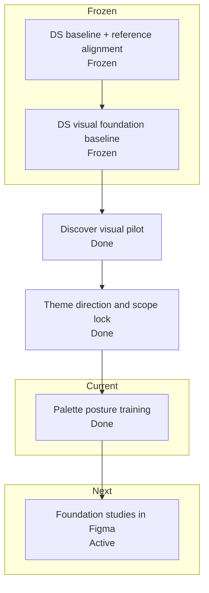

# Krukraft — Active Phase Tracker

Use this file as the single source of truth for active implementation state.

 ## Plan Snapshot

Parent Plan: `Krukraft theme refresh plan`

> [!info] Current Phase
> `Foundation study expansion in Figma`

> [!success] Completed
> The previous DS-first migration baseline is complete and now acts as the frozen implementation starting point
> The reference-driven DS alignment plan using Primer + Atlassian + Radix Themes is complete and now acts as the foundation-contract baseline
> The DS visual foundation pass is complete and now acts as the frozen visual baseline for route work
> The discover `/resources` visual pilot is complete and now acts as the latest public-route baseline
> Dashboard-v2 stabilization remains frozen
> Public marketplace perf baseline remains intact

> [!warning] Active
> Phase 3: foundation study expansion in Figma

> [!todo] Next Up
> Review the new Figma foundation studies as one system before choosing any runtime implementation slice

> [!abstract] Partial
> The editorial-minimal brief, playbook, and Figma training page are locked; palette posture is now approved as `Paper B` + `#4338CA` + support accents `Rust` and `Sand`, and first-pass foundation studies now exist in Figma across all five required areas, but no runtime color slice has landed yet

## Status Board

| Track            | Status   | Note                                                                                     |
| ---------------- | -------- | ---------------------------------------------------------------------------------------- |
| Reference Audit  | Kept     | Primer, Atlassian, and Radix Themes stay as the locked reference stack for the new visual pass |
| DS Baseline      | Frozen   | the previous DS-first migration baseline is complete and should be reused, not repeated |
| Foundation Align | Kept     | the completed reference-driven plan already locked token/component/chrome boundaries |
| Visual Foundation | Frozen   | completed visual baseline stays in force; do not reopen primitive work implicitly |
| Discover         | Frozen   | `/resources` listing-mode shell + fail-soft states landed and passed close-out audit    |
| Theme Refresh    | Active   | brief, playbook, and Figma review page are locked; palette posture is approved as `Paper B` + `#4338CA` + `Rust`/`Sand`, and first-pass foundation studies now exist in Figma across all five required areas |
| Dashboard-v2     | Frozen   | stable enough to pause; continue only after another explicit reprioritization change     |
| Public perf base | Kept     | existing `/resources` perf and streaming baseline stays in force during DS migration work |

## Progress

Krukraft theme refresh plan
`[█████████░] 90%`

## Daily Workflow

Before starting:
- Read `Current Phase`
- If `Next Up` has a mandatory item, pick exactly one and move it to `In Progress`
- If `Next Up` says the current parent plan is complete, stop and wait for an explicit new plan or reprioritization

Before closing:
- Update `In Progress`
- Update `Next Up`
- Update the progress percentage to match the real phase / plan status
- Fill `Session Close-Out Template`

Rules:
- Keep exactly one `Current Phase`
- Keep `Next Up` to at most 3 items
- Move anything not being worked right now into `Deferred`
- If a phase status changes, update this file in the same session
- If the parent plan status changes, update `Plan Snapshot`, `Current Status Inside Parent Plan`, and `Phase Map` in the same session
- Do not mark work complete in chat until the relevant phase/plan state here is updated
- If this file has an active parent plan, do not recommend or start `Deferred` work as the next step unless the user explicitly changes priorities
- When suggesting follow-up work, state whether it is `in-plan` or `out-of-plan` before recommending it
- If the user says `Next Up`, answer from the active plan's `Next Up` block first and keep the recommendation inside the active plan unless the user explicitly asks to reprioritize
- If a phase or parent plan is actually complete, update the percentage, phase status, and `Next Up` state to show that it is complete instead of fabricating more required work
- After a parent plan is complete, move any extra ideas into `Deferred` or clearly optional follow-up notes; do not keep the same plan artificially active

---

## Current Phase

### Name
Foundation study expansion in Figma

### Parent Plan
Krukraft theme refresh plan

### Current Status Inside Parent Plan
- The previous DS-first migration baseline, reference-driven DS alignment, and DS visual foundation pass are all complete and now act as the frozen starting baseline for theme work instead of being reopened
- The completed `/resources` visual pilot should be treated as evidence for what the current DS baseline already supports before a broader theme shift
- This new parent plan is about Krukraft-wide theme direction, not another discover slice and not another DS-boundary migration pass
- Canonical references for this plan start with:
  - `src/design-system/README.md` for DS ownership, visual brief, and reference stack
  - `krukraft-ai-contexts/06-design-system.md` for the current DS digest
  - `krukraft-ai-contexts/07-layout-ux.md` when a later theme slice touches route-level shells
  - `design-system.md` only if the theme work needs new Figma/handoff guidance
- The theme refresh should stay phased:
  - lock the Krukraft theme direction brief first
  - choose one narrow implementation slice second
  - keep route-level rollout decisions explicit instead of folding them into the scope-lock phase
- This plan should not implicitly reopen:
  - token taxonomy or DS boundary work already closed in the reference-driven alignment plan
  - primitive family calibration work already closed in the visual foundation pass
  - the completed `/resources` discover pilot
- The expected theme inputs are:
  - brand feel and emotional direction
  - type hierarchy and font posture
  - surface / elevation character
  - radius / density posture
  - action emphasis and contrast rules
- The theme direction brief is now locked in the canonical DS docs:
  - editorial-minimal: calm, clean, trustworthy, and human before trendy
  - premium through restraint, surface hierarchy, and atmosphere rather than saturated product shells
  - semantic roles stay authoritative while brand mood travels through background/surface tone instead of replacing semantic intent
  - one type/radius/density family should span marketplace and operational surfaces
  - stronger brand accents should stay supportive and sparse rather than becoming the default product surface language
- The last attempted color slice was rolled back because palette values were
  chosen too early and committed as concrete runtime values before user
  training/approval
- Theme training is now an explicit guardrail:
  - do not land new neutral or accent values from references alone
  - decide the palette vocabulary with the user first
  - only then choose and land a narrow color/surface slice
- `src/design-system/theme-playbook.md` is now the canonical training artifact:
  - it captures the editorial-minimal posture
  - it defines do/don't rules, review vocabulary, and approval gates
  - it keeps palette work at the vocabulary/posture level instead of jumping to
    runtime values
- `src/design-system/foundation-study-checklist.md` is now the dedicated
  checklist artifact for deciding whether Figma foundation coverage is broad
  enough to justify any code slice
- The `Theme Lab` page inside the live Figma file `Krukraft Design System` now
  acts as the visual review surface for palette posture training
- The old `/dev/theme-playbook` route has been removed so review stays outside
  the Krukraft app shell
- That Figma page now includes first-pass foundation studies across all five
  required checklist areas:
  - card studies
  - button states
  - input/search states
  - dropdown/popover shell
  - section/surface hierarchy
- The palette posture is now trained and approved:
  - `Paper B` is the chosen neutral direction
  - `#4338CA` is the chosen primary accent
  - `Rust` and `Sand` are the chosen support accents
- The active question is no longer whether Krukraft needs a second support
  accent; it is whether the Figma foundation studies are broad enough to justify
  any code implementation at all

### Goal
Expand the Figma foundation studies enough to justify a later code implementation slice.

### Why this is the current phase
- A color slice was attempted too early; rolling it back is the correct move
- The playbook approach is now locked, so the next safe step is broader
  foundation studies in Figma, not runtime token work
- The Figma page makes that review visual without committing runtime values
- The blank sandbox inside the Figma page keeps component exploration separate
  from premature token changes
- The neutral direction is no longer blocked: `Paper B` is approved and does
  not need another review loop unless the user reopens it
- The primary accent direction is no longer blocked: `#4338CA` is approved and
  does not need another review loop unless the user reopens it
- The support-accent direction is no longer blocked: `Rust` and `Sand` are
  approved and should stay support-only rather than co-primary
- The current foundation evidence is no longer just palette-level; the
  remaining question is whether the first-pass studies are cohesive enough to
  justify one later code slice safely
- This keeps the theme plan from drifting into designer-by-assumption behavior

### Definition of Done
- [x] A new explicit parent plan is opened for Krukraft theme refresh work
- [x] The completed DS baseline and discover pilot are carried forward as frozen inputs instead of being reopened
- [x] The Krukraft theme direction brief is locked
- [x] The theme training/playbook approach is locked
- [x] A visual training surface exists for palette review
- [ ] Figma foundation studies are broad enough to justify code implementation safely
- [ ] One narrow theme implementation slice is chosen from that trained palette direction
- [x] Relevant context docs are updated if the locked brief changes DS/system-level understanding materially
- [x] `09-todos.md` reflects the real phase and progress percentage for this new parent plan

### Phase Map

| Phase | Name | Status | Notes |
| --- | --- | --- | --- |
| 0 | Frozen baseline carry-forward | done | completed DS/reference/foundation/discover work stays frozen as the starting context |
| 1 | Theme direction and scope lock | done | the Krukraft theme brief is now locked in the canonical DS docs |
| 2 | Palette posture training | done | neutral, primary, and support-accent posture are now approved in the playbook/Figma training surface |
| 3 | Foundation study expansion in Figma | active | first-pass studies now exist across all five required areas; review and gap-fill them before choosing any code slice |
| 4 | First narrow theme slice | pending | choose and land one small code slice only after the Figma foundation evidence is strong enough |
| 5 | Review and close-out decision | pending | decide whether to stop, continue with a second slice, or open a separate rollout plan |

---

## Current Goal

Review the first-pass Figma foundation studies before choosing any code implementation slice.

Current recommendation order:
1. Use `src/design-system/theme-playbook.md` as the review and approval surface
2. Use the approved posture `Paper B` + `#4338CA` + `Rust`/`Sand` as the locked palette baseline
3. Use `src/design-system/foundation-study-checklist.md` as the explicit coverage gate for card, button states, input/search states, dropdown/popover shell, and section/surface hierarchy
4. Review the new `Theme Lab` studies as one system and gap-fill anything that still feels too thin, too loud, or too default-library
5. Avoid touching runtime values until those studies are broad enough to review as a system

---

## In Progress

- [x] Carry forward the completed DS baseline as the starting point
- [x] Carry forward the completed reference-driven alignment plan as the contract baseline
- [x] Carry forward the completed DS visual foundation pass as the visual baseline
- [x] Keep the dashboard runtime baseline frozen at the current stable baseline
- [x] Carry forward the completed `/resources` pilot as the latest public-route baseline
- [x] Open a new explicit parent plan for Krukraft theme refresh
- [x] Lock the Krukraft theme direction brief in the canonical DS docs
- [x] Roll back the premature `shared surface + neutral palette calibration` attempt
- [x] Create `src/design-system/theme-playbook.md` as the canonical theme-training artifact
- [x] Create the `Theme Lab` page inside the live Figma file `Krukraft Design System` as the visual palette-training surface
- [x] Remove the temporary `/dev/theme-playbook` route after moving training into Figma
- [x] Add a blank component sandbox to the Figma page for pre-token structure,
  spacing, and radius studies
- [x] Lock the neutral posture decision to `Paper B`
- [x] Lock the primary accent decision to `#4338CA`
- [x] Lock the support-accent decision to `Rust` and `Sand`
- [x] Add first-pass Figma foundation studies for all five required checklist areas

---

## Next Up

- [ ] Review the first-pass Figma studies against `src/design-system/foundation-study-checklist.md`
- [ ] Refine or gap-fill any study area that still feels too thin, too loud, or too default-library
- [ ] Reassess whether the foundation evidence is strong enough for a code slice only after that review, while keeping route-level rollout and runtime token edits out of scope until the first approved code slice is explicitly chosen

---

## Blocked / Waiting

- [ ] None right now

Use this section only for real blockers:
- missing env / credentials
- failing CI unrelated to the current task
- unclear product decision
- waiting on design / business confirmation

---

## Deferred

### Discover / Browse
- [ ] Audit discover/search/filter/creator-profile fallbacks for usable-but-consistent loading states after the DS migration direction is stable

### Dashboard / Perf
- [ ] Revisit route-level perf passes beyond the current rollback baseline only one route at a time
- [ ] Recheck whether `membership`, `settings`, `creator/profile`, or the public creator storefront need additional runtime perf work after visual/runtime feel review
- [ ] Re-open earnings perf only if runtime feel proves it is still a hotspot after rollback baseline

### Public Route / Loading Follow-ups
- [ ] Finish route-family fallback cleanup on public routes so hard refreshes on `/resources` and similar pages stay inside family-specific or neutral shells
- [ ] Verify dashboard/admin hard refreshes no longer show the global app-root fallback before their family loading shells under repeated refresh stress

### Brand / Platform
- [ ] Re-run perf measurements after major listing/detail/search changes and update thresholds intentionally
- [ ] Recheck preview/production LCP after major marketplace image or layout changes
- [ ] Verify favicon and OG logo propagation through `/brand-assets/*` in production browsers and crawlers
- [ ] Recheck that the trimmed first-party brand asset set still covers every metadata/favicon surface

### Ops / Config
- [ ] Replace `XENDIT_SECRET_KEY` test key in production environment
- [ ] Verify `DIRECT_URL` is present and correct for Prisma CLI / migration workflows in production
- [ ] Keep post-deploy warm targets aligned with perf smoke and browser verification coverage

---

## Verification Baseline

Run these before claiming the active reference-audit or DS alignment slice is complete:

- `npm run storybook:smoke` when the plan touches DS primitives, DS components, or their stories
- `npm run typecheck`
- `npm run lint`
- `npm run tokens:audit` when token docs, token files, or token contracts change
- `npm run context:check` when the tracker, DS ownership wording, or agent context changes materially

---

## Current Baseline Notes

### Dashboard
- `/dashboard/*` is now the canonical dashboard family.
- `(dashboard-lite)` stays retired.
- Active runtime perf baseline keeps the original frozen core at:
  - nav prefetch uplift
  - creator/resources timing cleanup
- plus one new deliberate learner-account follow-up:
- `/dashboard/settings` now streams its sections behind an in-page `Suspense` boundary again instead of awaiting the full combined payload before first in-page HTML
- `/dashboard/settings` now renders a real interactive settings surface inside that streamed shell, and the canonical settings route/API no longer accept a page-level language preference
- `/dashboard/membership` now renders its intro shell before the membership payload resolves and streams the summary cards plus plan-status panel behind a route-matched in-page fallback instead of awaiting the full account payload before any in-page content

### Verification
- Warm local `creator-workspace.spec.ts` passed `8/8` after rollback cleanup and short flake stabilization.
- Treat that suite as the main dashboard regression gate unless a task clearly needs a narrower surface.
- Runtime feel recheck on 2026-04-14 still confirms the dashboard family suite passes, and the public follow-up that remained after that pass is now green too:
  - `tests/e2e/navigation-shells.spec.ts` passes for `/resources` ↔ `/dashboard/library`
  - `tests/e2e/navigation-sentinels.spec.ts` passes for the public account dropdown contract
- Public account-menu parity pass now mirrors the dashboard IA/UI on the marketplace header, including the redesigned `Membership` entry and creator links, and the follow-up stabilization work closed the remaining public `/resources` auth-viewer and library cold-entry proof failures on the active baseline.
- The `/dashboard/settings` pass is now also green against:
  - `tests/e2e/settings-theme.spec.ts`
  - `tests/e2e/navigation-sentinels.spec.ts` (`dashboard avatar menu reaches home membership and settings`)
  - `tests/e2e/creator-workspace.spec.ts` (`dashboard account surfaces clear the dashboard overlay after shell readiness`)
- The `/dashboard/membership` pass is green against:
  - `tests/e2e/dashboard-membership.spec.ts`
  - `tests/e2e/creator-workspace.spec.ts` (`dashboard account surfaces clear the dashboard overlay after shell readiness`)
  - `tests/e2e/navigation-shells.spec.ts`
- One-pass local reruns still surfaced the older public sentinel and creator cold-entry flake classes during this work session, but those failures happened outside the membership route contract itself

### Git / Repo Hygiene
- Local design-tool repos under `.design-tools/*` are intentionally not tracked by the main repo.

---

## Decision Log

Add only short, high-signal entries here.

- 2026-04-17: Lock `Paper B` as the neutral direction, `#4338CA` as the primary accent, and `Rust` + `Sand` as the support accents for the Krukraft theme refresh plan; the next mandatory decision is the first narrow implementation slice.
- 2026-04-14: Keep dashboard perf baseline frozen after rollback; do not re-open broad streaming refactors.
- 2026-04-14: Remove `.design-tools/awesome-design-md` and `.design-tools/shadcn-examples` from repo tracking; keep them local-only.
- 2026-04-14: Runtime feel recheck shows the canonical dashboard route family is stable; next follow-up should target public↔dashboard library handoff/account-menu parity before reopening another perf pass.
- 2026-04-14: Public navbar account menu now follows the dashboard account-menu contract for IA/UI, but the next active follow-up remains public↔dashboard library handoff stabilization because `navigation-shells` still catches a blank-gap transition sample at that boundary.
- 2026-04-14: The authenticated account dropdown is now a shared public+dashboard component; keep sentinel coverage green when changing trigger shape, featured membership item, or account/creator menu sections.
- 2026-04-15: Marketplace navbar skeleton ownership and dashboard topbar skeleton geometry were both tightened after the shared dropdown refresh; the next public-nav follow-up is proof cleanliness, not another structural menu rewrite.
- 2026-04-15: The latest public navbar hydration warning sample points to a recoverable SSR/client mismatch around the auth-viewer boundary in dev, but it is not currently an active repro; treat the remaining public dropdown navigation timeout as the main open proof issue.
- 2026-04-15: `navigation-sentinels` is green again after tightening the public account-dropdown sentinel helper to use the real dropdown activation contract instead of an over-forced click path.
- 2026-04-16: Active plan changed from discover-first to DS-first; keep discover deferred and dashboard frozen until the first design-system migration pass is chosen deliberately.
- 2026-04-17: Active plan changed from the completed DS-first baseline to reference-driven DS alignment using Primer for token taxonomy, Atlassian for product-system rigor, and Radix Themes for implementation-level theming and primitive guidance.
- 2026-04-17: DS-first baseline is complete; the new active plan is reference-driven DS alignment using Primer for token taxonomy, Atlassian for product-system rigor, and Radix Themes for implementation-level theming/primitive guidance.
- 2026-04-17: The discover `/resources` listing-mode pilot passed close-out audit with request-level runtime proof and aligned fail-soft/loading shells; do not extend discover further inside the same parent plan.
- 2026-04-17: Active plan changed from the completed discover visual pilot to `Krukraft theme refresh plan`; start by locking theme direction and scope before any new implementation slice.
- 2026-04-17: The Krukraft theme direction brief is now locked from the completed DS/discover baseline; the next mandatory step is choosing one narrow implementation slice, not reopening direction work.
- 2026-04-17: The attempted `shared surface + neutral palette calibration` slice was rolled back because palette values were chosen too early; theme training and user-approved color posture now come before any new runtime theme slice.
- 2026-04-17: `src/design-system/theme-playbook.md` is now the canonical theme-training artifact; palette posture must be trained and approved there before any new runtime color slice is landed.
- 2026-04-17: the `Theme Lab` page inside the live Figma file `Krukraft Design System` is now the visual review surface for theme training; it may use temporary candidate colors for discussion, but it must not be treated as shipped DS theme output.
- 2026-04-17: the temporary `/dev/theme-playbook` route was removed after moving theme training into Figma so palette review is no longer tied to the Krukraft app shell.
- 2026-04-18: legacy `/dashboard-v2*` URLs were fully retired; canonical protected dashboard routes now live only under `/dashboard/*`, and old bookmarks/links should be updated because the legacy paths now return `404`.
- 2026-04-19: the remaining repo-owned `dashboard-v2` component filenames were retired too; canonical auth callbacks, admin fallback redirects, Stripe membership success returns, and dashboard skeleton/page-shell imports now point only at `/dashboard/*` plus `src/components/layout/dashboard/*`.
- 2026-04-18: public `/resources` shell stabilization is green again on the active baseline: `tests/e2e/resources.smoke.spec.ts` and `tests/e2e/navigation-shells.spec.ts` now pass together against canonical dashboard destinations after the shared account-menu/auth-helper cleanup; creator profile media upload proof remains a separate creator-surface follow-up, not part of the public-shell batch.
- 2026-04-19: admin routes and shared admin controls now normalize on the repo-owned `@/lib/icons` adapter too; direct `lucide-react` imports were retired from the active admin route/component surface.
- 2026-04-17: the `Theme Lab` page now includes a blank component sandbox so component studies can happen before palette, spacing, and radius decisions are committed into the DS.
- 2026-04-17: the neutral posture decision is now locked to `Paper B`; after approving `Rust` and `Sand` as support accents, the next mandatory decision is the first narrow implementation slice.

---

## Session Close-Out Template

Copy/update this at the end of a non-trivial task:

- Phase status:
  - `open` / `closed` / `deferred`
- Parent plan status changed?
  - `yes` / `no`
- What changed:
  - ...
- Verification run:
  - ...
- Next recommended task:
  - ...
- Knowledge triage:
  - `no ingest` / `log only` / `update existing wiki` / `new wiki entry`

Close-out rule:
- If `Phase status` changed, update `Plan Snapshot` and `Phase Map` before ending the session
- If the parent plan moved to a new stage or closed, update `Current Phase`, `Current Status Inside Parent Plan`, and `Next Up` before ending the session

### Phase Change Checklist

- [ ] Update `Phase status`
- [ ] Update `Plan Snapshot`
- [ ] Update `Phase Map`
- [ ] Update `Current Status Inside Parent Plan`
- [ ] Update `In Progress`
- [ ] Update `Next Up`
- [ ] Record verification actually run
- [ ] Record the next recommended task before closing the session

---

## Reference Pointers

Use these for deeper context instead of expanding this file again:
- Architecture / route-family behavior: [04-architecture.md](/Users/shanerinen/Projects/krukraft/krukraft-ai-contexts/04-architecture.md)
- Performance notes / rollback baseline: [08-performance-audit.md](/Users/shanerinen/Projects/krukraft/krukraft-ai-contexts/08-performance-audit.md)
- Design-system ownership: [06-design-system.md](/Users/shanerinen/Projects/krukraft/krukraft-ai-contexts/06-design-system.md)
- Layout / UX conventions: [07-layout-ux.md](/Users/shanerinen/Projects/krukraft/krukraft-ai-contexts/07-layout-ux.md)
