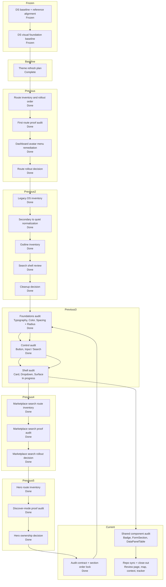

# Krukraft — Active Phase Tracker

Use this file as the single source of truth for active implementation state.

 ## Plan Snapshot

Parent Plan: `Figma DS section audit`

> [!info] Current Phase
> `Phase 3 — shell audit`

> [!success] Completed
> The previous DS-first migration baseline is complete and now acts as the frozen implementation starting point
> The reference-driven DS alignment plan using Primer + Atlassian + Radix Themes is complete and now acts as the foundation-contract baseline
> The DS visual foundation pass is complete and now acts as the frozen visual baseline for route work
> The discover `/resources` visual pilot is complete and now acts as the latest public-route baseline
> Dashboard-v2 stabilization remains frozen
> Public marketplace perf baseline remains intact

> [!warning] Active
> Open a new audit-only parent plan that re-checks the canonical Figma DS file against the repo one section family at a time. The goal is not to invent new DS work, but to verify section truth, variable usage, mapping posture, and repo-context parity in a tighter phased order than the previous broad alignment pass.

> [!todo] Next Up
> Start Phase 2 control audit in this order: `Button / Foundations` → `Input / Search`, then continue into shell sections only after the foundations pass is written down in repo context.

> [!abstract] Partial
> The previous theme refresh, route rollout audits, legacy DS cleanup, marketplace search-shell audit, and hero-search cleanup plan are complete; this new plan is a documentation/alignment pass that should not silently reopen runtime route work.

## Status Board

| Track            | Status   | Note                                                                                     |
| ---------------- | -------- | ---------------------------------------------------------------------------------------- |
| Reference Audit  | Kept     | Primer, Atlassian, and Radix Themes stay as the locked reference stack for the new visual pass |
| DS Baseline      | Frozen   | the previous DS-first migration baseline is complete and should be reused, not repeated |
| Foundation Align | Kept     | the completed reference-driven plan already locked token/component/chrome boundaries |
| Visual Foundation | Frozen   | completed visual baseline stays in force; do not reopen primitive work implicitly |
| Discover         | Frozen   | `/resources` listing-mode shell + fail-soft states landed and passed close-out audit    |
| Theme Refresh    | Complete | brief, playbook, Figma review page, approved surface baseline, cleanup slice, and first runtime slices all passed close-out audit |
| Figma DS Alignment | Complete | canonical Figma source, repo registry, and DS inventory are now aligned enough to close the previous alignment plan; use it as the baseline for this narrower re-audit |
| Figma DS Section Audit | Active | section-by-section verification pass for the canonical Figma DS file against repo docs, token contracts, and mapped component truth |
| Route Rollout Audit | Complete | the first proof route (`dashboard navigation + library`) passed runtime verification and the optional rollout audit closed cleanly |
| Legacy DS Cleanup | Complete | `secondary -> quiet`, outline inventory, and search-shell decision closed cleanly |
| Admin / Settings Rollout Audit | Complete | `/dashboard/settings`, `/admin/users`, `/admin/settings`, and `admin/resources` passed runtime proof |
| Marketplace Search Shell Audit | Complete | `/resources`, resource detail, category, and support shells passed; preview shells remain intentional dev-only exceptions |
| Marketplace Hero Search Audit | Complete | discover mode proved `HeroSurface` is live while `HeroSearch variant="hero"` has no runtime mount |
| Marketplace Hero Search Deprecation Cleanup | Complete | hero-only search branch, preview file, bones captures, and story references were removed while live discover/listing/navbar search proofs stayed intact |
| Dashboard-v2     | Frozen   | stable enough to pause; continue only after another explicit reprioritization change     |
| Public perf base | Kept     | existing `/resources` perf and streaming baseline stays in force during DS migration work |

## Progress

Figma DS section audit
`[██████░░░░] 60%`

## Daily Workflow

Before starting:
- Read `Current Phase`
- If `Next Up` has a mandatory item, pick exactly one and move it to `In Progress`
- If `Next Up` says the current parent plan is complete, stop and wait for an explicit new plan or reprioritization

Before closing:
- Update `In Progress`
- Update `Next Up`
- Update the progress percentage to match the real phase / plan status
- Fill `Session Close-Out Template`

Rules:
- Keep exactly one `Current Phase`
- Keep `Next Up` to at most 3 items
- Move anything not being worked right now into `Deferred`
- If a phase status changes, update this file in the same session
- If the parent plan status changes, update `Plan Snapshot`, `Current Status Inside Parent Plan`, and `Phase Map` in the same session
- Do not mark work complete in chat until the relevant phase/plan state here is updated
- If this file has an active parent plan, do not recommend or start `Deferred` work as the next step unless the user explicitly changes priorities
- When suggesting follow-up work, state whether it is `in-plan` or `out-of-plan` before recommending it
- If the user says `Next Up`, answer from the active plan's `Next Up` block first and keep the recommendation inside the active plan unless the user explicitly asks to reprioritize
- If a phase or parent plan is actually complete, update the percentage, phase status, and `Next Up` state to show that it is complete instead of fabricating more required work
- After a parent plan is complete, move any extra ideas into `Deferred` or clearly optional follow-up notes; do not keep the same plan artificially active
- When a parent plan or remediation slice is complete and verification passed, stage and commit that finished slice in the same session by default
- Do not close a completed plan or remediation slice while related tracked changes are still uncommitted, unless the user explicitly says not to commit yet

---

## Current Phase

### Name
Control audit after foundations re-check

### Parent Plan
Figma DS section audit

### Current Status Inside Parent Plan
- The previous `Figma DS alignment` parent plan is complete and now acts as the
  frozen baseline for this narrower re-audit.
- Phase 0 is now closed: the audit scope, order, and acceptance criteria are
  locked and written down in this tracker.
- Phase 1 is now closed: `Typography / Light`, `Typography / Dark`,
  `Color Primitives / Light`, `Color Primitives / Dark`, and
  `Spacing + Radius / Primitives` were re-audited and synced to repo context.
- The current section-level finding from foundations is repo-doc drift, not
  live Figma token drift: the audited boards are fully bound for text, fills,
  strokes, and per-corner radius, and the remaining correction was updating
  repo wording that still assumed older primitive-color counts or older radius
  audit logic.
- This new plan exists because the canonical Figma DS file and repo references
  are close enough to trust, but they have not yet been re-checked in one
  deliberate pass section by section.
- The audit should use the canonical source file
  `koZEgVUfQhNEQmXISNQx56` (`Krukraft Theme Lab Source-of-Truth`) as the base.
- The audit should stay Figma-first and repo-sync-focused:
  - verify section structure
  - verify variable bindings and local overrides
  - verify mapping truth in repo docs
  - verify whether each section reflects code/runtime contracts or intentional
    Figma-first candidates
- The audit must not silently expand into runtime redesign or new DS invention.
- The audit should keep the previous decisions intact unless the new evidence
  clearly disproves them, including:
  - `Dropdown` stays a study-board reference for now
  - `Badge` stays non-interactive while `Chip` remains outside the current DS
    foundations scope
  - `Button soft` and `sm=36` remain Figma-first candidates, not approved
    runtime contract

### Goal
Re-audit the canonical Figma DS file against the repo one section family at a
time and produce an explicit, current parity read on:
- what is aligned
- what is doc drift
- what is intentional Figma-first drift
- what still needs a follow-up plan

### Why this is the current phase
- The last plan closed at the parent-plan level, but the user now wants a
  tighter audit pass organized by section instead of broad DS slices.
- The repo already has enough mapping/context structure to support a more
  granular audit.
- A phased section audit reduces the chance of mixing small visual drift with
  real token, mapping, or contract drift.

### Definition of Done
- [ ] Every `DS Foundations` section family has been re-audited in a deliberate
      order and recorded as aligned, drifted, or intentionally Figma-first
- [ ] `Typography / Light` and `Typography / Dark` are checked against
      typography variables, text bindings, and repo docs
- [ ] `Color Primitives / Light` and `Color Primitives / Dark` are checked
      against primitive variables, support colors, and displayed board labels
- [ ] `Spacing + Radius / Primitives` is checked against the live variable
      collection and repo token docs
- [ ] `Button`, `Input / Search`, `Card`, `Dropdown`, `Surface`, `Badge`,
      `FormSection`, and `DataPanelTable` each have a fresh audit result and
      repo-context sync where needed
- [ ] `Foundation Review` is checked separately as a review artifact, not
      confused with `DS Foundations` source truth
- [ ] `figma-component-map.md`, `src/design-system/README.md`,
      `design-system.md`, `06-design-system.md`, and `09-todos.md` are synced
      whenever a section audit changes shared understanding
- [ ] The plan closes with one final close-out audit that stays inside this
      section-audit scope

### Phase Map

| Phase | Name | Status | Notes |
| --- | --- | --- | --- |
| 0 | Audit contract + section order lock | complete | scope, section order, and section-level acceptance criteria are now locked in this tracker |
| 1 | Foundations audit | complete | `Typography`, `Color Primitives`, and `Spacing + Radius / Primitives` were re-audited; the live boards stayed token-bound and the repo sync corrected stale primitive-count and radius-binding wording |
| 2 | Control audit | in progress | audit `Button` and `Input / Search` foundations, recipes, size/state boards, and repo mappings |
| 3 | Shell audit | pending | audit `Card`, `Dropdown`, and `Surface` as the shared shell layer |
| 4 | Shared component audit | pending | audit `Badge`, `FormSection`, and `DataPanelTable` against current repo truth |
| 5 | Review + repo close-out | pending | audit `Foundation Review`, sync repo references, run checks, and close the plan |

---

## Current Goal

Open a new `Figma DS section audit` parent plan that re-checks the canonical
Figma file and repo references one section family at a time without silently
reopening runtime redesign work.

Audit order for this plan:
1. `Typography / Light` + `Typography / Dark`
2. `Color Primitives / Light` + `Color Primitives / Dark`
3. `Spacing + Radius / Primitives`
4. `Button / Foundations`
5. `Input / Search`
6. `Card`, `Dropdown`, `Surface`
7. `Badge`, `FormSection`, `DataPanelTable`
8. `Foundation Review` + repo close-out

---

## In Progress

- [x] Open a new parent plan for `Figma DS section audit`
- [x] Lock the audit scope to Figma-vs-repo parity, not new runtime redesign
- [x] Define the exact section-by-section audit order and acceptance criteria
- [x] Complete Phase 1 foundations audit across `Typography`, `Color Primitives`, and `Spacing + Radius`
- [x] Start Phase 2 with `Button / Foundations`
- [x] Audit `Button / Foundations / Light` and `Button / Foundations / Dark`
- [x] Audit `Input / Search / Light` and `Input / Search / Dark`

---

## Next Up

- [ ] Audit `Dropdown / Foundations / Light` and `Dropdown / Foundations / Dark`
- [ ] Audit `Surface / Foundations / Light` and `Surface / Foundations / Dark`
- [ ] Move into `Badge`, `FormSection`, and `DataPanelTable` only after the shell pass is written down

---

## Blocked / Waiting

- [ ] None right now

Use this section only for real blockers:
- missing env / credentials
- failing CI unrelated to the current task
- unclear product decision
- waiting on design / business confirmation

---

## Deferred

### Discover / Browse
- [ ] Audit discover/search/filter/creator-profile fallbacks for usable-but-consistent loading states after the DS migration direction is stable

### Dashboard / Perf
- [ ] Revisit route-level perf passes beyond the current rollback baseline only one route at a time
- [ ] Recheck whether `membership`, `settings`, `creator/profile`, or the public creator storefront need additional runtime perf work after visual/runtime feel review
- [ ] Re-open earnings perf only if runtime feel proves it is still a hotspot after rollback baseline

### Public Route / Loading Follow-ups
- [ ] Finish route-family fallback cleanup on public routes so hard refreshes on `/resources` and similar pages stay inside family-specific or neutral shells
- [ ] Verify dashboard/admin hard refreshes no longer show the global app-root fallback before their family loading shells under repeated refresh stress

### Brand / Platform
- [ ] Re-run perf measurements after major listing/detail/search changes and update thresholds intentionally
- [ ] Recheck preview/production LCP after major marketplace image or layout changes
- [ ] Verify favicon and OG logo propagation through `/brand-assets/*` in production browsers and crawlers
- [ ] Recheck that the trimmed first-party brand asset set still covers every metadata/favicon surface

### Ops / Config
- [ ] Replace `XENDIT_SECRET_KEY` test key in production environment
- [ ] Verify `DIRECT_URL` is present and correct for Prisma CLI / migration workflows in production
- [ ] Keep post-deploy warm targets aligned with perf smoke and browser verification coverage

---

## Verification Baseline

Run these before claiming the active reference-audit or DS alignment slice is complete:

- `npm run storybook:smoke` when the plan touches DS primitives, DS components, or their stories
- `npm run typecheck`
- `npm run lint`
- `npm run tokens:audit` when token docs, token files, or token contracts change
- `npm run context:check` when the tracker, DS ownership wording, or agent context changes materially

---

## Current Baseline Notes

### Dashboard
- `/dashboard/*` is now the canonical dashboard family.
- `(dashboard-lite)` stays retired.
- Active runtime perf baseline keeps the original frozen core at:
  - nav prefetch uplift
  - creator/resources timing cleanup
- plus one new deliberate learner-account follow-up:
- `/dashboard/settings` now streams its sections behind an in-page `Suspense` boundary again instead of awaiting the full combined payload before first in-page HTML
- `/dashboard/settings` now renders a real interactive settings surface inside that streamed shell, and the canonical settings route/API no longer accept a page-level language preference
- `/dashboard/membership` now renders its intro shell before the membership payload resolves and streams the summary cards plus plan-status panel behind a route-matched in-page fallback instead of awaiting the full account payload before any in-page content

### Verification
- Warm local `creator-workspace.spec.ts` passed `8/8` after rollback cleanup and short flake stabilization.
- Treat that suite as the main dashboard regression gate unless a task clearly needs a narrower surface.
- Runtime feel recheck on 2026-04-14 still confirms the dashboard family suite passes, and the public follow-up that remained after that pass is now green too:
  - `tests/e2e/navigation-shells.spec.ts` passes for `/resources` ↔ `/dashboard/library`
  - `tests/e2e/navigation-sentinels.spec.ts` passes for the public account dropdown contract
- Public account-menu parity pass now mirrors the dashboard IA/UI on the marketplace header, including the redesigned `Membership` entry and creator links, and the follow-up stabilization work closed the remaining public `/resources` auth-viewer and library cold-entry proof failures on the active baseline.
- The `/dashboard/settings` pass is now also green against:
  - `tests/e2e/settings-theme.spec.ts`
  - `tests/e2e/navigation-sentinels.spec.ts` (`dashboard avatar menu reaches home membership and settings`)
  - `tests/e2e/creator-workspace.spec.ts` (`dashboard account surfaces clear the dashboard overlay after shell readiness`)
- The `/dashboard/membership` pass is green against:
  - `tests/e2e/dashboard-membership.spec.ts`
  - `tests/e2e/creator-workspace.spec.ts` (`dashboard account surfaces clear the dashboard overlay after shell readiness`)
  - `tests/e2e/navigation-shells.spec.ts`
- One-pass local reruns still surfaced the older public sentinel and creator cold-entry flake classes during this work session, but those failures happened outside the membership route contract itself

### Git / Repo Hygiene
- Local design-tool repos under `.design-tools/*` are intentionally not tracked by the main repo.

---

## Decision Log

Add only short, high-signal entries here.

- 2026-04-28: After `Figma DS alignment` closed, open a new parent plan `Figma DS section audit` to re-check the canonical Figma DS file against the repo in a stricter section-by-section order instead of reopening broad DS work implicitly.
- 2026-04-28: Phase 1 of `Figma DS section audit` is now closed. A fresh foundations re-audit confirmed that `Typography / Light`, `Typography / Dark`, `Color Primitives / Light`, `Color Primitives / Dark`, and `Spacing + Radius / Primitives` all stay fully bound for text, fills, strokes, and per-corner radius. The live correction was repo wording drift instead: old notes still implied a `20`-color primitive collection and treated per-corner radius bindings as if they were local radius debt.
- 2026-04-28: Phase 2 has now started with `Button / Foundations`. The live light/dark boards stay fully bound for text family/size/line-height/fill plus shell fills, strokes, and per-corner radius, and the old `wrapper radius debt` + dark `light recipe` subtitle claims are now closed as repo drift. The live `Button recipes` truth is also narrower and clearer now: `Row action` keeps an `Edit / Open` example row plus a compact state strip, `Pagination item` shares the same rounded-rect `radius/sm (8px)` recipe shape, and `Panel CTA` intentionally stays on the bounded-neutral pill candidate instead of inheriting the table posture.
- 2026-04-28: Phase 2 is now closed. A fresh `Input / Search` re-audit confirms that the light/dark boards stay token-bound for text family, text fill, shell fills/strokes, and the shared `radius/sm (8px)` field shells, but two explicit Figma-only gaps remain open by design: the four component-set wrappers still keep local `cornerRadius=5`, and the `Clear` action label in the search-state explainer still uses a local `14/20` type recipe. The repo registry also needed current dark ids for `Input / State`, `Input / Size`, `SearchInput / State`, and `SearchInput / Size`.
- 2026-04-28: Phase 3 has now started with `Card / Foundations`. The live light/dark boards remain bound for font family, line height, text fill, shell fills/strokes, and per-corner radius, and the old wrapper-radius debt on `Card / Size / Source` stays closed. The remaining live Figma gaps are explicit instead: the title/body/footer copy still uses local type sizes, the geometry still keeps intentional local values (`space/20`, `space/10`, preview-stack arrangement), and the repo registry needed current dark ids (`726:156`, `726:171`) for the dark board/source set.
- 2026-04-25: Active plan changed from the completed marketplace hero-search cleanup to `Figma DS alignment`; start by locking the canonical Figma source file and producing a repo-vs-Figma inventory diff before any new parity claim.
- 2026-04-25: `koZEgVUfQhNEQmXISNQx56` (`Krukraft Theme Lab Source-of-Truth`) is now the permanent canonical Figma DS source file; repo references and coverage docs must be migrated to that foundation-first source.
- 2026-04-25: The first repo-side doc drift pass is complete; stale mapping claims from the previous Figma file were downgraded, so the next active slice is `Input` / `SearchInput` foundation parity.
- 2026-04-25: The `Input` / `SearchInput` foundation parity pass is now landed in the canonical file through first-pass light/dark component sets; the next active slice is shared-library mapping starting with `Card`, `Dropdown`, and `Surface`.
- 2026-04-25: `Badge vs Chip` is now a locked DS contract decision from repo usage evidence: `Badge` stays non-interactive and semantic, while `Chip` is the interactive/removable/filter token surface that should absorb route-owned chip patterns over time.
- 2026-04-25: `Badge` is now explicitly part of the shared-library mapping pass too; it should be remapped in Figma as the non-interactive label primitive before the new `Chip` surface expands.
- 2026-04-25: `Card` is now landed in the canonical file through `Card / Size` and `Card / Size / Dark`; it becomes the first shared-library shell proof point, so the next active slice is `Dropdown`, `Surface`, then `Badge`.
- 2026-04-25: `Dropdown / Foundations / Light` (`499:110`) and `Dropdown / Foundations / Dark` (`499:181`) are now landed as verified study boards in the canonical file; reusable dropdown mapping remains pending, so the next active slice is `Surface`, then `Badge`.
- 2026-04-27: The canonical Figma semantic layer now includes `state/selected-fill`, `state/selected-stroke`, and `state/selected-text`, aliased to `primary/mist`, `primary/lift`, and `primary/base` so selected rows, selected chips, and other selected surfaces can share a stable theme-aware state contract before `Badge` remapping resumes.
- 2026-04-28: `Badge / Foundations / Light` (`736:156`) and `Badge / Foundations / Dark` (`736:184`) are now landed as canonical boards, with `Badge / Variant / Source` (`736:178`) and the current dark source set (`746:208`) as the live reusable sets. The canonical set stays non-interactive, covers `neutral`, `info`, `success`, `warning`, `featured`, `destructive`, and `outline`, and records one explicit token gap: badge labels still rely on a local `12/16` xs recipe until the typography scale grows an xs label token.
- 2026-04-28: The canonical `Color Primitives / Light` (`2:1269`) and `Color Primitives / Dark` (`158:177`) boards now surface the support-status primitives too. `support/success/*` and `support/warning/*` are no longer visible only in variables or badge recipes; they now appear as dedicated `Success` and `Warning` cards on the primitive boards with bound fills and live hex labels, and the support family now runs `base / dust / soft` in both modes.
- 2026-04-28: The follow-up badge tuning now keeps the warm semantics intentionally split in the canonical file: `warning` stays crisp on `bg/inset` via `support/warning/base|dust`, while `featured` uses `accent/sand/wash` fill plus `accent/sand/base` border/text so it reads as an editorial highlight instead of a second warning-like badge.
- 2026-04-28: `FormSection / Foundations / Light` (`759:156`) and `FormSection / Foundations / Dark` (`759:184`) are now landed as canonical boards, with `FormSection / Variant / Source` light/dark sets (`759:251`, `759:252`) covering `variant=flat|card`. The board keeps its runtime geometry gaps explicit: `16/20` section-title rhythm, `20px` card padding, the `6px` flat-header gap, and the missing `border/subtle` semantic still sit outside the current token scales.
- 2026-04-28: The earlier `36px` footer-button study has now been folded into the canonical Figma `Button / Foundations` boards as a bounded neutral `soft` tone that sits beside `ghost`, plus a Figma-first `sm=36` step. Treat that as source-of-truth design direction only for now; runtime still stays on `primary | quiet | ghost` and the current size ladder until a separate button adoption pass lands.
- 2026-04-28: The follow-up button-ladder audit is now recorded too: if the `36px` posture is promoted later, the current safest trial path is `xs=32 / sm=36 / md=40 / lg=48`, keep `density=\"compact\" -> xs` during the first rollout proof, and leave `Input` / `SearchInput` on the current field ladder. The impact map is concentrated in `dashboard` (~60 `size=\"sm\"` button uses) and `admin` (~34), while live `density=\"compact\"` usage is still narrow (`public-resources` 3, `creator` 1).
- 2026-04-28: The button-family decision rule is now locked in repo docs too: keep `primary | quiet | ghost` as the approved runtime family, treat Figma-side `soft` as a bounded-neutral candidate only, and keep `row action`, `pagination item`, and `panel CTA` as recipes on top of existing button variants until cross-context reuse proves a new family member is warranted.
- 2026-04-28: The follow-up recipe pass now locks the `DataPanelTable`-style action controls in the canonical Figma file too: `row action` and `pagination item` stay recipes, not new families, but they now use the rounded-rect `radius/sm (8px)` posture you preferred from the live table instead of inheriting the core pill shape.
- 2026-04-28: The final recipe cleanup restored the canonical `Button recipes / Row action` card to an `Edit / Open` example row plus a compact `Default|Hover|Focus|Pressed|Disabled` state strip, and `DataPanelTable` now mirrors that same outline recipe posture in its light/dark foundations.
- 2026-04-28: The optional `Dropdown` promotion decision is now closed for this parent plan: keep `Dropdown` as a verified study-board reference for now rather than forcing a reusable component-set mapping before the shell recipe is proven broader. The shared-library close-out audit found no remaining in-plan issue after syncing the final Figma truth back into repo docs/context, so `Figma DS alignment` closes at `100%`.
- 2026-04-27: A full-canvas repo-sync audit of `koZEgVUfQhNEQmXISNQx56` is now landed; repo docs now reflect the actual two-page file (`DS Foundations` + `Foundation Review`), the live section inventory, the clean paint-binding posture of `DS Foundations`, the review-only status of `Foundation Review`, and the current live `Button` / `Card` component-set ids after earlier Figma rebuilds.
- 2026-04-26: The canonical Figma radius collection now includes `radius/xs = 4px`, and the `Spacing + Radius / Primitives` board was expanded to six rows to keep the visual audit surface aligned with the variable truth; repo runtime tokens still do not expose `radius/xs` yet.
- 2026-04-26: Text across `DS Foundations` now binds `font/family/base` by default; four glyph-only nodes were intentionally left on symbol-font rendering so carets/chevrons do not break during the typography-variable pass.
- 2026-04-26: `font/family/base` in the canonical Figma file now points to `IBM Plex Sans Thai`; representative `DS Foundations` screenshots were rerun and the current typography plus dropdown boards remained visually stable after the family switch.
- 2026-04-26: The `Button` / `Input` size contract is now explicitly locked for Figma handoff: typography scale stays in variables, while control size stays in component variants (`Button`: `xs|sm|md|lg|icon`; fields: `sm|md|lg|field`) with the current density defaults carried forward from code.
- 2026-04-26: The canonical Figma foundations now reflect that control-size contract more directly: `Button / Size` light/dark were rebuilt to include `xs|sm|md|lg`, while `Input` / `SearchInput` gained explicit light/dark `... / Size` component sets for the shared field ladder.
- 2026-04-27: A detailed re-audit of the canonical `Input / Search` boards confirmed that `Input / State`, `SearchInput / State`, `Input / Size`, and `SearchInput / Size` now use `radius/sm (8px)` consistently across light and dark. Repo context is synced to that Figma truth; runtime code still carries the older larger comfortable-radius branch and should be treated as drift until adoption.
- 2026-04-27: A detailed `Button / Foundations` re-audit confirmed that the light/dark boards stay semantically token-bound at the section-shell level and logged the live design-vs-runtime gap: canonical Figma now uses more explicit `quiet` / `ghost` foreground shifts by state than the current runtime `Button.tsx` recipe exposes. The older `wrapper radius debt` and dark `light recipe` subtitle caveats from that audit were later cleared by the 2026-04-28 control re-audit and should now be treated as superseded repo drift, not live Figma debt.
- 2026-04-28: `Card` repo adoption has now started too: runtime `Card.tsx` uses `surface` for the root shell and `inset` for the footer band, and the canonical `Card / Size / Source` light/dark component sets no longer carry wrapper-radius debt after the latest Figma cleanup. Remaining card debt is now explicit token-gap / preview-polish work only.
- 2026-04-28: Runtime `card` semantics now follow the same Figma base as `Card`: `bg-card` resolves to the `surface` layer, while shared shell chrome that should stay on the outer shell now has to use `bg-shell` explicitly. The first shared consumers normalized in that slice were the sidebar, navbar/account chrome, theme switcher menu, and notification chrome.
- 2026-04-28: A user-directed follow-up audit of `bg-card` consumers closed the first nested-surface remediation slice after the semantic shift. The creator editor family had the first material holdouts, so preview/icon chips, delivery-source segmented controls, and profile/banner preview wrappers now use `bg-shell` explicitly inside creator `bg-card` sections. Public `/resources`, `/resources/[slug]`, and `/creators/[slug]` stayed on the `surface` posture, and the local `creator-editor-refresh-shell` browser probe passed after the local DB was restarted.
- 2026-04-28: A second user-directed `bg-card` remediation slice closed on `admin resources`. The route-family audit confirmed that data-table/list shells remain valid `surface` consumers, while the admin editor needed narrower subordinate-shell remaps only: the file-upload subpanel, preview-image rows, dropzones, and owner-picker trigger now use `bg-shell` / `bg-background`. Repo-owned Playwright sentinels for the create route, edit route, and lazy preview uploader all passed after that patch.
- 2026-04-26: Runtime adoption has started on the shared search field too: the default `SearchInput` branch now resolves `size` / `density` through the same field recipe as `Input`, while `hero` remains the one intentional exception branch.
- 2026-04-26: `Surface / Foundations / Light` (`573:143`) and `Surface / Foundations / Dark` (`573:182`) are now landed and screenshot-verified in the canonical file; each board now carries a `Surface / Variant / Source` block plus a hierarchy card, and the remaining gaps are explicit token gaps (`border/subtle`, `bg-muted`, `radius/12`, `space/20`) rather than silent local styling.
- 2026-04-25: The reviewed light palette from `Theme Lab` frame `464:545` is now promoted into the canonical Figma primitive variables (`primary`, `Rust`, `Sand`, `neutral/*`, and `neutral/ink*`) while dark-mode values and semantic alias chains stay unchanged.
- 2026-04-25: The reviewed dark palette from `Theme Lab` frame `477:479` is now promoted into the canonical Figma primitive variables (`primary`, `Rust`, `Sand`, `neutral/*`, and `neutral/ink*`); the canonical `Color Primitives / Dark` board was updated so its displayed hex labels match the promoted values.
- 2026-04-25: `Surface` now exists as a distinct primitive in the canonical Figma variable system too; `neutral/surface` was added under `Color / Primitives` and `bg/surface` now aliases to it instead of piggybacking on older shell/inset values.
- 2026-04-17: Lock `Paper B` as the neutral direction, `#4338CA` as the primary accent, and `Rust` + `Sand` as the support accents for the Krukraft theme refresh plan; the next mandatory decision is the first narrow implementation slice.
- 2026-04-14: Keep dashboard perf baseline frozen after rollback; do not re-open broad streaming refactors.
- 2026-04-14: Remove `.design-tools/awesome-design-md` and `.design-tools/shadcn-examples` from repo tracking; keep them local-only.
- 2026-04-14: Runtime feel recheck shows the canonical dashboard route family is stable; next follow-up should target public↔dashboard library handoff/account-menu parity before reopening another perf pass.
- 2026-04-14: Public navbar account menu now follows the dashboard account-menu contract for IA/UI, but the next active follow-up remains public↔dashboard library handoff stabilization because `navigation-shells` still catches a blank-gap transition sample at that boundary.
- 2026-04-14: The authenticated account dropdown is now a shared public+dashboard component; keep sentinel coverage green when changing trigger shape, featured membership item, or account/creator menu sections.
- 2026-04-15: Marketplace navbar skeleton ownership and dashboard topbar skeleton geometry were both tightened after the shared dropdown refresh; the next public-nav follow-up is proof cleanliness, not another structural menu rewrite.
- 2026-04-15: The latest public navbar hydration warning sample points to a recoverable SSR/client mismatch around the auth-viewer boundary in dev, but it is not currently an active repro; treat the remaining public dropdown navigation timeout as the main open proof issue.
- 2026-04-15: `navigation-sentinels` is green again after tightening the public account-dropdown sentinel helper to use the real dropdown activation contract instead of an over-forced click path.
- 2026-04-16: Active plan changed from discover-first to DS-first; keep discover deferred and dashboard frozen until the first design-system migration pass is chosen deliberately.
- 2026-04-17: Active plan changed from the completed DS-first baseline to reference-driven DS alignment using Primer for token taxonomy, Atlassian for product-system rigor, and Radix Themes for implementation-level theming and primitive guidance.
- 2026-04-17: DS-first baseline is complete; the new active plan is reference-driven DS alignment using Primer for token taxonomy, Atlassian for product-system rigor, and Radix Themes for implementation-level theming/primitive guidance.
- 2026-04-17: The discover `/resources` listing-mode pilot passed close-out audit with request-level runtime proof and aligned fail-soft/loading shells; do not extend discover further inside the same parent plan.
- 2026-04-17: Active plan changed from the completed discover visual pilot to `Krukraft theme refresh plan`; start by locking theme direction and scope before any new implementation slice.
- 2026-04-17: The Krukraft theme direction brief is now locked from the completed DS/discover baseline; the next mandatory step is choosing one narrow implementation slice, not reopening direction work.
- 2026-04-17: The attempted `shared surface + neutral palette calibration` slice was rolled back because palette values were chosen too early; theme training and user-approved color posture now come before any new runtime theme slice.
- 2026-04-17: `src/design-system/theme-playbook.md` is now the canonical theme-training artifact; palette posture must be trained and approved there before any new runtime color slice is landed.
- 2026-04-17: the `Theme Lab` page inside the live Figma file `Krukraft Design System` is now the visual review surface for theme training; it may use temporary candidate colors for discussion, but it must not be treated as shipped DS theme output.
- 2026-04-17: the temporary `/dev/theme-playbook` route was removed after moving theme training into Figma so palette review is no longer tied to the Krukraft app shell.
- 2026-04-18: legacy `/dashboard-v2*` URLs were fully retired; canonical protected dashboard routes now live only under `/dashboard/*`, and old bookmarks/links should be updated because the legacy paths now return `404`.
- 2026-04-19: the remaining repo-owned `dashboard-v2` component filenames were retired too; canonical auth callbacks, admin fallback redirects, Stripe membership success returns, and dashboard skeleton/page-shell imports now point only at `/dashboard/*` plus `src/components/layout/dashboard/*`.
- 2026-04-18: public `/resources` shell stabilization is green again on the active baseline: `tests/e2e/resources.smoke.spec.ts` and `tests/e2e/navigation-shells.spec.ts` now pass together against canonical dashboard destinations after the shared account-menu/auth-helper cleanup; creator profile media upload proof remains a separate creator-surface follow-up, not part of the public-shell batch.
- 2026-04-19: admin routes and shared admin controls now normalize on the repo-owned `@/lib/icons` adapter too; direct `lucide-react` imports were retired from the active admin route/component surface.
- 2026-04-19: auth recovery routes, creator/settings account surfaces, and shared resources fallback shells now normalize on the same `@/lib/icons` adapter too; those account-facing feature files no longer import `lucide-react` directly.
- 2026-04-19: the repo-owned ops baseline now includes first-pass Sentry wiring
  (`instrumentation*.ts`, `sentry.*.config.ts`, `withSentryConfig(...)`,
  `.env.example` keys), plus canonical docs for plugin rollout and Supabase DB
  incident workflow under `docs/agent-plugin-workflows.md`,
  `docs/supabase-db-workflow.md`, and `docs/supabase-incident-playbook.md`.
- 2026-04-17: the `Theme Lab` page now includes a blank component sandbox so component studies can happen before palette, spacing, and radius decisions are committed into the DS.
- 2026-04-17: the neutral posture decision is now locked to `Paper B`; after approving `Rust` and `Sand` as support accents, the next mandatory decision is the first narrow implementation slice.
- 2026-04-23: the first cleanup slice landed in repo code; shared DS import surfaces were tightened, `ResourceCard` ownership/export boundaries were clarified, `Button` gained a canonical `primary | quiet | ghost` tone set for new work, `Input` and `SearchInput` now share a base field recipe direction, and `Dropdown` shell posture was normalized toward the approved surface baseline.

---

## Session Close-Out Template

Copy/update this at the end of a non-trivial task:

- Phase status:
  - `open` / `closed` / `deferred`
- Parent plan status changed?
  - `yes` / `no`
- What changed:
  - ...
- Verification run:
  - ...
- Next recommended task:
  - ...
- Knowledge triage:
  - `no ingest` / `log only` / `update existing wiki` / `new wiki entry`

Close-out rule:
- If `Phase status` changed, update `Plan Snapshot` and `Phase Map` before ending the session
- If the parent plan moved to a new stage or closed, update `Current Phase`, `Current Status Inside Parent Plan`, and `Next Up` before ending the session

### Phase Change Checklist

- [ ] Update `Phase status`
- [ ] Update `Plan Snapshot`
- [ ] Update `Phase Map`
- [ ] Update `Current Status Inside Parent Plan`
- [ ] Update `In Progress`
- [ ] Update `Next Up`
- [ ] Record verification actually run
- [ ] Record the next recommended task before closing the session

---

## Reference Pointers

Use these for deeper context instead of expanding this file again:
- Architecture / route-family behavior: [04-architecture.md](/Users/shanerinen/Projects/krukraft/krukraft-ai-contexts/04-architecture.md)
- Performance notes / rollback baseline: [08-performance-audit.md](/Users/shanerinen/Projects/krukraft/krukraft-ai-contexts/08-performance-audit.md)
- Design-system ownership: [06-design-system.md](/Users/shanerinen/Projects/krukraft/krukraft-ai-contexts/06-design-system.md)
- Layout / UX conventions: [07-layout-ux.md](/Users/shanerinen/Projects/krukraft/krukraft-ai-contexts/07-layout-ux.md)
