# Krukraft — Active Phase Tracker

Use this file as the single source of truth for active implementation state.

## Plan Snapshot

Parent Plan: `Composed shared-component coverage`

> [!info] Current Phase
> `Phase 5 — Close-out / defer decision`

> [!success] Completed
> The previous DS-first migration baseline is complete and now acts as the frozen implementation starting point
> The reference-driven DS alignment plan using Primer + Atlassian + Radix Themes is complete and now acts as the foundation-contract baseline
> The DS visual foundation pass is complete and now acts as the frozen visual baseline for route work
> The discover `/resources` visual pilot is complete and now acts as the latest public-route baseline
> Dashboard-v2 stabilization remains frozen
> Public marketplace perf baseline remains intact

> [!success] Completed
> `Dashboard/Admin runtime normalization` is now closed. Shared dashboard/admin header, sidebar-label, and search contracts normalize through one authority, the last live admin tracking hotspot (`/admin/orders`) is route-proved, and the live settings loading intro no longer bypasses the shared dashboard page-header contract.

> [!success] Completed
> `Creator color token normalization` is now closed. The close-out audit found no remaining in-scope live creator preview/account surface with signal high enough to justify another required slice: `CreatorResourcePreview` already rides semantic warning/muted families, `CreatorApplicationForm` keeps semantic success/danger intent despite a few route-owned utility holdouts, and the heavier amber helper cards remain non-live or preview-only mounts outside that plan.

> [!success] Completed
> `Creator application semantic cleanup` is now closed. Route-level inventory on the live `/dashboard/creator/apply` form found no remaining high-signal runtime slice: `CreatorApplicationForm` already uses semantic `danger`, `success`, and `muted` families for its error rail, field-error copy, and slug-availability states, so the remaining route-owned styling is too minor to justify another required proof patch.

> [!success] Completed
> `Figma shared-component coverage` is now closed. The first heavier primitive slice is landed and verified on `DS Primitives`: `Modal` now has paired light/dark foundation boards plus nested size sets, and the close-out audit found no remaining in-plan omission strong enough to keep this parent plan open.

> [!success] Completed
> `Composed shared-component coverage` is now closed. `DS Components` now carries paired light/dark canonical boards for both `EmptyState` and `SectionHeader`, and the close-out audit found no remaining in-scope omission strong enough to keep this parent plan open. `Pagination`, `RowActions`, and `ConfirmDialog` remain explicit optional follow-ups because they are still more entangled with button recipes, table-density rollout work, or modal/async behavior than this composed-coverage pass should absorb.

> [!todo] Next Up
> - No in-plan `Next Up` remains; this parent plan is complete
> - Open a separate optional parent plan only if the user explicitly reprioritizes `Pagination`, `RowActions`, `ConfirmDialog`, or another DS/Figma bucket
> - Keep runtime adoption and product-bound exemplar work out of scope unless a new plan is opened

> [!abstract] Partial
> The previous theme refresh, route rollout audits, legacy DS cleanup, marketplace search-shell audit, hero-search cleanup, and Figma DS audits are complete; this new plan is a narrow Figma coverage pass and should not silently reopen broad runtime rollout or product-exemplar work.

## Status Board

| Track            | Status   | Note                                                                                     |
| ---------------- | -------- | ---------------------------------------------------------------------------------------- |
| Reference Audit  | Kept     | Primer, Atlassian, and Radix Themes stay as the locked reference stack for the new visual pass |
| DS Baseline      | Frozen   | the previous DS-first migration baseline is complete and should be reused, not repeated |
| Foundation Align | Kept     | the completed reference-driven plan already locked token/component/chrome boundaries |
| Visual Foundation | Frozen   | completed visual baseline stays in force; do not reopen primitive work implicitly |
| Discover         | Frozen   | `/resources` listing-mode shell + fail-soft states landed and passed close-out audit    |
| Theme Refresh    | Complete | brief, playbook, Figma review page, approved surface baseline, cleanup slice, and first runtime slices all passed close-out audit |
| Figma DS Alignment | Complete | canonical Figma source, repo registry, and DS inventory are now aligned enough to close the previous alignment plan; use it as the baseline for this narrower re-audit |
| Figma DS Section Audit | Complete | section-by-section verification pass for the canonical Figma DS file against repo docs, token contracts, and mapped component truth closed cleanly after the Foundation Review + repo close-out audit |
| Runtime DS Adoption | Complete | first runtime slice is landed and closed; use it as the baseline for narrower follow-up rollout plans |
| Admin Table Action Rollout | Complete | inventory, rollout decision, first admin proof slice, runtime verification, and close-out audit are complete |
| Admin Simple Row-Action Rollout | Complete | inventory, rollout decision, follow-up adoption slice, runtime verification, and close-out audit are complete |
| Dense Action Holdout Lockdown | Complete | remaining dense admin/creator action clusters are now explicit compact holdouts, with `/admin/resources` and `/admin/tags` proved at runtime |
| Family-by-family DS Runtime Adoption | Complete | `Badge` runtime adoption and the narrow `SearchInput` runtime parity slice are both closed; the plan-level close-out audit found no in-scope reason to keep this parent plan open |
| Field Shell Runtime Residual Follow-up | Complete | the shared `Input` radius gap and `SearchInput onClear` route-proof gap are both closed after one narrow follow-up slice |
| Select/Textarea Runtime Parity Preparation | Complete | both sibling controls now have canonical Figma slices and the first runtime parity proof passed on `/admin/settings` |
| Select/Textarea Rollout Widening | Complete | `/admin/resources` landed as the first widened follow-up family after `/admin/settings`; close-out audit found no in-scope reason to keep the plan open |
| Select Filter-Shell Widening | Complete | the low-risk `Select`-only admin filter bucket (`activity`, `audit`, `analytics/ranking`) now proves the shared `56px / 8px` shell; creator routes remain a separate optional future plan |
| Creator Select/Textarea Widening | Complete | `/dashboard/creator/profile` now proves the first creator-owned widened follow-up; heavier creator buckets stay deferred to future plans |
| Creator Resource Editor Field-Shell Widening | Complete | `/dashboard/creator/resources/new` and edit now prove the metadata slice; delivery/previews stays deferred as a separate future plan |
| Creator Delivery/Previews Shell Widening | Complete | linked URL editor inputs are widened and proved on `/dashboard/creator/resources/new` and edit; bulk preview parsing and upload controls stay deferred to future plans |
| Creator Delivery Preview Parser | Complete | create/edit route proof confirms the bulk preview URL editor stays a route-owned composite parser on top of the shared `Textarea` shell |
| Creator Delivery Upload Controls | Complete | creator-owned delivery-source toggle + upload-branch wrapper shell now prove cleanly on `/dashboard/creator/resources/new` and edit |
| Shared FileUploadWidget Internals | Complete | creator/admin create routes now prove the shared empty-state + selected-file preview + upload CTA slice; that baseline is now frozen |
| Shared FileUploadWidget Upload-Complete States | Complete | creator/admin edit routes now prove the uploaded-file card + replace/remove posture slice; that baseline is now frozen |
| Shared FileUploadWidget Success/Error Feedback States | Complete | creator/admin create routes now prove the shared success banner; that baseline is now frozen |
| Shared FileUploadWidget Error Feedback States | Complete | creator/admin create routes now prove the shared oversize-validation error banner; that baseline is now frozen |
| Shared FileUploadWidget Save-First / Backend Error Copy | Complete | inventory found no shared-safe widget patch: creator/admin diverge at widget prop copy and backend response copy |
| Route-Owned Upload Error Copy | Complete | creator/admin create routes now prove the route-owned draft-create failure copy before upload; backend upload-failure copy and route-level flash messaging remain separate optional follow-ups |
| Route-Owned Backend Upload-Failure Copy | Complete | creator/admin create routes now prove the route-owned backend `500`/fallback upload-failure slice after draft creation succeeds; validation copy and route-level flash messaging remain optional follow-ups |
| Route-Owned Upload Validation Copy | Complete | creator/admin create routes now prove the route-owned `404` upload-not-found slice after draft creation succeeds; use that as the frozen baseline for the next shared `400` validation pass |
| Shared Upload 400 Validation Copy | Complete | creator/admin create routes now prove the shared `unsupported format` `400` branch after draft creation succeeds; use that as the frozen baseline for any later lower-signal `400` follow-up |
| Route-Level Upload Flash Messaging | Complete | creator create now proves the route-owned remove-file failure message outside the widget shell, while admin create has no matching create-flow upload/remove flash slice beyond the frozen widget banners |
| Admin Edit-Flow Upload/Remove Feedback | Complete | `/admin/resources/[id]` now proves the route-owned remove-file success/error rail, and the close-out audit found no in-scope reason to keep the plan open |
| Creator Delivery Action Control Styling | Complete | `/dashboard/creator/resources/new` and edit now prove the creator-owned linked-file action cluster on an explicit compact `40px / 8px` posture; close-out audit found no in-scope reason to keep the plan open |
| Dashboard/Admin Runtime Normalization | Complete | dashboard user-route intros, creator workspace intro, creator resource-form labels, creator settings labels, admin creators/reviews/orders table-summary labels, dashboard/admin search surfaces, and the live settings loading intro now normalize through one authority with no default tracking; remaining dashboard intro exceptions are preview/demo-only |
| Creator color token normalization | Complete | `/dashboard/creator/apply`, `/dashboard/creator/resources/*`, and `/dashboard/creator/profile` now prove the main live creator semantic warning/success/danger feedback surfaces, and the close-out audit found no remaining in-scope live slice strong enough to keep the plan open |
| Creator application semantic cleanup | Complete | route-level inventory on `/dashboard/creator/apply` found no remaining high-signal runtime slice; the form already rides semantic success/danger/muted families closely enough to close the optional follow-up plan |
| Figma shared-component coverage | Complete | page roles are normalized, `Avatar` and `Switch` are landed, `Modal` now has canonical paired light/dark boards with nested size sets, and the close-out audit found no remaining in-plan blocker |
| Figma heavier primitive follow-ups | Complete | `LoadingSkeleton` shell-only coverage is landed, `RevealImage` is deliberately deferred as a container-/asset-owned helper, and `ToastProvider` is deliberately deferred as a runtime behavior/provider pattern rather than a canonical static Figma primitive |
| Composed shared-component coverage | Complete | `EmptyState` and `SectionHeader` are now both landed on `DS Components`; the close-out audit defers `Pagination`, `RowActions`, and `ConfirmDialog` as lower-signal optional follow-ups instead of keeping the parent plan open |
| Route Rollout Audit | Complete | the first proof route (`dashboard navigation + library`) passed runtime verification and the optional rollout audit closed cleanly |
| Legacy DS Cleanup | Complete | `secondary -> quiet`, outline inventory, and search-shell decision closed cleanly |
| Admin / Settings Rollout Audit | Complete | `/dashboard/settings`, `/admin/users`, `/admin/settings`, and `admin/resources` passed runtime proof |
| Marketplace Search Shell Audit | Complete | `/resources`, resource detail, category, and support shells passed; preview shells remain intentional dev-only exceptions |
| Marketplace Hero Search Audit | Complete | discover mode proved `HeroSurface` is live while `HeroSearch variant="hero"` has no runtime mount |
| Marketplace Hero Search Deprecation Cleanup | Complete | hero-only search branch, preview file, bones captures, and story references were removed while live discover/listing/navbar search proofs stayed intact |
| Dashboard-v2     | Frozen   | stable enough to pause; continue only after another explicit reprioritization change     |
| Public perf base | Kept     | existing `/resources` perf and streaming baseline stays in force during DS migration work |

## Progress

Composed shared-component coverage
`[██████████] 100%`

```mermaid
flowchart TB
  subgraph Frozen
    D1[DS baseline + reference alignment<br/>Frozen]
    D2[DS visual foundation baseline<br/>Frozen]
  end

  subgraph Baseline
    T0[Theme refresh plan<br/>Complete]
  end

  subgraph Previous
    R1[Route inventory and rollout order<br/>Done]
    R2[First route proof audit<br/>Done]
    R3[Dashboard avatar menu remediation<br/>Done]
    R4[Route rollout decision<br/>Done]
  end

  subgraph Previous2
    L1[Legacy DS inventory<br/>Done]
    L2[Secondary to quiet normalization<br/>Done]
    L3[Outline inventory<br/>Done]
    L4[Search shell review<br/>Done]
    L5[Cleanup decision<br/>Done]
  end

  subgraph Previous3
    A1[Admin/settings route inventory<br/>Done]
    A2[First proof-route audit<br/>Done]
    A3[Rollout decision<br/>Done]
  end

  subgraph Previous4
    M1[Marketplace search route inventory<br/>Done]
    M2[Marketplace search proof audit<br/>Done]
    M3[Marketplace search rollout decision<br/>Done]
  end

  subgraph Previous5
    H1[Hero route inventory<br/>Done]
    H2[Discover-mode proof audit<br/>Done]
    H3[Hero ownership decision<br/>Done]
  end

  subgraph Current
    AD0["Plan open<br/>Done"]
    AD1["Shared-component coverage inventory<br/>Done"]
    AD2["Canonical page architecture normalization<br/>Complete"]
    AD3["Avatar coverage on new primitives page<br/>Complete"]
    AD4["Switch coverage on new primitives page<br/>Complete"]
    AD5["Heavier primitive slice selection<br/>Complete"]
    AD6["Modal coverage slice<br/>Complete"]
    AE0["New heavier follow-up plan open<br/>Complete"]
    AE1["LoadingSkeleton follow-up inventory<br/>Complete"]
    AE2["LoadingSkeleton shell-only slice<br/>Complete"]
    AE3["RevealImage follow-up selection<br/>Complete"]
    AE4["ToastProvider follow-up selection<br/>Complete"]
    AF0["Composed shared-component plan open<br/>Complete"]
    AF1["Composed shared-component inventory<br/>Complete"]
    AF2["EmptyState coverage slice<br/>Complete"]
    AF3["Remaining composed follow-up selection<br/>Complete"]
    AF4["SectionHeader coverage slice<br/>Complete"]
    AF5["Close-out / defer decision<br/>Complete"]
  end

  D1 --> D2 --> T0 --> R1 --> R2 --> R3 --> R4 --> L1 --> L2 --> L3 --> L4 --> L5 --> A1 --> A2 --> A3 --> M1 --> M2 --> M3 --> H1 --> H2 --> H3 --> W0 --> W1 --> W2 --> W3 --> W4 --> S0 --> S1 --> S2 --> S3 --> F0 --> F1 --> F2 --> F3 --> F4 --> U0 --> U1 --> U2 --> U3 --> U4 --> V0 --> V1 --> V2 --> V3 --> V4 --> X0 --> X1 --> X2 --> X3 --> X4 --> Y0 --> Y1 --> Y2 --> Y3 --> Y4 --> Z0 --> Z1 --> Z2 --> Z3 --> Z4 --> AA0 --> AA1 --> AA2 --> AA3 --> AA4 --> AB0 --> AB1 --> AB2 --> AB3 --> AB4 --> AC0 --> AC1 --> AC2 --> AC3 --> AC4 --> AD0 --> AD1 --> AD2 --> AD3 --> AD4 --> AD5 --> AD6 --> AE0 --> AE1 --> AE2 --> AE3 --> AE4 --> AF0 --> AF1 --> AF2 --> AF3 --> AF4 --> AF5
```

## Daily Workflow

Before starting:
- Read `Current Phase`
- If `Next Up` has a mandatory item, pick exactly one and move it to `In Progress`
- If `Next Up` says the current parent plan is complete, stop and wait for an explicit new plan or reprioritization

Before closing:
- Update `In Progress`
- Update `Next Up`
- Update the progress percentage to match the real phase / plan status
- Fill `Session Close-Out Template`

Rules:
- Keep exactly one `Current Phase`
- Keep `Next Up` to at most 3 items
- Move anything not being worked right now into `Deferred`
- If a phase status changes, update this file in the same session
- If the parent plan status changes, update `Plan Snapshot`, `Current Status Inside Parent Plan`, and `Phase Map` in the same session
- Do not mark work complete in chat until the relevant phase/plan state here is updated
- If this file has an active parent plan, do not recommend or start `Deferred` work as the next step unless the user explicitly changes priorities
- When suggesting follow-up work, state whether it is `in-plan` or `out-of-plan` before recommending it
- If the user says `Next Up`, answer from the active plan's `Next Up` block first and keep the recommendation inside the active plan unless the user explicitly asks to reprioritize
- If a phase or parent plan is actually complete, update the percentage, phase status, and `Next Up` state to show that it is complete instead of fabricating more required work
- After a parent plan is complete, move any extra ideas into `Deferred` or clearly optional follow-up notes; do not keep the same plan artificially active
- When a parent plan or remediation slice is complete and verification passed, stage and commit that finished slice in the same session by default
- Do not close a completed plan or remediation slice while related tracked changes are still uncommitted, unless the user explicitly says not to commit yet

---

## Current Phase

### Name
Phase 5 — Close-out / defer decision

### Parent Plan
Composed shared-component coverage

### Current Status Inside Parent Plan
- Primitive follow-up coverage is now closed and acts as the frozen baseline
  for the next Figma/DS handoff pass.
- The next unresolved shared-coverage bucket is the remaining composed set
  still called out in docs and the Figma registry:
  - `SectionHeader`
  - `Pagination`
  - `EmptyState`
  - `RowActions`
  - `ConfirmDialog`
- This new parent plan stays Figma-first and composed-scoped:
  - first inventory the real runtime/shared ownership and canonical Figma gap
    for the remaining composed set
  - then choose one narrow first slice instead of reopening all five at once
- Runtime adoption, product exemplars, and unrelated primitive follow-ups stay
  out of scope unless the user reprioritizes.
- That inventory is now resolved:
  - `SectionHeader` is live and story-backed, but it still overlaps route-owned
    local intro/header duplicates and typography decisions more than the other
    candidates
  - `Pagination` is live and story-backed, but its visual contract already
    leaks into `Button` recipe cards and helper-level runtime rollout work
  - `RowActions` is live and story-backed, but it is tightly coupled to button
    tones, icon-only triggers, and compact-density table recipes
  - `ConfirmDialog` is runtime-bounded but story-less today, and its shell
    overlaps the already-landed `Modal` contract plus async behavior
  - `EmptyState` is the cleanest bounded shell: icon, title, description,
    action slot, dashed container posture, one story surface, and broad live
    route usage across dashboard/admin/creator families
- That first slice is now landed on `DS Components`:
  - `EmptyState / Foundations / Light`
  - `EmptyState / Foundations / Dark`
  - nested light/dark `EmptyState / Variant / Source` sets
  - the bounded shared contract is now frozen as centered stack rhythm,
    dashed rounded container posture, and the shared
    `icon -> title -> description -> action` slot order
  - the explicit Figma-only token gap is preserved instead of hidden:
    runtime uses `border-border-subtle`, while canonical Figma still lacks a
    semantic `border/subtle` variable, so the dashed rail currently binds to
    `border/default`
- That follow-up selection is now resolved too:
  - `SectionHeader` is the chosen next slice because it is still bounded at the
    shell level, has Storybook proof, and has broad live route usage without
    inheriting button-recipe/table-density fanout like `Pagination` or
    `RowActions`
  - `ConfirmDialog` stays behind it because it still overlaps `Modal` and
    async behavior concerns while lacking its own story surface
  - `Pagination` and `RowActions` remain deferred because both are tightly
    coupled to existing button recipe and table-density rollout decisions
- That second composed slice is now landed on `DS Components` too:
  - `SectionHeader / Foundations / Light`
  - `SectionHeader / Foundations / Dark`
  - nested light/dark `SectionHeader / Variant / Source` sets
  - the bounded shared contract is now frozen as eyebrow, title, description,
    alignment, and the optional trailing actions slot through
    `default | centered | with-actions | minimal`
  - action slots now use neutral placeholders instead of invented CTA
    examples or component-owned button recipes
- The plan-level close-out audit is now resolved:
  - `Pagination` remains better treated as an optional follow-up because its
    visual contract is still entangled with existing `Button` recipe work and
    live pagination rollout decisions
  - `RowActions` remains better treated as an optional follow-up because its
    visual contract is still entangled with tone, density, and table-action
    rollout decisions
  - `ConfirmDialog` remains better treated as an optional follow-up because it
    still overlaps the already-landed `Modal` shell and async behavior without
    a dedicated Storybook surface
- Therefore no remaining in-scope omission is strong enough to keep this
  parent plan open.

### Goal
Close the composed shared-component coverage plan cleanly now that the two
highest-signal bounded slices are landed and the remaining candidates are
explicitly deferred.

### Why this is the current phase
- The primitive-first Figma coverage pass is now closed cleanly.
- The two bounded composed slices with the strongest signal are now both
  landed on `DS Components`.
- The remaining candidates are still lower-signal or more entangled with
  existing runtime rollout work than this parent plan should absorb.

### Definition of Done
- [x] Open a new active parent plan for the remaining composed shared set
- [x] Inventory the real shared runtime surface and canonical Figma gap for `SectionHeader`, `Pagination`, `EmptyState`, `RowActions`, and `ConfirmDialog`
- [x] Choose one narrow first composed-component slice
- [x] Land and verify that first canonical composed-component slice
- [x] Sync mapping/docs for the landed composed slice in the same session
- [x] Choose the next narrow composed-component slice after `EmptyState`
- [x] Land and verify canonical `SectionHeader` coverage
- [x] Sync mapping/docs for the landed `SectionHeader` slice in the same session
- [x] Close the parent plan or defer remaining composed items explicitly after the chosen slice resolves

### Phase Map

| Phase | Name | Status | Notes |
| --- | --- | --- | --- |
| 0 | Plan open | complete | the heavier primitive follow-up plan is now closed, and this composed follow-up plan is opened explicitly as a separate optional parent plan |
| 1 | Composed shared-component inventory | complete | runtime/story/Figma audit now resolves the ownership question across `SectionHeader`, `Pagination`, `EmptyState`, `RowActions`, and `ConfirmDialog` |
| 2 | EmptyState coverage slice | complete | canonical `EmptyState` coverage is now landed on `DS Components` and synced through the Figma registry plus DS docs |
| 3 | Remaining composed follow-up selection | complete | `SectionHeader` is the chosen next slice; `Pagination`, `RowActions`, and `ConfirmDialog` stay deferred until that slice resolves |
| 4 | SectionHeader coverage slice | complete | canonical `SectionHeader` coverage is now landed on `DS Components` and synced through the Figma registry plus DS docs |
| 5 | Close-out / defer decision | complete | the close-out audit defers `Pagination`, `RowActions`, and `ConfirmDialog` as optional follow-ups and closes the parent plan at `100%` |

---

## Current Goal

No active in-plan implementation remains. Open a separate optional follow-up
plan only if the user explicitly reprioritizes another composed/shared bucket.

---

## In Progress

- [x] Open the new parent plan `Composed shared-component coverage`
- [x] Inventory the real shared runtime surface and canonical Figma gap for `SectionHeader`, `Pagination`, `EmptyState`, `RowActions`, and `ConfirmDialog`
- [x] Choose one narrow first composed-component slice
- [x] Land canonical `EmptyState` coverage on `DS Components`
- [x] Verify the `EmptyState` slice against runtime component, Storybook, and representative route-family usage
- [x] Decide whether `SectionHeader`, `Pagination`, `RowActions`, or `ConfirmDialog` should be the next narrow composed slice
- [x] Land canonical `SectionHeader` coverage on `DS Components`
- [x] Verify the `SectionHeader` slice against runtime component, Storybook, and representative route-family usage
- [x] Defer `Pagination`, `RowActions`, and `ConfirmDialog` explicitly instead of keeping the parent plan open

---

## Next Up

- [ ] No in-plan `Next Up` remains; this parent plan is complete
- [ ] Open a separate optional parent plan only if the user explicitly reprioritizes `Pagination`, `RowActions`, `ConfirmDialog`, or another DS/Figma bucket
- [ ] Keep runtime adoption and product-bound exemplar work out of scope unless a new plan is opened

---

## Blocked / Waiting

- [ ] None right now

Use this section only for real blockers:
- missing env / credentials
- failing CI unrelated to the current task
- unclear product decision
- waiting on design / business confirmation

---

## Deferred

### Discover / Browse
- [ ] Audit discover/search/filter/creator-profile fallbacks for usable-but-consistent loading states after the DS migration direction is stable

### Dashboard / Perf
- [ ] Revisit route-level perf passes beyond the current rollback baseline only one route at a time
- [ ] Recheck whether `membership`, `settings`, `creator/profile`, or the public creator storefront need additional runtime perf work after visual/runtime feel review
- [ ] Re-open earnings perf only if runtime feel proves it is still a hotspot after rollback baseline

### Public Route / Loading Follow-ups
- [ ] Finish route-family fallback cleanup on public routes so hard refreshes on `/resources` and similar pages stay inside family-specific or neutral shells
- [ ] Verify dashboard/admin hard refreshes no longer show the global app-root fallback before their family loading shells under repeated refresh stress

### DS Runtime Follow-ups
- [ ] Open a separate parent plan for `creator AI draft helpers` if the next goal is widening AI-assisted authoring shells

### Brand / Platform
- [ ] Re-run perf measurements after major listing/detail/search changes and update thresholds intentionally
- [ ] Recheck preview/production LCP after major marketplace image or layout changes
- [ ] Verify favicon and OG logo propagation through `/brand-assets/*` in production browsers and crawlers
- [ ] Recheck that the trimmed first-party brand asset set still covers every metadata/favicon surface

### Ops / Config
- [ ] Replace `XENDIT_SECRET_KEY` test key in production environment
- [ ] Verify `DIRECT_URL` is present and correct for Prisma CLI / migration workflows in production
- [ ] Keep post-deploy warm targets aligned with perf smoke and browser verification coverage

---

## Verification Baseline

Run these before claiming the active reference-audit or DS alignment slice is complete:

- `npm run storybook:smoke` when the plan touches DS primitives, DS components, or their stories
- `npm run typecheck`
- `npm run lint`
- `npm run tokens:audit` when token docs, token files, or token contracts change
- `npm run context:check` when the tracker, DS ownership wording, or agent context changes materially

---

## Current Baseline Notes

### Dashboard
- `/dashboard/*` is now the canonical dashboard family.
- `(dashboard-lite)` stays retired.
- Active runtime perf baseline keeps the original frozen core at:
  - nav prefetch uplift
  - creator/resources timing cleanup
- plus one new deliberate learner-account follow-up:
- `/dashboard/settings` now streams its sections behind an in-page `Suspense` boundary again instead of awaiting the full combined payload before first in-page HTML
- `/dashboard/settings` now renders a real interactive settings surface inside that streamed shell, and the canonical settings route/API no longer accept a page-level language preference
- `/dashboard/membership` now renders its intro shell before the membership payload resolves and streams the summary cards plus plan-status panel behind a route-matched in-page fallback instead of awaiting the full account payload before any in-page content

### Verification
- Warm local `creator-workspace.spec.ts` passed `8/8` after rollback cleanup and short flake stabilization.
- Treat that suite as the main dashboard regression gate unless a task clearly needs a narrower surface.
- Runtime feel recheck on 2026-04-14 still confirms the dashboard family suite passes, and the public follow-up that remained after that pass is now green too:
  - `tests/e2e/navigation-shells.spec.ts` passes for `/resources` ↔ `/dashboard/library`
  - `tests/e2e/navigation-sentinels.spec.ts` passes for the public account dropdown contract
- Public account-menu parity pass now mirrors the dashboard IA/UI on the marketplace header, including the redesigned `Membership` entry and creator links, and the follow-up stabilization work closed the remaining public `/resources` auth-viewer and library cold-entry proof failures on the active baseline.
- The `/dashboard/settings` pass is now also green against:
  - `tests/e2e/settings-theme.spec.ts`
  - `tests/e2e/navigation-sentinels.spec.ts` (`dashboard avatar menu reaches home membership and settings`)
  - `tests/e2e/creator-workspace.spec.ts` (`dashboard account surfaces clear the dashboard overlay after shell readiness`)
- The `/dashboard/membership` pass is green against:
  - `tests/e2e/dashboard-membership.spec.ts`
  - `tests/e2e/creator-workspace.spec.ts` (`dashboard account surfaces clear the dashboard overlay after shell readiness`)
  - `tests/e2e/navigation-shells.spec.ts`
- One-pass local reruns still surfaced the older public sentinel and creator cold-entry flake classes during this work session, but those failures happened outside the membership route contract itself

### Git / Repo Hygiene
- Local design-tool repos under `.design-tools/*` are intentionally not tracked by the main repo.

---

## Decision Log

Add only short, high-signal entries here.

- 2026-05-01: `EmptyState` and `SectionHeader` canonical boards were first cleaned to remove invented icon/CTA examples. The shared contracts stay bounded to shell structure and slot order only; if a canonical DS-backed example is not already present in the file, the board should prove the slot with a neutral placeholder instead of faking final product UI.
- 2026-05-01: `EmptyState` default proof is now fully DS-backed. The light/dark action lanes reuse canonical `Button size=\"sm\" variant=\"soft\"` instances with a generic `Soft action` label, and the icon examples now reuse bounded `Phosphor light` instances too, so the board proves a real CTA + icon posture without inventing route-specific product chrome.
- 2026-05-01: `Button` runtime now adopts the canonical `soft` tone too. `Button.tsx`, Storybook, and the `EmptyState` Storybook proof now mirror the same `bg/surface + border/default + fg/default` rest state, `bg/inset` hover/pressed states, and disabled `fg/subtle` posture already locked in the Figma `Button / Foundations` boards. The remaining button-family drift is now size-only: Figma still trials `sm=36` while runtime stays at `sm=32`.
- 2026-05-01: `quiet` button posture now has a family-owned border too. Canonical Figma introduces `border/quiet` as a semantic stroke token derived from `primary/lift`, and runtime mirrors that through `border-quiet` so quiet buttons no longer borrow the neutral `border/default` rail when a stroked edge is needed.
- 2026-05-01: `quiet` focus now intentionally escapes that quieter rest border. The canonical `Button / State` focus variants for quiet bind their stroke to semantic `focus/ring`, and runtime mirrors that with `focus-visible:border-ring` so the focus state reads as an accessibility affordance instead of a tonal rest shell.
- 2026-05-01: Shared `Button` focus now normalizes stroke weight too. The live `Button / State` family already held `2px` focus strokes on `primary`, `soft`, and `RowAction`; `quiet` was the only outlier at `1px`. Canonical Figma now brings quiet up to the same `2px focus/ring` posture, and runtime mirrors the shared rule with `focus-visible:border-2 focus-visible:border-ring` on the button primitive.
- 2026-05-01: The soft-tone re-audit is now closed too: `soft` no longer starts on the darker `inset` fill that read like a pressed state. Canonical Figma `Button / State`, `Button / Size`, and `Button / Icon` now use the lighter `surface` fill for rest/focus/disabled and `inset` for hover/pressed in both modes, and runtime tokens/CSS were flipped to the same ladder in the same pass.
- 2026-05-01: `SectionHeader` eyebrow tracking has now been normalized back out of both runtime and canonical Figma coverage. The shared contract remains eyebrow, title, description, alignment, and the optional trailing actions slot through `default | centered | with-actions | minimal`, while CTA semantics stay route-owned instead of becoming part of the composed contract.
- 2026-05-01: `SectionHeader` eyebrow sizing has now been stepped down onto the shared `badge` size contract (`12/16`) in both canonical Figma coverage and runtime `SectionHeader`. The eyebrow stays part of the bounded shared shell, but it now reads more clearly as a lighter context label rather than a competing subheading.
- 2026-05-01: `SectionHeader` action proof now uses shared `Button size="md"` examples instead of `sm` in the canonical light/dark `with-actions` variants and Storybook mirror. The composed contract is still slot-based rather than CTA-semantic, but the example cluster now matches the larger action posture you chose in Figma.
- 2026-05-01: `SectionHeader` action proof is now DS-backed instead of placeholder-only. The light/dark `with-actions` variants reuse canonical `Button size="sm"` instances with generic `Quiet action` / `Primary action` labels, and the Storybook `WithActions` story now mirrors that bounded shared example so the board proves a real action cluster without inventing route-specific CTA semantics.
- 2026-05-01: `Composed shared-component coverage` is now closed at `100%`. `SectionHeader` is landed as the second composed slice on `DS Components` through paired light/dark foundation boards plus nested light/dark source sets. The frozen contract is intentionally narrow: eyebrow, title, description, alignment, and the optional trailing actions slot through `default | centered | with-actions | minimal`. The close-out audit then deferred `Pagination`, `RowActions`, and `ConfirmDialog` as optional follow-ups because they remain more entangled with button recipes, table-density rollout work, or modal/async behavior than this parent plan should absorb.
- 2026-04-30: The follow-up selection after `EmptyState` is now resolved. `SectionHeader` is the chosen next composed slice because it stays shell-bounded, has Storybook proof, and has broad live route usage without inheriting the denser button-recipe/table fanout that still surrounds `Pagination` and `RowActions`. `ConfirmDialog` stays behind it because it still overlaps the already-landed `Modal` contract and async behavior concerns while lacking a dedicated story surface.
- 2026-04-30: `EmptyState` is now landed as the first composed shared-component slice. `DS Components` now contains paired `EmptyState / Foundations / Light` and `EmptyState / Foundations / Dark` boards plus nested light/dark `EmptyState / Variant / Source` sets. The frozen contract is intentionally narrow: centered stack rhythm, dashed rounded container posture, and the shared `icon -> title -> description -> action` slot order proven through `default` and `minimal` variants. The explicit Figma-only gap is preserved instead of hidden: runtime asks for `border-border-subtle`, but the canonical file still lacks a semantic `border/subtle` variable, so the dashed rail currently binds to `border/default`.
- 2026-04-30: The first inventory pass for `Composed shared-component coverage` is now resolved. `SectionHeader`, `Pagination`, `EmptyState`, `RowActions`, and `ConfirmDialog` all exist in runtime code, but only some have bounded story coverage and none are verified in the current canonical Figma file. `EmptyState` is the chosen first slice because it has the cleanest shell-level contract (icon, title, description, action slot, dashed container posture), one simple Storybook surface, and broad live route usage without inheriting modal behavior (`ConfirmDialog`) or recipe/table fanout (`Pagination`, `RowActions`). `SectionHeader` stays deferred behind that slice because it still overlaps route-owned intro/header duplicates and typography decisions more than the others.
- 2026-04-30: Open a new parent plan `Composed shared-component coverage` after `Figma heavier primitive follow-ups` closed. Primitive follow-ups are now either landed (`LoadingSkeleton`) or deliberately deferred (`RevealImage`, `ToastProvider`), so the next highest-signal Figma/DS handoff gap is the remaining composed shared set still marked as doc drift or pending coverage: `SectionHeader`, `Pagination`, `EmptyState`, `RowActions`, and `ConfirmDialog`. The first required step is inventory, not another automatic board landing.
- 2026-04-30: The first inventory pass for `Figma heavier primitive follow-ups` is now closed. `LoadingSkeleton` is confirmed to be a shell-only primitive in runtime code: `src/design-system/primitives/LoadingSkeleton.tsx` exposes neutral pulse + default rounded posture with caller-owned `className/style`, Storybook only proves example shapes/usages rather than a shared size ladder, and the canonical Figma `DS Primitives` page still has no `Loading`/`Skeleton` nodes at all. The next in-plan slice should therefore stay narrow: paired light/dark `LoadingSkeleton` foundation boards plus a bounded shared shape/source set, not a route-level loading layout ladder.
- 2026-04-30: Open a new parent plan `Figma heavier primitive follow-ups` after `Figma shared-component coverage` closed. Keep the follow-up order explicit instead of silently reopening the old plan: `LoadingSkeleton` first, then `RevealImage`, then `ToastProvider`. The first required step is a narrow `LoadingSkeleton` inventory pass to separate primitive-owned shell truth from route-owned skeleton geometry before any new board lands.
- 2026-04-30: `RevealImage` follow-up inventory is now resolved. The runtime helper in `src/design-system/primitives/RevealImage.tsx` only wraps `next/image` for already-sized containers and leaves shell geometry, placeholder/background tone, crop mode, overlay, zoom affordances, badges, and other editorial/product-specific image chrome to callers such as `ResourceGallery`, `ResourceCard`, and `HeroSearch`. Because the canonical Figma file still has no reusable image primitive node beyond avatar-specific image states, the correct plan decision is to defer `RevealImage` from canonical Figma coverage rather than promote product/container-owned image examples into `DS Primitives`.
- 2026-04-30: `ToastProvider` follow-up inventory is now resolved too. The runtime primitive in `src/design-system/primitives/ToastProvider.tsx` is a provider + queue manager whose real shared contract is behavioral: viewport anchoring, global mount ownership, success-dedupe, auto-dismiss timing, persistent warning/error defaults, and exit choreography. There are still no `Toast` or `Notification` nodes anywhere in the canonical Figma file, and creating a static board now would under-describe the real contract. The correct plan decision is to defer `ToastProvider` from canonical Figma coverage rather than pretend a single toast-card snapshot captures the provider behavior.
- 2026-04-30: `Figma shared-component coverage` is now closed at `100%`. `DS Primitives` now carries paired `Modal / Foundations / Light` and `Modal / Foundations / Dark` boards plus nested `Modal / Size` sets. The landed slice locks the shared runtime `384 / 448 / 512 / 576` width ladder, centered surface shell, close affordance, and header/body/footer rail structure while keeping route-owned form geometry, overlay tint, portal motion, and button semantics out of the primitive contract. The close-out audit found one explicit Figma-only gap worth preserving rather than silently patching around it: divider rails still bind to `neutral/line` because the canonical file does not yet expose a semantic `border/subtle` variable. Any follow-up for `LoadingSkeleton`, `RevealImage`, `ToastProvider`, or the composed shared set should reopen only as a separate optional parent plan.
- 2026-05-01: `Modal / Foundations` was re-audited after a user-led Figma refresh on both light and dark boards. The primitive contract is unchanged: the live boards still prove the shared `384 / 448 / 512 / 576` width ladder, centered surface shell, close affordance, and header/body/footer rails while keeping route-owned form geometry, overlay tint, portal motion, and button semantics out of scope. Repo handoff truth now tracks the refreshed live dark size-set ids and makes the board-level confirm/cancel pair explicit as illustrative shell proof rather than primitive-owned button semantics.
- 2026-04-30: The light neutral inset was tuned again after follow-up review in Figma. The current approved light set is `canvas #FEFDFC`, `shell #FCFBFB`, `surface #F9F7F8`, `inset #F1EFEE`, `line #E5E2E4`, while the dark companion still stays `canvas #111019`, `shell #1B1820`, `surface #19171D`, `inset #282330`, `line #322D39`. This remains a token-truth sync slice only and does not change the active `Figma shared-component coverage` plan ordering.
- 2026-04-30: The tier 2 primitive inventory inside `Figma shared-component coverage` is now resolved. `Modal` is the chosen first heavier primitive slice because it has the cleanest bounded shared API and shell structure, plus real runtime usage that can be verified without dragging in global-provider fanout (`ToastProvider`), route-owned skeleton geometry (`LoadingSkeleton`), or product/asset-heavy image posture (`RevealImage`). Keep those other tier 2 primitives deferred until the `Modal` slice lands cleanly.
- 2026-04-30: The token-export residual is now closed. `src/app/globals.css` was resynced to the latest neutral and primary/support accent truth in `src/design-system/tokens/colors.ts`, and `scripts/export-tokens-studio.ts` now resolves CSS alias values such as `var(--inset)` and `var(--line)` instead of crashing on them. `npm run tokens:export` is green again, and the generated Tokens Studio artifacts now match the current DS token posture.
- 2026-04-30: The canonical primary and support accent primitives were re-audited against the Figma source-of-truth and now need to be treated as authoritative runtime handoff too. The approved primary family is `deep #3A34C5`, `base #5144ED`, `lift #786EF3`, `mist #E0DDFF`; the approved support accents are `Rust #DB3A1C` and `Sand #E59C46` with their current light/dark companion ramps staying support-only rather than replacing semantic roles. This remains a token-truth sync slice, not a runtime adoption reprioritization inside `Figma shared-component coverage`.
- 2026-04-30: The canonical neutral primitives were recalibrated directly in the Figma source-of-truth and now need to be treated as the authoritative runtime handoff too. The current approved light set is `canvas #FEFDFC`, `shell #FCFBFB`, `surface #F9F7F8`, `inset #F1EFEE`, `line #E5E2E4`; the current dark companion is `canvas #111019`, `shell #1B1820`, `surface #19171D`, `inset #282330`, `line #322D39`. This is a token-truth sync slice only; it does not replace the active `Figma shared-component coverage` phase or reopen runtime adoption work.
- 2026-04-30: The second narrow primitive slice inside `Figma shared-component coverage` is now landed. `DS Primitives` now carries paired `Switch / Foundations / Light` and `Switch / Foundations / Dark` boards plus reusable `Switch / State` sets. The slice locks the current runtime `46×24` track, `20×20` thumb, and checked/unchecked + disabled visual states while keeping labels, helper copy, and row shells route-owned. With both tier 1 primitives now proved (`Avatar`, `Switch`), the parent plan should move to choosing the first heavier primitive slice instead of reopening runtime adoption or composed shared coverage.
- 2026-04-30: The first canonical shared-primitive slice inside `Figma shared-component coverage` is now landed. `DS Primitives` now carries paired `Avatar / Foundations / Light` and `Avatar / Foundations / Dark` boards plus nested `Avatar / Size` and `Avatar / Source` sets. The slice locks the shared `24 / 32 / 40 / 56` ladder, the current runtime fallback order (image, name, email, explicit initials, anonymous), and makes the remaining gap explicit instead of silent: avatar fallback still uses a narrow local brand gradient and proportional initials sizing because the canonical file does not yet expose avatar-specific gradient/type tokens. The parent plan stays open, but the next phase is no longer `Avatar`; it is choosing the second narrow primitive slice, with `Switch` as the leading candidate.
- 2026-04-30: The first narrow slice inside `Figma shared-component coverage` is now chosen. Inventory grouped the missing canonical Figma set into safer primitives first (`Avatar`, `Switch`), then heavier primitives (`Modal`, `LoadingSkeleton`, `RevealImage`, `ToastProvider`), then composed components (`SectionHeader`, `Pagination`, `EmptyState`, `RowActions`, `ConfirmDialog`). `Avatar` is the best first slice because it is already reused across dashboard, public account chrome, creator/profile surfaces, and creator detail views, but its state space is still bounded enough to map cleanly in one canonical Figma pass.
- 2026-04-30: Before landing `Avatar`, the canonical Figma file now has explicit page roles again. `DS Foundations` was reduced to the 5 true token/foundation boards, `DS Primitives` now owns the primitive component boards, `DS Components` now owns the composed shared boards, `DS Parking / Legacy` now keeps recovered orphan root text off canonical pages, and `Foundation Review` was restored as a review-only surface. The next in-plan slice stays `Avatar`, but it should now land on `DS Primitives` instead of reopening the old all-in-one foundation page.
- 2026-04-30: Open a new parent plan `Figma shared-component coverage` after the latest DS audit separated canonical Figma gaps from runtime-adoption gaps. The next required work is confined to missing shared coverage in the canonical file (`Switch`, `Avatar`, `Modal`, `LoadingSkeleton`, `RevealImage`, `ToastProvider`, `SectionHeader`, `Pagination`, `EmptyState`, `RowActions`, `ConfirmDialog`) before reopening runtime adoption or product-exemplar work.
- 2026-04-30: `Creator application semantic cleanup` is now closed at `100%`. Route-level inventory on the live `/dashboard/creator/apply` form found no remaining high-signal runtime slice: `CreatorApplicationForm` already uses semantic danger for the top-level error rail and field-error copy, semantic success/danger/muted for slug availability messaging, and no raw utility color branch remained strong enough to justify another required proof patch. Any future creator-application cleanup should reopen only as a separate optional plan if a new live drift is discovered.
- 2026-04-30: Open a new optional parent plan `Creator application semantic cleanup` after `Creator color token normalization` closed. Keep the scope narrow: only the live `/dashboard/creator/apply` route and route-owned `CreatorApplicationForm` semantic utility holdouts are in play, while preview-only helper/demo surfaces, creator profile/resource-editor feedback, and broader creator/dashboard work stay out of scope. The first required step is inventory, not another automatic runtime patch.
- 2026-04-30: `Creator color token normalization` is now closed at `100%`. The required close-out audit stayed inside the original live creator preview/account scope and found no remaining required slice: `CreatorResourcePreview` already rides semantic warning/muted families, `CreatorApplicationForm` still contains a few route-owned success/danger utility classes but keeps the same semantic intent contract, and the heavier amber helper cards are not live route mounts for this plan. Remaining creator helper/demo cleanup should only reopen as an optional new plan if explicitly chosen.
- 2026-04-30: The next live proof slice inside `Creator color token normalization` is now closed on `/dashboard/creator/profile`. `CreatorProfileForm` now keeps asset-ready and remove-pending media statuses on semantic success/warning families, its save-success feedback now rides a semantic success surface instead of inline success text only, and its save-error feedback now rides the same semantic danger surface family used by the earlier creator apply slice. Runtime proof passed on the real creator profile route for both the successful asset-save path and a forced profile-save failure, so the parent plan now moves into a narrow close-out inventory rather than another broad slice-selection pass.
- 2026-04-30: The remaining live preview/account inventory inside `Creator color token normalization` is now narrowed enough to choose the next proof target. `CreatorResourcePreview` stays live but already rides semantic warning/muted token families, while the amber-heavy `CreatorResourceHelperCard` and `CreatorQuickTipsCard` do not currently mount on live routes and therefore stay out of scope for this parent plan. `CreatorApplicationForm` is already close enough to the semantic baseline that it is not the next high-signal target. The next in-plan slice is now `CreatorProfileForm` on `/dashboard/creator/profile`, where the densest remaining live feedback/status cluster still lives.
- 2026-04-30: The next live slice inside `Creator color token normalization` is now closed on the real creator publish flow. Inventory narrowed the publish/readiness bucket to `CreatorPublishReadiness`, `CreatorPublishActions`, and `CreatorPublishSuccessModal` on `/dashboard/creator/resources/new`, and the landed proof now confirms the semantic warning/success core of that flow: incomplete readiness stays on the warning family, the ready-state flips to the success family after file upload, and the publish-success modal indicator keeps the same success family after the resource goes live. `CreatorPublishActions` now exposes a stable route-level status hook and keeps its error copy on semantic destructive text, but that status copy is not the canonical proof surface for this slice. With that slice frozen, the next in-plan work is inventorying the remaining live preview/helper and account/application feedback surfaces.
- 2026-04-30: The first follow-up slice inside `Creator color token normalization` is now closed on `/dashboard/creator/resources/*`. Inventory narrowed the next live hotspot to `CreatorResourceForm` helper/callout surfaces before any preview/demo widening, and the landed patch keeps the slice narrow: the `Images`, linked-images empty state, and `Buyer file` helper icons now use semantic `primary` instead of route-owned brand color, while preview-image validation copy now uses semantic destructive text instead of route-owned red utilities. Runtime proof passed on create and edit routes, so the next in-plan step is inventorying live publish/readiness feedback surfaces.
- 2026-04-30: Open a new parent plan `Creator color token normalization` instead of jumping into dashboard demo cleanup or shell-width work. The closed dashboard/admin normalization plan stays frozen, and the first narrow live proof route is now `/dashboard/creator/apply`: pending, approved, and rejected state panels now ride semantic warning/success/danger emphasis surfaces, the rejected feedback rail rides the same semantic danger family, and runtime proof passed for all three creator-application states. The next in-plan step is inventorying the remaining live creator color hotspots before choosing a heavier editor or publish/readiness slice.
- 2026-04-30: User explicitly reprioritized out of `Creator color token normalization` long enough to start a narrow performance slice on protected dashboard compile scope. The first extraction moved `/dashboard/library`, `/dashboard/downloads`, and `/dashboard/purchases` off the `DashboardSections.tsx` monolith onto route-local modules plus one shared `DashboardRouteIntro` authority, shrinking the shared dashboard file from `5118` lines / `188 KB` to `4147` lines / `153 KB`. Keep the creator color plan active after this slice, but treat further dashboard compile-scope reduction as a separate optional performance track rather than silently folding it into the creator color parent plan.
- 2026-04-30: The same user-driven performance track now has a second extraction slice. `creator/(workspace)` plus the shared loading consumers for `creator/storefront` and `creator/settings` now import a route-local workspace module, and `DashboardCreatorStats` is extracted as a shared helper so analytics and workspace can link to one authority without pulling the main dashboard monolith. After this slice, `DashboardSections.tsx` is down again to `3405` lines, and dashboard performance follow-up should next target another route family only if the user keeps prioritizing compile-scope reduction over the active creator color plan.
- 2026-04-30: The same user-driven performance track now has a third extraction slice. `/dashboard` overview no longer imports `DashboardSections.tsx`; it now renders through a route-local `DashboardHomeRoute` module, and the remaining monolith drops again from `3405` lines to `2997`. A clean dev restart confirms the structural win is real, but it also narrows the remaining bottleneck more honestly: warm redirects for `/dashboard` and `/dashboard/library` stay at ~`0.01s`, while the first authenticated dev compile for `/dashboard` still logs `33.7s` total with roughly `29.6s` spent inside Next.js compile time. If the user keeps prioritizing this perf track over the active creator color plan, the next extraction target should come from the heaviest remaining monolith consumers (`creator resources/editor` or `membership/settings`) instead of reopening already-split dashboard user routes.
- 2026-04-30: The same user-driven performance track now has a fourth extraction slice. The whole `creator resources/editor` family (`/dashboard/creator/resources`, `/new`, `/[id]`, plus matching loading shells) now imports one route-local `DashboardCreatorResourcesRoute` module instead of reaching into `DashboardSections.tsx`, dropping the monolith again from `2997` lines to `2258` and cutting the remaining monolith route imports from `17` to `11`. A clean dev restart now shows the first cold `/dashboard` compile down to `24.3s` from the previous `33.7s`, with warm protected redirects for `/dashboard` and `/dashboard/creator/resources` still around `0.004–0.005s`. If the user keeps prioritizing compile-scope work over the still-active creator color plan, the next extraction target should be `membership/settings` or the remaining creator/admin families that still import the monolith.
- 2026-04-30: The same user-driven performance track now has a fifth extraction slice. `membership` plus the streamed `settings` route now import a route-local `DashboardAccountRoutes` module instead of rendering through `DashboardSections.tsx`, cutting the monolith from `2258` lines to `1684` and lowering the remaining monolith route imports from `11` to `8`. The new truth is mixed but useful: `membership` and `settings` warm protected redirects settle back to ~`0.006–0.008s`, yet a clean restart still logged `GET /dashboard 200 in 36.3s`, followed by a separate `GET /api/auth/session 200 in 24.1s`. That means compile-scope work is still helping structurally, but the next perf track should stop assuming `DashboardSections.tsx` is the only remaining cold-start villain; auth/session compile cost is now a co-equal hotspot.
- 2026-04-30: The next perf slice attacked that auth/session hotspot directly. `SessionProvider` is no longer global in `src/app/providers.tsx`; it now lives only around the `ProfileSettings` subtree through a narrow `AuthSessionProvider`, because `useSession()` is only used there. After a clean restart, dashboard entry no longer auto-compiled `/api/auth/[...nextauth]` as part of the first protected dashboard visit. `/dashboard` warmed back down to ~`0.024s` on the second request, and `/api/auth/session` compiled only when hit explicitly, taking ~`4.2s` instead of the earlier `24.1s`. If the user keeps prioritizing this perf track, the next follow-up should return to route-level cold compile hotspots such as `/dashboard/library` and the remaining creator/admin monolith consumers, rather than chasing global session scope again.
- 2026-04-30: The next perf slice confirmed that `/dashboard/library` still had its own route graph hotspot even after auth/session scope was narrowed. The route no longer renders the generic client `ResourceCard` + `ResourceCardLibraryFooter` stack for owned-library tiles; it now uses a route-local server-led `DashboardLibraryResourceCard` with plain `download / preview / open` actions and a static purchased-time label. That removes the marketplace-oriented client card graph (`usePathname`, reveal-image state, intent-navigation helpers, interactive download-click footer state) from the cold library route path. In the current local environment, a clean-start shell probe to `/dashboard/library` dropped from the earlier `35.0s` server-log baseline to about `15.0s` total on the new probe path, so the route-level product-card graph is now a confirmed residual bottleneck class alongside the remaining monolith consumers.
- 2026-04-30: The next perf slice moved one more shared-shell hotspot out of the cold path. `DashboardAppNavigation.tsx` no longer static-imports the account-menu/auth-client graph; the dashboard topbar now lazy-loads a dedicated `DashboardAccountMenu` module instead, leaving a non-ready fallback trigger until the real menu chunk hydrates. Runtime proof stayed clean (`tests/e2e/navigation-sentinels.spec.ts` passed all 4 tests), and the comparable clean-start `/dashboard/library` shell probe stayed in the same improved band (~`14.4s`) instead of regressing. Treat this as compile-scope hygiene on the shared shell, not as proof that the remaining cold-start bottleneck is solved; the next perf work should keep targeting the other shared dashboard/admin route graphs that still dominate cold compiles.
- 2026-04-30: The same user-driven performance track now has a creator protected-route extraction slice too. `/dashboard/creator/analytics`, `/sales`, `/payouts`, and `/profile` plus their loading shells now import one route-local `DashboardCreatorProtectedRoutes` module instead of reaching into `DashboardSections.tsx`, cutting the old monolith from `1684` lines to `531` and eliminating the remaining live route imports back into that file. A clean restart shows the structural win clearly even though the local cold-start bottleneck moved elsewhere: warm creator redirect probes settle at about `0.011–0.036s`, while the first cold work in the session now shows up as `/api/internal/ready` (~`19.2s`) followed by `/dashboard/library` (~`31.5s`) rather than another creator-route compile spike. If the user keeps prioritizing this perf track over the still-active creator color plan, the next follow-up should target shared dashboard shell / ready-path graphs or other remaining route-local client islands, not more `DashboardSections.tsx` slicing for its own sake.
- 2026-04-30: The same user-driven performance track now has a shared topbar-endcap slice. `DashboardAppNavigation.tsx` no longer statically owns the notifications dropdown or the account-menu/auth-client graph; those now sit behind a lazy `DashboardTopbarActions` module, while `DashboardAppViewer` became a tiny shared type so shell/navigation/account code no longer has to import that contract through the main topbar file. This slice finally also has authenticated browser proof instead of only shell/curl probes: in the in-app browser session, a clean-restart navigation to `/dashboard/library` came in around `8.2s`, a warm reload on the same route settled around `2.17s`, and the server log for that cold visit was `GET /dashboard/library 200 in 6.6s` before the warm `851ms` follow-up. If the user keeps prioritizing this perf track, the next follow-up should inspect the remaining shared navigation/search shell or route-local app-code path, not the already-lazy topbar dropdown endcap.
- 2026-04-30: The same user-driven performance track now has a mobile-drawer extraction slice too. `DashboardAppNavigation.tsx` no longer statically imports `@radix-ui/react-dialog` or keeps the mobile drawer subtree in the default cold dashboard shell; the shared rail/search contract moved into `DashboardSidebarContent`, and the actual mobile drawer now mounts through a lazy `DashboardMobileNavigation` chunk only after the user opens the menu. After a clean restart, the first `/dashboard/library` server log settled at `17.2s` (`14.9s` inside Next compile time plus `1.7s` application code) and the authenticated in-app browser warm reload on the same route stayed around `1.8s`. Treat that as another real shared-shell reduction, but not as a full cold-start fix: the next perf follow-up should keep targeting the remaining shared navigation/search shell or route-local app graph, not reopen account-menu or monolith work by instinct.
- 2026-04-30: The same user-driven performance track now has a topbar-search extraction slice too. The visible dashboard search field no longer forces `SearchInput`, router/search-param hooks, and search-submit/clear logic into the default shell graph; `DashboardAppNavigation.tsx` now lazy-loads a dedicated `DashboardTopbarSearch` island and keeps a structural fallback shell in the header until the real search chunk hydrates. Runtime proof stayed clean (`input-search-runtime-parity` and `navigation-sentinels` both passed), and the current authenticated browser proof is the strongest of this track so far: after a clean restart, `/dashboard/library` measured about `5.2s` on first navigation and about `1.47s` on warm reload, while the dev log for that cold route landed at `4.1s` before the `277ms` warm follow-up. Treat that as confirmation that shared topbar search was still a material residual hotspot; the next perf follow-up should inspect what remains in the shared dashboard shell path or route-local app graph rather than reopening the already-split search/menu chunks.
- 2026-04-30: The same user-driven performance track now has a creator-workspace loading split too. `DashboardCreatorWorkspaceRoute.tsx` no longer co-locates the large loading/skeleton tree that powers `(workspace)`, `storefront`, and `settings` loading routes; those loading surfaces now import from a dedicated `DashboardCreatorWorkspaceLoading` module, so the final `/dashboard/creator` route graph stops compiling fallback geometry from the same file by default. Verification stayed intentionally narrow after a failed attempt to widen dashboard-shell link changes in the same session: the creator workspace route proof still passed on the empty-state path, static checks stayed clean, and the current dev log captured a cold `/dashboard/creator` compile event around `8.5s` (`7.5s` inside Next compile time) rather than the earlier `~35.5s` worst-case creator snapshot. Treat that as a route-local graph win, not as proof that dashboard perf is solved or that broader shell changes from the aborted nav-link experiment should be kept.
- 2026-04-30: The same user-driven performance track now has a protected creator-route family split too. The four live protected routes (`/dashboard/creator/analytics`, `/sales`, `/payouts`, `/profile`) plus their loading shells no longer point at one `1177`-line `DashboardCreatorProtectedRoutes` module; route pages now import `DashboardCreatorAnalyticsRoute`, `DashboardCreatorEarningsRoute`, or `DashboardCreatorProfileRoute` directly, the old shared file shrank to a `13`-line compatibility barrel, and the shared locked/error empty-state helper now lives in its own tiny module. Runtime proof stayed on the existing creator shell regression test, which still passed across `resources`, `profile`, `analytics`, `sales`, `payouts`, and `settings`; the clean-restart local dev log stayed noisy but did confirm separate compile events for the protected creator pages instead of one shared family hit. If the user keeps prioritizing this perf track over the still-active creator color plan, the next follow-up should inspect per-route creator app code or remaining shared startup noise rather than reopening the protected-family wrapper again.
- 2026-04-30: The same user-driven performance track now has a creator resources-family split too. `/dashboard/creator/resources`, `/dashboard/creator/resources/new`, and `/dashboard/creator/resources/[id]` no longer import one `802`-line `DashboardCreatorResourcesRoute` file that mixed inventory, editor, and both loading trees; route pages now import `DashboardCreatorResourceInventoryRoute` or `DashboardCreatorResourceEditorRoute` directly, while the old shared file shrank to an `8`-line compatibility barrel. The existing creator shell regression test still passed after a clean restart, and the dev log from that run now shows separate route-local compile events for inventory and editor (`/resources` ~`11.8s`, `/resources/new` ~`9.7s`, then a later fresh editor-only compile ~`3.9s`) instead of one shared resources-family graph hit. If the user keeps prioritizing this perf track over the still-active creator color plan, the next follow-up should keep chasing per-route creator/dashboard app code or shared startup noise rather than reopening the already-split creator resources family.
- 2026-04-30: The same user-driven performance track now has a shared startup fast-path slice too. `DashboardAppShell`, `/api/auth/viewer`, and `requireCreatorDashboardAccess()` no longer query creator-access context for obviously creator-capable roles; `ADMIN` and `INSTRUCTOR` now reuse one synthetic role-scoped creator-access state and only learner-like accounts fall back to `getCreatorAccessState()`. Existing creator shell and creator-nav regression tests both still passed after a clean restart, and the local dev log captured the intended viewer-path win: after creator login, `/api/auth/viewer` came back in about `27ms` total (`20ms` in Next + `7ms` application code) while creator links stayed visible in the sidebar and account menu. If the user keeps prioritizing this perf track over the still-active creator color plan, the next follow-up should focus on learner/public startup noise or remaining route-local app graphs, not on creator-role access lookups that now fast-path correctly.
- 2026-04-30: The same user-driven performance track now has a learner-library route slice too. `DashboardLibraryRoute.tsx` no longer imports the client `SearchInput` primitive or the marketplace intent-navigation wrappers just to render its toolbar and empty/recovery CTAs; the toolbar search now uses a server-safe `Input` + local adornment shell, and those links now use plain `Link` because this route does not need the heavier intent-prefetch/state graph. The shared search geometry proof still passed after the swap, and the clean-start local run that first exercised the new route shape logged `/dashboard/library` at about `2.9s` cold and `203ms` warm. If the user keeps prioritizing this perf track over the still-active creator color plan, the next follow-up should inspect `dashboard/home` or the remaining learner/public startup noise rather than reopening the already-lightened library route.
- 2026-04-30: The same user-driven performance track now has a learner-home route slice too. `DashboardHomeRoute.tsx` no longer imports `ResourceIntentLink`, `next/image`, or `shouldBypassImageOptimizer` for the continue-learning cards; those overview tiles now use plain `Link` plus a lazy native `` because the dashboard overview does not need marketplace-intent navigation state or image-optimizer wiring just to reopen owned resources. Existing dashboard route-sentinel proof still passed, and the clean-restart authenticated runtime walk logged the first `/dashboard` hit at about `10.4s` total (`8.9s` Next compile + `466ms` proxy + `1.1s` application code) before warm follow-ups fell back under a second. If the user keeps prioritizing this perf track over the still-active creator color plan, the next follow-up should inspect the remaining learner/public startup noise or any still-heavy per-route app code rather than reopening the already-lightened home/library routes.
- 2026-04-30: The same user-driven performance track now has a shared public-navbar startup slice too. `Navbar.tsx` no longer disables auth-viewer cache hydration on mount; it now uses the default `useAuthViewer()` behavior so same-session public routes can reuse cached/persisted viewer state instead of forcing a guaranteed cold empty navbar state plus a fresh `/api/auth/viewer` fetch by policy. Signed-in public membership navbar proof and the public `/resources` → `/dashboard/library` shell-handoff proof both stayed green after the change. The clean-restart runtime log still shows `/api/auth/viewer` plus public `resources/viewer-state` requests as residual startup noise, so the next follow-up should target duplicate viewer/public-state requesters rather than the navbar cache policy itself.
- 2026-04-30: The same user-driven performance track now has a public resources viewer-state consolidation slice too. `ResourcesPageContent` now mounts one `ResourcesViewerStateProvider` around the live listing surface, and `ViewerAwareResourceGrid` now reads owned ids from that shared context instead of spinning up its own `useAuthViewer()` + `useFetchJson("/api/resources/viewer-state?scope=base")` hydrator beside the spotlight card. The public `/resources` → `/dashboard/library` shell-handoff proof stayed green, and the clean-restart runtime log now shows the authenticated public walk issuing one `scope=base` viewer-state request before dashboard transition instead of separate listing card/grid requesters. If the user keeps prioritizing this perf track over the still-active creator color plan, the next follow-up should inspect `scope=discover` personalization or the remaining shared auth-viewer startup request rather than reopening the base owned-state readers.
- 2026-04-30: The same user-driven performance track now has a credentials-login auth-viewer seed slice too. The login form now primes `authViewer` immediately after a successful `signIn("credentials", { redirect: false })` and before redirecting to the protected destination, so credential-based sign-in seeds sessionStorage viewer state up front instead of forcing the first protected/public destination route to discover it later. A real browser automation proof against `/auth/login?next=/dashboard/library` confirmed that the route arrives on `/dashboard/library` with `sessionStorage["krukraft.authViewer"]` already present and only one `/api/auth/viewer` request issued during the flow. If the user keeps prioritizing this perf track beyond the still-active creator color plan, the remaining follow-up is essentially a judgment call between `scope=discover` personalization noise and stopping here because the remaining startup cost is drifting into webpack-dev/runtime overhead territory.
- 2026-04-29: `Creator delivery action control styling` is now closed. The landed route-scoped slice keeps the shared widget/upload baselines frozen while proving the remaining creator-owned linked-file controls on `/dashboard/creator/resources/new` and edit: `Clear link`, `Edit`, `Open link`, and the uploaded-file guard `Remove uploaded file` action now all use the explicit compact `40px / 8px` posture, and the linked-file summary/edit/guard shells now share the same `rounded-2xl` route-owned chrome. The close-out audit found no in-scope reason to keep the parent plan open; upload-branch internals stay widget-owned and any later creator-control or untouched DS-family work must open as a separate plan.
- 2026-04-29: Inventory for `Creator delivery action control styling` is now closed. The route-owned delivery-source toggle and upload wrapper shell were already frozen by the earlier creator upload-controls proof, and the upload-branch actions themselves stay widget-owned inside `FileUploadWidget`. The remaining creator-owned styling drift sits in the external/linked-file branch instead: `Clear link`, `Edit`, `Open link`, and the `Remove uploaded file` guard card/action. Existing hardening coverage already proves those branch semantics, so the first safe proof slice is the creator linked-file action cluster on `/dashboard/creator/resources/new` and `/dashboard/creator/resources/[id]`, while lower-signal upload `400` follow-ups and untouched DS families remain out of scope.
- 2026-04-29: Open a new parent plan `Creator delivery action control styling` instead of jumping to another upload-copy branch or a brand-new DS family. The admin edit-flow plan is now closed and frozen, so the next highest-signal visible drift is the creator-owned delivery action layer around upload, link, and removal controls on `/dashboard/creator/resources/*`. Lower-signal upload `400` follow-ups and untouched DS families stay explicitly out of scope until this creator delivery-control inventory chooses one safe proof slice.
- 2026-04-29: `Admin edit-flow upload/remove feedback` is now closed. `/admin/resources/[id]` now proves the route-owned remove-file success/error rail outside the shared widget shell: success shows `File removed`, failure shows `Failed to remove file`, and both paths were verified on the live edit route after priming the uploaded state through the real admin upload API. Runtime proof found one material issue inside the same scope, so a narrow remediation landed before close-out: `ResourceForm.handleRemoveFile()` now rethrows route-owned delete failures, and `FileUploadWidget` now preserves the uploaded card while catching that rejection locally so the form-level error rail remains visible without triggering a Next dev overlay. The close-out audit reran the shared uploaded-branch proof and found no remaining in-scope reason to keep this parent plan open; creator control styling and lower-signal `400` branches remain optional separate plans.
- 2026-04-29: Inventory for `Admin edit-flow upload/remove feedback` is now closed. `ResourceForm` already isolates the true route-owned admin edit branch in `handleRemoveFile()`: `DELETE /api/admin/resources/[id]/file` clears the private upload and then surfaces either `File removed` or the route fallback `Failed to remove file` through the existing form-level `success/error` rail. Generic save success (`Resource updated successfully.`) stays out of scope, and replace-file posture remains frozen under the shared uploaded-card baseline, so the first proof slice should stay narrow: prove the admin edit remove-file success/error rail on `/admin/resources/[id]`.
- 2026-04-29: `Route-owned upload validation copy` is now closed. `/dashboard/creator/resources/new` and `/admin/resources/new` both prove the route-owned `404` upload-not-found slice after draft creation succeeds: creator create continues to surface the Thai `/api/creator/resources/upload` not-found copy, admin create continues to surface the English `/api/admin/resources/upload` not-found copy, and the shared widget error banner stays frozen while surfacing those route-owned messages. The required close-out audit found no in-scope reason to keep this parent plan open; the remaining `400` validation strings stay shared service copy, and route-level flash messaging remains an optional future plan.
- 2026-04-29: Open a new parent plan `Shared upload 400 validation copy` instead of jumping straight to route-level flash messaging. The route-owned `404` upload-not-found branch is now frozen on creator/admin create routes, so the next narrow bucket is the remaining shared `400` validation strings surfaced through the widget error banner after upload starts. Flash messaging stays explicitly out of scope until shared `400` inventory is closed and one safe proof slice is chosen.
- 2026-04-29: Inventory for `Shared upload 400 validation copy` is now closed. Creator/admin still share the same service-layer `400` wording for missing `resourceId`, empty file, unsupported mime type, and invalid generated key after upload starts; local oversize validation remains a separate frozen widget-owned branch. The safest first shared proof slice is `unsupported format` because it runs through the real upload route/service on both sides after draft creation succeeds, stays clear of the route-owned `404` divergence, and avoids the low-signal `invalid generated key` branch that normal sanitized filenames cannot reach through the UI. Route-level flash messaging remains out of scope.
- 2026-04-29: `Shared upload 400 validation copy` is now closed. `/dashboard/creator/resources/new` and `/admin/resources/new` both prove the shared `unsupported format` `400` branch after draft creation succeeds, and the proof confirmed the existing shared service copy already surfaces through the frozen widget error banner without any new runtime patch. The required close-out audit found no in-scope reason to keep this parent plan open; route-level flash messaging plus the lower-signal remaining `400` branches (`resourceId required`, empty file, invalid generated key) remain optional future plans.
- 2026-04-29: Open a new parent plan `Route-level upload flash messaging` instead of reopening lower-signal `400` validation branches first. The shared `unsupported format` proof plus the route-owned save-first / backend `500` / `404` upload-copy proofs are now frozen on creator/admin create routes, so the next narrow ownership bucket is flash or toast feedback that lives outside the widget banner shell. Lower-signal `400` branches stay explicitly out of scope until flash-message inventory is closed and one safe proof slice is chosen.
- 2026-04-29: `Route-level upload flash messaging` is now closed. Inventory confirmed the create flows are asymmetric: creator create exposes a clear route-owned remove-file failure message outside the widget shell, while admin create has no matching upload/remove flash branch beyond the already-frozen widget banners. `/dashboard/creator/resources/new` now proves the creator remove-failure slice after upload and draft creation succeed. The required close-out audit found no in-scope reason to keep this parent plan open; any admin-side feedback work there belongs to a separate edit-flow plan, and creator delivery-action styling belongs to a separate control-styling plan.
- 2026-04-29: Open a new parent plan `Admin edit-flow upload/remove feedback` instead of jumping to creator control styling or lower-signal `400` validation branches. The previous flash plan already proved the creator create slice and confirmed admin create has no matching upload/remove flash branch, so the next narrow ownership bucket is the admin edit-mode form-level `success/error` rail around file replacement and deletion.
- 2026-04-29: Inventory for `Route-owned upload validation copy` is now closed. Creator/admin still surface validation responses through the shared widget error banner after upload starts, but most `400` validation strings are shared English service copy on both sides (`resourceId` missing, empty file, oversize, unsupported format, invalid generated key). The first clear route-owned divergence inside validation copy is `404`: admin upload returns `Resource not found.`, while creator upload returns `ไม่พบ resource ที่ต้องการอัปโหลดไฟล์`. The safest first proof slice is therefore the creator/admin `404` upload-not-found path after draft creation succeeds, while route-level flash messaging stays out of scope.
- 2026-04-29: Open a new parent plan `Route-owned upload validation copy` instead of jumping straight to route-level flash messaging. Save-first and backend `500` fallback copy are now both frozen on creator/admin create routes, so the next narrow ownership bucket is the route/service validation copy (`400/404`) that appears after draft creation succeeds. Flash messaging stays explicitly out of scope until validation-copy inventory is complete and one safe proof slice is chosen.
- 2026-04-29: `Route-owned backend upload-failure copy` is now closed. `/dashboard/creator/resources/new` and `/admin/resources/new` both prove the backend `500`/fallback upload-failure slice after draft creation succeeds: creator create continues to surface the Thai `/api/creator/resources/upload` fallback, admin create now uses an upload-specific English fallback from `/api/admin/resources/upload`, and the shared widget error banner stays frozen while surfacing those route-owned messages. The required close-out audit found no in-scope reason to keep this parent plan open; validation copy (`400/404`) and route-level flash messaging remain optional future plans.
- 2026-04-29: Inventory for `Route-owned backend upload-failure copy` is now closed. Creator/admin both still render backend upload failures through the shared widget error banner after the upload request starts, but the visible copy is route-owned: creator create uses Thai route/API fallback copy from `/api/creator/resources/upload`, while admin create uses English route/service fallback copy from `/api/admin/resources/upload`. The safest first proof slice is therefore the backend `500`/fallback path after draft creation succeeds, because it isolates route-owned locale/fallback wording without mixing in validation/not-found semantics or route-level flash messaging.
- 2026-04-29: Open a new parent plan `Route-owned backend upload-failure copy` instead of jumping straight to route-level flash messaging. The save-first branch is now frozen on creator/admin create routes, so the next narrow ownership bucket is the upload-endpoint failure copy that appears after draft creation succeeds. Flash messaging stays explicitly out of scope until backend upload-failure inventory is complete and one safe proof slice is chosen.
- 2026-04-29: `Route-owned upload error copy` is now closed. `/dashboard/creator/resources/new` and `/admin/resources/new` both prove the draft-create / `saveFirstError` slice before upload starts: `FileUploadWidget` now catches `onEnsureResourceId()` failures, creator continues to surface the Thai `/api/creator/resources/draft` payload inline, and admin create now throws/passes an explicit English fallback from `/api/admin/resources/draft` instead of relying on the shared default copy. The required close-out audit found no in-scope reason to keep this parent plan open; backend upload-failure copy and route-level flash messaging remain optional future plans.
- 2026-04-29: Inventory for `Route-owned upload error copy` is now closed. The save-first branch diverges earlier and more safely than backend upload failure: admin create uses `/api/admin/resources/draft` and falls back to the widget default English `saveFirstError` when draft creation returns `undefined`, while creator create uses `/api/creator/resources/draft` and surfaces the thrown route/API payload directly instead of the widget prop override. Backend upload-failure copy diverges later and more deeply because it depends on upload-endpoint/storage failure after draft creation. The safest first route-owned slice is therefore the draft-create / save-first error path on creator/admin create routes, while backend upload-failure copy and route-level flash messaging stay out of scope.
- 2026-04-29: Open a new parent plan `Route-owned upload error copy` instead of jumping straight to flash messaging. The previous inventory proved there is no shared-safe `FileUploadWidget` patch left for `saveFirstError` or backend upload-failure text, so the next narrow bucket is route-owned copy only: creator/admin draft-timing copy and creator/admin backend upload-failure wording. Flash messaging remains explicitly out of scope until that route-owned copy bucket is inventoried and one safe proof slice is chosen.
- 2026-04-29: `Shared FileUploadWidget save-first/backend error copy` is now closed after inventory only. The remaining two branches are not shared-safe widget work: `saveFirstError` already diverges at the widget prop layer (admin uses the default English copy while creator overrides Thai copy tied to draft creation), and backend upload-failure text already diverges at the route/service layer (admin English API errors vs creator Thai API errors). The close-out audit found no in-scope shared widget patch to land without overriding route-owned copy ownership, so any follow-up should move to a route-owned copy plan rather than another `FileUploadWidget` runtime widening slice.
- 2026-04-29: Open a new parent plan `Shared FileUploadWidget save-first/backend error copy` instead of jumping straight to route-level flash messaging. The oversize-validation banner is now frozen, so the next narrow bucket is the remaining widget-facing error copy only: `saveFirstError` during draft creation and backend upload-failure text returned from the shared widget path. Route-level flash messaging stays explicitly out of scope until this widget-facing copy bucket is inventoried and a safe proof slice is chosen.
- 2026-04-29: `Shared FileUploadWidget error feedback states` is now closed. `/dashboard/creator/resources/new` and `/admin/resources/new` now both prove the shared oversize-validation error banner after selecting a file larger than `50 MB`, and the creator proof explicitly waits for draft creation before asserting the widget-owned error state so `saveFirstError` stays out of scope. The required close-out audit found no in-scope reason to keep this parent plan open; `saveFirstError`, backend upload-failure copy, and route-level flash messaging remain separate future-plan material.
- 2026-04-29: Inventory for `Shared FileUploadWidget error feedback states` is now closed. The widget currently exposes three error classes: `saveFirstError` when no draft/resource id exists, local oversize validation, and upload-endpoint failure text returned from the route. The safest first slice is the shared oversize-validation banner on `/dashboard/creator/resources/new` and `/admin/resources/new`, because `saveFirstError` still depends on route-specific draft creation behavior and upload-failure copy still depends on backend messaging. Route-level flash messaging stays out of scope.
- 2026-04-29: Open a new parent plan `Shared FileUploadWidget error feedback states` instead of stretching the closed success-banner slice. The frozen shared baseline now includes creator/admin proof for the pre-upload branch, the uploaded-file card plus replace/remove posture, and the success banner on create routes, so the only unresolved shared widget surface is the error branch. Route-level flash messaging and save-first messaging remain explicitly out of scope until the widget-owned error states are inventoried.
- 2026-04-29: `Shared FileUploadWidget success/error feedback states` is now closed. `/dashboard/creator/resources/new` and `/admin/resources/new` both prove the widget-owned success banner after upload completion, while widget error feedback and route-level flash messaging remain deferred to a separate future plan. This slice also closed the admin-side blocker discovered during proof: create-route draft creation now reuses one in-flight draft request, and stale draft cleanup deletes only unreferenced drafts so historical purchase foreign keys no longer break `POST /api/admin/resources/draft`.
- 2026-04-29: Inventory for `Shared FileUploadWidget success/error feedback states` is now closed. Creator and admin both mount the same widget-owned success banner after upload completion, but error feedback diverges more than success because upload failures can surface through the widget while `saveFirstError` and route-level remove/upload failures still use separate route-owned messaging. The safest first feedback slice is therefore the shared success banner on `/dashboard/creator/resources/new` and `/admin/resources/new`, while error feedback stays deferred until that lower-risk proof is green.
- 2026-04-29: Open a new parent plan `Shared FileUploadWidget success/error feedback states` instead of stretching the closed uploaded-card slice. The frozen shared baseline now includes creator/admin proof for the pre-upload branch plus the uploaded-file card and replace/remove posture, so the remaining shared widget work is the feedback branch only: success banner and error banner. Route-level flash messaging and upload/remove side effects remain out of scope until the widget feedback surfaces themselves are inventoried.
- 2026-04-29: `Shared FileUploadWidget upload-complete states` is now closed. `/dashboard/creator/resources/[id]` and `/admin/resources/[id]` now prove the uploaded-file card plus replace/remove posture, while the close-out audit keeps success/error banners and route-level flash messaging deferred because those surfaces still diverge more by response timing, translated copy, and delivery-source side effects than by shared widget geometry.
- 2026-04-29: Inventory for `Shared FileUploadWidget upload-complete states` is now closed. Creator and admin both mount the same uploaded-file card branch (`uploaded-file card`, remove icon, replace CTA), but success/error banners and remove/upload flash messages diverge more by route because they depend on response timing, translated copy, and delivery-source side effects. The safest first upload-complete slice is therefore the uploaded-file card + replace/remove posture on `/dashboard/creator/resources/[id]` and `/admin/resources/[id]`, while success/error feedback stays deferred until that lower-risk proof is green.
- 2026-04-29: Open a new parent plan `Shared FileUploadWidget upload-complete states` instead of stretching the closed pre-upload slice. The frozen baseline now includes creator/admin create-route proof for the empty dropzone, selected-file preview, and upload CTA, so the remaining shared widget work is the upload-complete branch only: uploaded-file card, remove/replace affordances, and success/error feedback. The next in-plan job is inventory before any shared widget patch.
- 2026-04-29: Inventory for `Shared FileUploadWidget internals` is now closed. Creator and admin both mount the same widget state machine, but creator overrides copy heavily while admin keeps mostly shared copy plus outer helper text. The safest first shared slice is therefore the pre-upload branch only: empty dropzone shell, selected-file preview row, and upload CTA on `/dashboard/creator/resources/new` plus `/admin/resources/new`, while uploaded/removal/success/error flows stay deferred until that lower-risk proof is green.
- 2026-04-29: `Shared FileUploadWidget internals` is now closed. The lowest-risk shared slice landed on creator/admin create routes only: `/dashboard/creator/resources/new` and `/admin/resources/new` now prove the empty dropzone shell, selected-file preview row, and upload CTA posture/copy surface, while uploaded-file/removal/success/error states stay deferred as future-plan work instead of silently widening the same parent plan.
- 2026-04-29: Open a new parent plan `Shared FileUploadWidget internals` instead of stretching the closed creator upload-controls plan. The creator-owned wrapper chrome is now frozen, so the remaining upload work is the shared widget itself: upload/replace/success/error states and copy surfaces that are mounted by both creator editor and admin resource form. The next in-plan job is shared-state inventory before any product-component patch.
- 2026-04-29: `Creator delivery upload controls` is now closed. The safe first runtime slice landed on creator-owned wrapper chrome only: `/dashboard/creator/resources/new` and edit now prove the `delivery-source` toggle posture plus the upload-branch wrapper shell around `FileUploadWidget`, while shared widget internals remain intentionally deferred so admin resource form consumers do not inherit creator-only changes by accident.
- 2026-04-29: Inventory for `Creator delivery upload controls` is now closed. `FileUploadWidget` is not creator-only; it is a shared DS product component also mounted by the admin resource form, so the safest first proof slice is not a blind shared-widget patch. The first in-plan runtime slice is now locked to creator-owned wrapper behavior only: the `delivery-source` segmented toggle plus the upload-branch shell around the widget on create/edit routes, while external-link editing and the preview parser stay frozen out of scope.
- 2026-04-29: Open a new parent plan `Creator delivery upload controls` instead of stretching the closed preview-parser plan. The linked-URL and parser baselines are now frozen, so the remaining creator delivery work is the upload-control bucket only: `FileUploadWidget` plus the delivery-source toggle. The next in-plan job is inventory and slice choice, not another parser/editor patch.
- 2026-04-29: Open a new parent plan `Select/Textarea runtime parity preparation` instead of jumping straight into another runtime rollout. The first inventory pass already shows both primitives are widely used in admin/creator flows but still `pending-figma` in the canonical registry, so the immediate job is to lock the source-of-truth decision before patching runtime shells. That decision is now recorded too: both controls should be treated as `Figma-first DS primitives`, not code-owned exceptions, so the next in-plan work is canonical Figma mapping rather than a blind runtime shell edit.
- 2026-04-29: The first canonical mapping slice of `Select/Textarea runtime parity preparation` is now landed. `Select` now has dedicated light/dark `Select / Foundations` boards plus verified `Select / State` and `Select / Size` sets in the canonical Figma file, intentionally derived from the shared `Input / Search` shell grammar with the explicit caret affordance layered on top. The plan stays open because `Textarea` is still pending, and `/admin/activity` + `/admin/audit` are only route-proof candidates for the later runtime slice, not permission to patch code yet.
- 2026-04-29: The sibling `Textarea` canonical mapping is now landed too. `Textarea / Foundations / Light` (`1019:312`) and `Textarea / Foundations / Dark` (`1019:433`) now exist with verified `Textarea / State` sets (`1019:386`, `1019:507`) and rendered screenshot QA, while rows, counters, max length, and resize behavior stay route-owned instead of turning into a fake size ladder. With both controls mapped, the plan now locks `/admin/settings` as the first proof-route family because it mounts shared `Input`, `Select`, and `Textarea` shells together without product-owned search overrides.
- 2026-04-29: The narrow runtime parity slice is now live too. `Select.tsx` explicitly overrides the shared field shell back to `radius/sm (8px)` at runtime, `Textarea.tsx` now keeps the same `8px` target while preserving route-owned rows / counter / resize behavior, and `/admin/settings` passed route-level geometry proof for both controls. Any wider rollout should now happen in a separate route-family plan, not by silently extending that closed baseline slice.
- 2026-04-29: Open a new parent plan `Select/Textarea rollout widening` instead of jumping to another primitive family. The first inventory pass already shows three widening buckets: `admin/resources` form family, `creator` form family, and lower-risk `admin/activity|audit|analytics` select-only filters. The next in-plan job is to finish that bucket inventory and choose exactly one slice before widening beyond `/admin/settings`.
- 2026-04-29: Route-family inventory for `Select/Textarea rollout widening` is now closed. `admin/resources` is the first widened slice because it stays admin-only like `/admin/settings` while still exercising both sibling controls together; `admin/activity|audit|analytics` remains the lower-risk `Select`-only follow-up bucket, and `creator` stays deferred until after one more admin-side proof slice because its draft/upload behavior is more route-owned.
- 2026-04-29: `Select/Textarea rollout widening` is now closed. The first widened slice landed on `admin/resources`: the resource form, listing filters, move-category modal, and bulk-upload editor now stay on the shared `Select` / `Textarea` shell grammar without local radius drift, and route proof passed across `/admin/resources/new`, `/admin/resources/bulk`, and `/admin/resources`. The close-out audit found no in-scope reason to widen a second bucket inside the same parent plan, so `admin/activity|audit|analytics` and `creator` are now optional new plans rather than hidden continuations.
- 2026-04-29: `Select filter-shell widening` is now closed too. The low-risk admin filter bucket (`/admin/activity`, `/admin/audit`, `/admin/analytics/ranking`) now explicitly opts into the shared `Select` shell through `size="field"`, route proof passed for all three routes at `56px / 8px`, and the close-out audit kept `creator` as a separate optional parent plan because those forms still mount through route-owned creator shells and longer authoring flows.
- 2026-04-29: Open a new parent plan `Creator Select/Textarea widening` instead of stretching the completed admin filter-shell plan. The frozen admin baselines are now sufficient, and creator-owned forms need their own route-family inventory because the resource editor, profile/settings, application flow, and AI draft helpers all mix shared controls with heavier route-owned authoring behavior.
- 2026-04-29: Creator route-family inventory is now closed too. The first creator proof slice is `creator profile/settings` because it proves both sibling controls (`Textarea` + `Select`) on a lower-risk route-owned form than the resource editor, while `creator application` would prove only `Textarea` and the resource editor still mixes uploads, preview URLs, pricing controls, and AI helpers.
- 2026-04-29: `Creator Select/Textarea widening` is now closed. `/dashboard/creator/profile` proved the first creator-owned widened slice at runtime: `creator-status` now opts into `Select size="field"`, the creator bio keeps the shared `Textarea` shell while preserving route-owned `min-height` and counter behavior, and the close-out audit intentionally deferred `creator resource editor`, `creator application`, and `creator AI draft helpers` into future separate plans instead of silently widening them here.
- 2026-04-29: Open a new parent plan `Creator resource editor field-shell widening` instead of stretching the closed creator profile plan. `/dashboard/creator/resources/*` is the heaviest remaining creator bucket and the highest-impact next step, but it mixes shared field shells with upload, preview, pricing, status, and AI-helper behavior, so the first required job is a route-family inventory rather than a blind runtime patch.
- 2026-04-29: Creator editor inventory is now closed too. The clean shared-shell candidates are the `description` textarea plus the `status` (edit only), `type`, and `category` selects inside the metadata sections, while the bulk preview URL textarea belongs to a route-owned composite editor inside the delivery/previews zone. The first proof slice is therefore `basic info + pricing/visibility metadata`, leaving upload, external-link, preview-list, and AI-adjacent behavior for a later follow-up bucket.
- 2026-04-29: `Creator resource editor field-shell widening` is now closed. `/dashboard/creator/resources/new` and `/dashboard/creator/resources/[id]` now prove the metadata slice at runtime: the edit-only `status` select plus the shared `type` / `category` selects all keep the canonical `56px / 8px` field shell, and the main `description` textarea stays on the shared multiline shell. The close-out audit intentionally deferred the delivery/previews zone because the bulk preview URL textarea remains a route-owned composite editor and the upload/external-link widgets still sit too close to preview parsing and AI-adjacent authoring behavior.
- 2026-04-29: Open a new parent plan `Creator delivery/previews shell widening` instead of stretching the closed creator editor metadata plan. The metadata slice is now frozen, but the preview-link editor plus delivery-source/upload controls still form a distinct risk bucket because they combine shared field shells with parsing logic, upload widgets, and AI-adjacent authoring behavior. The next in-plan step is inventory, not runtime patching.
- 2026-04-29: Creator delivery/previews inventory is now closed too. The bucket splits into two safe classes and two deferred composites: per-image preview URL rows and the external file URL editor both still use shared `Input` shells with route-owned surrounding chrome, while the bulk preview URL textarea remains a route-owned parser/apply editor and the upload flow stays inside `FileUploadWidget` plus the delivery-source toggle. The first runtime slice is therefore locked to `linked URL editors`, leaving the parser-heavy textarea and upload controls deferred unless a later close-out audit justifies a separate future plan.
- 2026-04-29: `Creator delivery/previews shell widening` is now closed. `/dashboard/creator/resources/new` and edit now prove the linked URL editor slice: preview image URL rows and the external file URL editor both keep the shared `56px / 8px` `Input` shell, while the close-out audit intentionally defers the bulk preview parser and `FileUploadWidget`/delivery-source controls into separate future plans instead of stretching this parent plan beyond the safe shared-shell slice.
- 2026-04-29: Open a new parent plan `Creator delivery preview parser` instead of stretching the closed linked-URL plan or mixing parser work with upload controls. The new frozen baseline is the creator editor metadata + linked-URL proof routes, while the next in-plan step is to inventory the bulk preview URL textarea as its own parser/apply bucket before any runtime patching.
- 2026-04-29: `Creator delivery preview parser` is now closed. Route proof on `/dashboard/creator/resources/new` and edit confirms the bulk preview editor already sits on the shared `Textarea` shell while invalid-URL validation, apply-button state, line parsing, dedupe, cover ordering, and persistence remain route-owned composite behavior. The close-out audit found no in-scope runtime shell patch to land, so only `FileUploadWidget` / delivery-source controls remain as future-plan work.
- 2026-04-29: `Field shell runtime residual follow-up` is now closed. The final shared field-shell drift did not require another broad family rollout: `Input.tsx` now enforces canonical `radius/sm (8px)` directly, `/admin/users` proves that shared field shell, and the old `SearchInput onClear` proof gap narrowed to a route-hydration issue instead of a primitive bug. `/dashboard/library` now proves the hydrated topbar clear action too, so no in-scope blocker remains.
- 2026-04-29: Open a new parent plan `Field shell runtime residual follow-up` instead of silently reopening the closed family-by-family rollout. Scope it tightly to the two known leftovers: `Input.tsx` still carrying the larger comfortable-radius branch and `SearchInput` clear-action visibility still depending on props alone in some controlled consumers.
- 2026-04-29: `Family-by-family DS runtime adoption` is now closed. The second family did not widen into `Input.tsx`; inventory showed that the smallest safe runtime slice was `SearchInput variant="default"` first. Runtime now enforces the canonical `radius/sm (8px)` shell on that shared branch, route proof passed on `/dashboard/library` for both the `56px / 8px` toolbar search and the `44px / 8px` topbar override, and the close-out audit found no in-scope reason to keep the parent plan open. Any wider `Input` parity or product-bound search-shell work should start as a new plan.
- 2026-04-29: `Badge runtime adoption` is now closed inside the family-by-family plan. Inventory narrowed the rollout to the canonical `warning` / `featured` split first, runtime `Badge.tsx` now mirrors that split, and route-level proof passed on `/dashboard/creator/apply` and `/dashboard/creator` before the follow-up cleanup removed the last non-canonical badge aliases from the shared primitive.
- 2026-04-29: A user-directed badge cleanup follow-up closed immediately after the first badge slice. The only live non-canonical badge consumers (`owned` in admin bulk preview counts and `secondary` in the public category hero count) were remapped to canonical `neutral`, the unused alias variants were removed from `Badge.tsx`, and the public category route was added to badge runtime proof. `Input/Search` remains the next in-plan family after that cleanup.
- 2026-04-29: A second user-directed badge follow-up closed the last Figma-side badge gaps without reopening the active `Input/Search` phase. The light/dark `Badge / Variant / Source` wrappers now sit at `cornerRadius=0`, the badge labels now bind to dedicated `type/badge/size` + `type/badge/line` variables instead of local `12/16` overrides, and runtime `Badge.tsx` now consumes the matching `text-badge` size token.
- 2026-04-29: After `Dense action holdout lockdown` closed cleanly, open a new parent plan `Family-by-family DS runtime adoption` instead of another broad repo audit. Lock the rollout order to `Badge runtime adoption` first and `Input/Search runtime parity` second because both families already have stable Figma truth and a safer blast radius than broader button/dropdown/shell rewrites.
- 2026-04-29: `Dense action holdout lockdown` is now closed. Inventory confirmed that `/admin/resources` main table, `/admin/tags`, and creator-side status actions are dense control clusters that should not silently inherit the widened rounded-rect `md` table-action recipe. The follow-up patch now passes `size="sm"` explicitly on those holdouts, runtime proof passed for `/admin/resources` and `/admin/tags`, and `CreatorResourceStatusButton` is recorded as a code-level compact holdout because no live route mount was found during the audit.
- 2026-04-29: `Admin simple row-action rollout` is now closed. Inventory confirmed that `/admin/categories`, `/admin/reviews`, `/admin/resources/trash`, and `/admin/resources/[id]/versions` all behave like simple table-action surfaces rather than dense inline editor clusters, so each now opts into `RowActionButton size="md"`. The close-out audit keeps `/admin/resources` main table, `/admin/tags`, and creator/admin status-action groups as explicit holdouts for a future separate plan.
- 2026-04-29: After `Runtime DS adoption` closed cleanly, open a new parent plan `Admin table action rollout` instead of silently continuing the old plan. Start with inventory of `admin/users`, `admin/tags`, and `TablePagination` consumers so the next row-action / pagination rollout decision is based on real admin surface density.
- 2026-04-29: `Admin table action rollout` is now closed. Inventory confirmed three different densities: `/admin/users` behaves like a spaced row-action column and now adopts `RowActionButton size="md"`, `/admin/audit` behaves like a standalone table footer and now adopts `TablePagination buttonSize="md"`, and `/admin/tags` remains an explicit compact `sm` holdout because its edit/save/delete clusters are denser inline controls. Runtime proof passed for `/admin/users`, `/admin/tags`, and `/admin/audit`, and the close-out audit found no in-scope reason to widen shared defaults further.
- 2026-04-28: After `Figma DS section audit` closed at `100%`, open a new parent plan `Runtime DS adoption` so the next work uses the audited Figma baseline in the app instead of reopening another DS-analysis loop. Start with `DataPanelTable` because its row-action, pagination, and shell posture are the most locked-down runtime targets.
- 2026-04-29: Phase 1 runtime inventory is now complete. `DataPanelTable` itself is live only in `src/components/dashboard/DashboardSections.tsx` (`12` mounts), but the related runtime recipe helpers already exist beyond that route family: `RowActionButton` is live across admin/creator/moderation surfaces and `PaginationButton` is already used by both admin table pagination and dashboard pagination. That makes the first safe adoption slice a shared helper + dashboard-consumer patch, not a `DataPanelTable` shell-only rewrite.
- 2026-04-28: After `Figma DS alignment` closed, open a new parent plan `Figma DS section audit` to re-check the canonical Figma DS file against the repo in a stricter section-by-section order instead of reopening broad DS work implicitly.
- 2026-04-28: Phase 1 of `Figma DS section audit` is now closed. A fresh foundations re-audit confirmed that `Typography / Light`, `Typography / Dark`, `Color Primitives / Light`, `Color Primitives / Dark`, and `Spacing + Radius / Primitives` all stay fully bound for text, fills, strokes, and per-corner radius. The live correction was repo wording drift instead: old notes still implied a `20`-color primitive collection and treated per-corner radius bindings as if they were local radius debt.
- 2026-04-28: Phase 2 has now started with `Button / Foundations`. The live light/dark boards stay fully bound for text family/size/line-height/fill plus shell fills, strokes, and per-corner radius, and the old `wrapper radius debt` + dark `light recipe` subtitle claims are now closed as repo drift. The live `Button` truth is also narrower and clearer now: `Button States` carries a dedicated row-action companion, `Row action` keeps an `Edit / Open` example row plus that same state proof in the recipe card, `Pagination item` shares the same rounded-rect `radius/sm (8px)` recipe shape, and `Panel CTA` now follows that same rounded-rect table posture on the bounded-neutral `soft` tone instead of the older primary-pill candidate.
- 2026-04-28: Phase 2 is now closed. A fresh `Input / Search` re-audit confirms that the light/dark boards stay token-bound for text family, text fill, shell fills/strokes, and the shared `radius/sm (8px)` field shells, but two explicit Figma-only gaps remain open by design: the four component-set wrappers still keep local `cornerRadius=5`, and the `Clear` action label in the search-state explainer still uses a local `14/20` type recipe. The repo registry also needed current dark ids for `Input / State`, `Input / Size`, `SearchInput / State`, and `SearchInput / Size`.
- 2026-04-28: Phase 3 has now started with `Card / Foundations`. The live light/dark boards remain bound for font family, line height, text fill, shell fills/strokes, and per-corner radius, and the old wrapper-radius debt on `Card / Size / Source` stays closed. The remaining live Figma gaps are explicit instead: the title/body/footer copy still uses local type sizes, the geometry still keeps intentional local values (`space/20`, `space/10`, preview-stack arrangement), and the repo registry needed current dark ids (`726:156`, `726:171`) for the dark board/source set.
- 2026-04-28: Phase 3 is now halfway through the shell layer. A fresh `Dropdown / Foundations` re-audit confirms both light/dark study boards stay fully bound for all `23/23` text nodes across font family, font size, line height, and text fill, and all painted fills/strokes remain token-bound. The only remaining live Figma debt is narrow and explicit: local `20` radius on `context scene` + `row calibration scene` and local `12` radius on the default/unselected `menu row` shells. `Dropdown` remains a study-board reference rather than a reusable component-set mapping.
- 2026-04-28: Phase 3 is now closed. A fresh `Surface / Foundations` re-audit confirms both light/dark boards stay fully bound for all `26/26` text nodes across font family, font size, line height, and text fill, and all painted fills/strokes remain token-bound. The only remaining live local-radius gap is `shell zone` (`20`) in the hierarchy card, and the repo registry needed current dark source/hierarchy ids (`627:633`, `627:646`). The board copy itself is now partially stale because it still describes a broader token-gap story than the live subtle/muted/popover/support nodes actually show.
- 2026-04-28: Phase 4 has now started with `Badge / Foundations`. A fresh shared-component re-audit confirms the light/dark boards stay fully bound for font family, text fill, and all painted fills/strokes, and the `warning` / `featured` split still matches the tuned canonical recipe. The remaining live badge debt is explicit instead of broad: the seven badge labels still use local `12/16` xs type recipes, and the light/dark source-set wrapper frames keep local `cornerRadius=5`.
- 2026-04-28: Phase 4 is now moving through `FormSection / Foundations`. A fresh shared-component re-audit confirms both light/dark boards stay fully bound for all `24/24` text nodes across font family and text fill plus all painted fills/strokes, and there is no local radius debt. The remaining live gaps are explicit geometry/type gaps instead: local `16/20` section titles, local `14/20` field labels, local `20px` card padding, the local `6px` flat-header gap, and divider/footer separators that still rely on `border/default` until a dedicated `border/subtle` semantic exists. The repo registry also needed the current dark source-set id `746:275`.
- 2026-04-28: Phase 4 now closes its section audits with `DataPanelTable / Foundations`. A fresh shared-component re-audit confirms the live light/dark boards still keep all painted strokes bound and narrow their true drift to explicit Figma-only gaps: the two `Showing latest 2 entries` footer-note copies are still fully local, the current dark source set now lives at `1276:78`, the light/dark source-set wrapper frames still keep local `cornerRadius=5`, and the shell copy itself still relies on local type recipes (`16/20` titles, `14/20` descriptions/columns/row copy, inherited `12/16` badge labels) while runtime still asks for `border-subtle` and route-owned table-head fills.
- 2026-04-28: Phase 5 close-out audit is now complete. `Foundation Review` still behaves as a review-only artifact under `371:29` / `371:30`: all `47/47` text nodes keep text-fill binding, `0/47` bind the font-family variable, and all painted fills/strokes remain bound. No material repo drift or in-scope omission remained after the final section audits, so `Figma DS section audit` closes at `100%` without reopening any section family.
- 2026-04-25: Active plan changed from the completed marketplace hero-search cleanup to `Figma DS alignment`; start by locking the canonical Figma source file and producing a repo-vs-Figma inventory diff before any new parity claim.
- 2026-04-25: `koZEgVUfQhNEQmXISNQx56` (`Krukraft Theme Lab Source-of-Truth`) is now the permanent canonical Figma DS source file; repo references and coverage docs must be migrated to that foundation-first source.
- 2026-04-25: The first repo-side doc drift pass is complete; stale mapping claims from the previous Figma file were downgraded, so the next active slice is `Input` / `SearchInput` foundation parity.
- 2026-04-25: The `Input` / `SearchInput` foundation parity pass is now landed in the canonical file through first-pass light/dark component sets; the next active slice is shared-library mapping starting with `Card`, `Dropdown`, and `Surface`.
- 2026-04-25: `Badge vs Chip` is now a locked DS contract decision from repo usage evidence: `Badge` stays non-interactive and semantic, while `Chip` is the interactive/removable/filter token surface that should absorb route-owned chip patterns over time.
- 2026-04-25: `Badge` is now explicitly part of the shared-library mapping pass too; it should be remapped in Figma as the non-interactive label primitive before the new `Chip` surface expands.
- 2026-04-25: `Card` is now landed in the canonical file through `Card / Size` and `Card / Size / Dark`; it becomes the first shared-library shell proof point, so the next active slice is `Dropdown`, `Surface`, then `Badge`.
- 2026-04-25: `Dropdown / Foundations / Light` (`499:110`) and `Dropdown / Foundations / Dark` (`499:181`) are now landed as verified study boards in the canonical file; reusable dropdown mapping remains pending, so the next active slice is `Surface`, then `Badge`.
- 2026-04-27: The canonical Figma semantic layer now includes `state/selected-fill`, `state/selected-stroke`, and `state/selected-text`, aliased to `primary/mist`, `primary/lift`, and `primary/base` so selected rows, selected chips, and other selected surfaces can share a stable theme-aware state contract before `Badge` remapping resumes.
- 2026-04-28: `Badge / Foundations / Light` (`736:156`) and `Badge / Foundations / Dark` (`736:184`) are now landed as canonical boards, with `Badge / Variant / Source` (`736:178`) and the current dark source set (`746:208`) as the live reusable sets. The canonical set stays non-interactive, covers `neutral`, `info`, `success`, `warning`, `featured`, `destructive`, and `outline`, and records one explicit token gap: badge labels still rely on a local `12/16` xs recipe until the typography scale grows an xs label token.
- 2026-04-28: The canonical `Color Primitives / Light` (`2:1269`) and `Color Primitives / Dark` (`158:177`) boards now surface the support-status primitives too. `support/success/*` and `support/warning/*` are no longer visible only in variables or badge recipes; they now appear as dedicated `Success` and `Warning` cards on the primitive boards with bound fills and live hex labels, and the support family now runs `base / dust / soft` in both modes.
- 2026-04-28: The follow-up badge tuning now keeps the warm semantics intentionally split in the canonical file: `warning` stays crisp on `bg/inset` via `support/warning/base|dust`, while `featured` uses `accent/sand/wash` fill plus `accent/sand/base` border/text so it reads as an editorial highlight instead of a second warning-like badge.
- 2026-04-28: `FormSection / Foundations / Light` (`759:156`) and `FormSection / Foundations / Dark` (`759:184`) are now landed as canonical boards, with `FormSection / Variant / Source` light/dark sets (`759:251`, `759:252`) covering `variant=flat|card`. The board keeps its runtime geometry gaps explicit: `16/20` section-title rhythm, `20px` card padding, the `6px` flat-header gap, and the missing `border/subtle` semantic still sit outside the current token scales.
- 2026-04-28: The earlier `36px` footer-button study has now been folded into the canonical Figma `Button / Foundations` boards as a bounded neutral `soft` tone that sits beside `ghost`, plus a Figma-first `sm=36` step. Treat that as source-of-truth design direction only for now; runtime still stays on `primary | quiet | ghost` and the current size ladder until a separate button adoption pass lands.
- 2026-04-28: The follow-up button-ladder audit is now recorded too: if the `36px` posture is promoted later, the current safest trial path is `xs=32 / sm=36 / md=40 / lg=48`, keep `density=\"compact\" -> xs` during the first rollout proof, and leave `Input` / `SearchInput` on the current field ladder. The impact map is concentrated in `dashboard` (~60 `size=\"sm\"` button uses) and `admin` (~34), while live `density=\"compact\"` usage is still narrow (`public-resources` 3, `creator` 1).
- 2026-04-28: The button-family decision rule is now locked in repo docs too: keep `primary | quiet | ghost` as the approved runtime family, treat Figma-side `soft` as a bounded-neutral candidate only, promote `row action` only where dense table-action reuse truly warrants its own bounded family, and keep `pagination item` plus `panel CTA` as recipes on top of existing button variants until broader reuse proves otherwise.
- 2026-04-28: The follow-up recipe pass now locks the `DataPanelTable`-style action controls in the canonical Figma file too: `row action` adopts the rounded-rect `radius/sm (8px)` posture you preferred from the live table instead of inheriting the core pill shape, while `pagination item` still stays a recipe rather than a new family.
- 2026-04-28: The final recipe cleanup restored the canonical `Button recipes / Row action` card to an `Edit / Open` example row plus a compact `Default|Hover|Focus|Pressed|Disabled` state proof, and `DataPanelTable` now mirrors that same outline recipe posture in its light/dark foundations.
- 2026-05-01: The row-action recipe proof is now duplicated where reviewers actually need it: `Button States` carries dedicated light/dark `RowAction / State` sets beside the main matrix, sourced from the live `Edit / Open` posture, and the `Button recipes / Row action` card now reuses those real row-action instances instead of local fake state frames in both light and dark.
- 2026-05-01: The `DataPanelTable` toolbar/footer CTA examples were tightened again after the table-action audit: light/dark boards no longer keep any primary-pill outlier inside the table shell, and the remaining panel CTA examples now use `soft + radius/sm (8px)` to stay consistent with the calmer table-control family while runtime table-toolbar adoption remains deferred.
- 2026-05-01: The live `DataPanelTable / Variant / Source` light/dark sets (`813:545`, `1276:78`) now reuse real `RowAction / State` default instances in every row-action lane instead of `Button / Size` quiet placeholders, so the composed table proof now exercises the bounded row-action family directly.
- 2026-05-01: Runtime row-action adoption now matches that bounded Figma family more closely too. `RowActionButton` no longer rides the old `outline + muted/40` hover posture; it now keeps a transparent `border/default` rest state, switches to `bg/inset` on hover/pressed, promotes `border primary` on focus, and drops to `fg/subtle` on disabled while preserving the compact `sm` and spaced `md` size split for dense versus table-like consumers.
- 2026-05-01: Residual runtime audit of `RowActionButton` overrides is now narrowed too. Inline edit/confirm flows such as `/admin/tags` and the dense admin resources table still intentionally keep `primary` / `danger` overrides, but `/admin/resources/[id]/versions` now drops the older `quiet / ghost` posture and uses the bounded row-action `default / muted` ladder directly because that surface behaves like a normal two-action table column.
- 2026-04-28: The optional `Dropdown` promotion decision is now closed for this parent plan: keep `Dropdown` as a verified study-board reference for now rather than forcing a reusable component-set mapping before the shell recipe is proven broader. The shared-library close-out audit found no remaining in-plan issue after syncing the final Figma truth back into repo docs/context, so `Figma DS alignment` closes at `100%`.
- 2026-04-27: A full-canvas repo-sync audit of `koZEgVUfQhNEQmXISNQx56` is now landed; repo docs now reflect the actual two-page file (`DS Foundations` + `Foundation Review`), the live section inventory, the clean paint-binding posture of `DS Foundations`, the review-only status of `Foundation Review`, and the current live `Button` / `Card` component-set ids after earlier Figma rebuilds.
- 2026-04-26: The canonical Figma radius collection now includes `radius/xs = 4px`, and the `Spacing + Radius / Primitives` board was expanded to six rows to keep the visual audit surface aligned with the variable truth; repo runtime tokens still do not expose `radius/xs` yet.
- 2026-04-26: Text across `DS Foundations` now binds `font/family/base` by default; four glyph-only nodes were intentionally left on symbol-font rendering so carets/chevrons do not break during the typography-variable pass.
- 2026-04-26: `font/family/base` in the canonical Figma file now points to `IBM Plex Sans Thai`; representative `DS Foundations` screenshots were rerun and the current typography plus dropdown boards remained visually stable after the family switch.
- 2026-04-26: The `Button` / `Input` size contract is now explicitly locked for Figma handoff: typography scale stays in variables, while control size stays in component variants (`Button`: `xs|sm|md|lg|icon`; fields: `sm|md|lg|field`) with the current density defaults carried forward from code.
- 2026-04-26: The canonical Figma foundations now reflect that control-size contract more directly: `Button / Size` light/dark were rebuilt to include `xs|sm|md|lg`, while `Input` / `SearchInput` gained explicit light/dark `... / Size` component sets for the shared field ladder.
- 2026-04-27: A detailed re-audit of the canonical `Input / Search` boards confirmed that `Input / State`, `SearchInput / State`, `Input / Size`, and `SearchInput / Size` now use `radius/sm (8px)` consistently across light and dark. Repo context is synced to that Figma truth; runtime code still carries the older larger comfortable-radius branch and should be treated as drift until adoption.
- 2026-04-27: A detailed `Button / Foundations` re-audit confirmed that the light/dark boards stay semantically token-bound at the section-shell level and logged the live design-vs-runtime gap: canonical Figma now uses more explicit `quiet` / `ghost` foreground shifts by state than the current runtime `Button.tsx` recipe exposes. The older `wrapper radius debt` and dark `light recipe` subtitle caveats from that audit were later cleared by the 2026-04-28 control re-audit and should now be treated as superseded repo drift, not live Figma debt.
- 2026-04-28: `Card` repo adoption has now started too: runtime `Card.tsx` uses `surface` for the root shell and `inset` for the footer band, and the canonical `Card / Size / Source` light/dark component sets no longer carry wrapper-radius debt after the latest Figma cleanup. Remaining card debt is now explicit token-gap / preview-polish work only.
- 2026-04-28: Runtime `card` semantics now follow the same Figma base as `Card`: `bg-card` resolves to the `surface` layer, while shared shell chrome that should stay on the outer shell now has to use `bg-shell` explicitly. The first shared consumers normalized in that slice were the sidebar, navbar/account chrome, theme switcher menu, and notification chrome.
- 2026-04-28: A user-directed follow-up audit of `bg-card` consumers closed the first nested-surface remediation slice after the semantic shift. The creator editor family had the first material holdouts, so preview/icon chips, delivery-source segmented controls, and profile/banner preview wrappers now use `bg-shell` explicitly inside creator `bg-card` sections. Public `/resources`, `/resources/[slug]`, and `/creators/[slug]` stayed on the `surface` posture, and the local `creator-editor-refresh-shell` browser probe passed after the local DB was restarted.
- 2026-04-28: A second user-directed `bg-card` remediation slice closed on `admin resources`. The route-family audit confirmed that data-table/list shells remain valid `surface` consumers, while the admin editor needed narrower subordinate-shell remaps only: the file-upload subpanel, preview-image rows, dropzones, and owner-picker trigger now use `bg-shell` / `bg-background`. Repo-owned Playwright sentinels for the create route, edit route, and lazy preview uploader all passed after that patch.
- 2026-04-26: Runtime adoption has started on the shared search field too: the default `SearchInput` branch now resolves `size` / `density` through the same field recipe as `Input`, while `hero` remains the one intentional exception branch.
- 2026-04-26: `Surface / Foundations / Light` (`573:143`) and `Surface / Foundations / Dark` (`573:182`) are now landed and screenshot-verified in the canonical file; each board now carries a `Surface / Variant / Source` block plus a hierarchy card, and the remaining gaps are explicit token gaps (`border/subtle`, `bg-muted`, `radius/12`, `space/20`) rather than silent local styling.
- 2026-04-25: The reviewed light palette from `Theme Lab` frame `464:545` is now promoted into the canonical Figma primitive variables (`primary`, `Rust`, `Sand`, `neutral/*`, and `neutral/ink*`) while dark-mode values and semantic alias chains stay unchanged.
- 2026-04-25: The reviewed dark palette from `Theme Lab` frame `477:479` is now promoted into the canonical Figma primitive variables (`primary`, `Rust`, `Sand`, `neutral/*`, and `neutral/ink*`); the canonical `Color Primitives / Dark` board was updated so its displayed hex labels match the promoted values.
- 2026-04-25: `Surface` now exists as a distinct primitive in the canonical Figma variable system too; `neutral/surface` was added under `Color / Primitives` and `bg/surface` now aliases to it instead of piggybacking on older shell/inset values.
- 2026-04-17: Lock `Paper B` as the neutral direction, `#4338CA` as the primary accent, and `Rust` + `Sand` as the support accents for the Krukraft theme refresh plan; the next mandatory decision is the first narrow implementation slice.
- 2026-04-14: Keep dashboard perf baseline frozen after rollback; do not re-open broad streaming refactors.
- 2026-04-14: Remove `.design-tools/awesome-design-md` and `.design-tools/shadcn-examples` from repo tracking; keep them local-only.
- 2026-04-14: Runtime feel recheck shows the canonical dashboard route family is stable; next follow-up should target public↔dashboard library handoff/account-menu parity before reopening another perf pass.
- 2026-04-14: Public navbar account menu now follows the dashboard account-menu contract for IA/UI, but the next active follow-up remains public↔dashboard library handoff stabilization because `navigation-shells` still catches a blank-gap transition sample at that boundary.
- 2026-04-14: The authenticated account dropdown is now a shared public+dashboard component; keep sentinel coverage green when changing trigger shape, featured membership item, or account/creator menu sections.
- 2026-04-15: Marketplace navbar skeleton ownership and dashboard topbar skeleton geometry were both tightened after the shared dropdown refresh; the next public-nav follow-up is proof cleanliness, not another structural menu rewrite.
- 2026-04-15: The latest public navbar hydration warning sample points to a recoverable SSR/client mismatch around the auth-viewer boundary in dev, but it is not currently an active repro; treat the remaining public dropdown navigation timeout as the main open proof issue.
- 2026-04-15: `navigation-sentinels` is green again after tightening the public account-dropdown sentinel helper to use the real dropdown activation contract instead of an over-forced click path.
- 2026-04-16: Active plan changed from discover-first to DS-first; keep discover deferred and dashboard frozen until the first design-system migration pass is chosen deliberately.
- 2026-04-17: Active plan changed from the completed DS-first baseline to reference-driven DS alignment using Primer for token taxonomy, Atlassian for product-system rigor, and Radix Themes for implementation-level theming and primitive guidance.
- 2026-04-17: DS-first baseline is complete; the new active plan is reference-driven DS alignment using Primer for token taxonomy, Atlassian for product-system rigor, and Radix Themes for implementation-level theming/primitive guidance.
- 2026-04-17: The discover `/resources` listing-mode pilot passed close-out audit with request-level runtime proof and aligned fail-soft/loading shells; do not extend discover further inside the same parent plan.
- 2026-04-17: Active plan changed from the completed discover visual pilot to `Krukraft theme refresh plan`; start by locking theme direction and scope before any new implementation slice.
- 2026-04-17: The Krukraft theme direction brief is now locked from the completed DS/discover baseline; the next mandatory step is choosing one narrow implementation slice, not reopening direction work.
- 2026-04-17: The attempted `shared surface + neutral palette calibration` slice was rolled back because palette values were chosen too early; theme training and user-approved color posture now come before any new runtime theme slice.
- 2026-04-17: `src/design-system/theme-playbook.md` is now the canonical theme-training artifact; palette posture must be trained and approved there before any new runtime color slice is landed.
- 2026-04-17: the `Theme Lab` page inside the live Figma file `Krukraft Design System` is now the visual review surface for theme training; it may use temporary candidate colors for discussion, but it must not be treated as shipped DS theme output.
- 2026-04-17: the temporary `/dev/theme-playbook` route was removed after moving theme training into Figma so palette review is no longer tied to the Krukraft app shell.
- 2026-04-18: legacy `/dashboard-v2*` URLs were fully retired; canonical protected dashboard routes now live only under `/dashboard/*`, and old bookmarks/links should be updated because the legacy paths now return `404`.
- 2026-04-19: the remaining repo-owned `dashboard-v2` component filenames were retired too; canonical auth callbacks, admin fallback redirects, Stripe membership success returns, and dashboard skeleton/page-shell imports now point only at `/dashboard/*` plus `src/components/layout/dashboard/*`.
- 2026-04-18: public `/resources` shell stabilization is green again on the active baseline: `tests/e2e/resources.smoke.spec.ts` and `tests/e2e/navigation-shells.spec.ts` now pass together against canonical dashboard destinations after the shared account-menu/auth-helper cleanup; creator profile media upload proof remains a separate creator-surface follow-up, not part of the public-shell batch.
- 2026-04-19: admin routes and shared admin controls now normalize on the repo-owned `@/lib/icons` adapter too; direct `lucide-react` imports were retired from the active admin route/component surface.
- 2026-04-19: auth recovery routes, creator/settings account surfaces, and shared resources fallback shells now normalize on the same `@/lib/icons` adapter too; those account-facing feature files no longer import `lucide-react` directly.
- 2026-05-01: the residual icon-inventory risk is now closed on the design side. `DS Primitives` carries paired `Icon / Foundations / Light` (`1377:280`) and `Icon / Foundations / Dark` (`1377:394`) boards that lock the shared `@/lib/icons` adapter contract explicitly instead of leaving icon rules as implicit runtime truth only: `Phosphor` family source, default `light` weight, bounded `14 / 16 / 20 / 24` size ladder, semantic tones (`fg/default`, `fg/muted`, `fg/subtle`, `fg/on-fill-dark`, `fg/on-fill-light`), and bounded contexts (`dense row action`, `default UI`, `support action`, `section support`). The slice intentionally stays foundations-only; glyph choice remains product-owned and the canonical file must not turn into a copied Phosphor catalog.
- 2026-05-01: the first runtime icon/shell cleanup pass is now landed too, but it stays intentionally narrow. Shared upload/picker/dropzone surfaces (`FileUploadWidget`, `PickerControls`, `ImageDropzone`, `LazyImageDropzone`) no longer use `brand-*` aliases for emphasized icons or active dropzone borders; they now lean on semantic `primary` emphasis instead. Status-heavy and product-bound icon colors remain a separate follow-up so the foundations contract does not get blurred together with route-owned status semantics.
- 2026-04-19: the repo-owned ops baseline now includes first-pass Sentry wiring
  (`instrumentation*.ts`, `sentry.*.config.ts`, `withSentryConfig(...)`,
  `.env.example` keys), plus canonical docs for plugin rollout and Supabase DB
  incident workflow under `docs/agent-plugin-workflows.md`,
  `docs/supabase-db-workflow.md`, and `docs/supabase-incident-playbook.md`.
- 2026-04-17: the `Theme Lab` page now includes a blank component sandbox so component studies can happen before palette, spacing, and radius decisions are committed into the DS.
- 2026-04-17: the neutral posture decision is now locked to `Paper B`; after approving `Rust` and `Sand` as support accents, the next mandatory decision is the first narrow implementation slice.
- 2026-04-23: the first cleanup slice landed in repo code; shared DS import surfaces were tightened, `ResourceCard` ownership/export boundaries were clarified, `Button` gained a canonical `primary | quiet | ghost` tone set for new work, `Input` and `SearchInput` now share a base field recipe direction, and `Dropdown` shell posture was normalized toward the approved surface baseline.

---

## Session Close-Out Template

Copy/update this at the end of a non-trivial task:

- Phase status:
  - `open` / `closed` / `deferred`
- Parent plan status changed?
  - `yes` / `no`
- What changed:
  - ...
- Verification run:
  - ...
- Next recommended task:
  - ...
- Knowledge triage:
  - `no ingest` / `log only` / `update existing wiki` / `new wiki entry`

Close-out rule:
- If `Phase status` changed, update `Plan Snapshot` and `Phase Map` before ending the session
- If the parent plan moved to a new stage or closed, update `Current Phase`, `Current Status Inside Parent Plan`, and `Next Up` before ending the session

### Phase Change Checklist

- [ ] Update `Phase status`
- [ ] Update `Plan Snapshot`
- [ ] Update `Phase Map`
- [ ] Update `Current Status Inside Parent Plan`
- [ ] Update `In Progress`
- [ ] Update `Next Up`
- [ ] Record verification actually run
- [ ] Record the next recommended task before closing the session

---

## Reference Pointers

Use these for deeper context instead of expanding this file again:
- Architecture / route-family behavior: [04-architecture.md](/Users/shanerinen/Projects/krukraft/krukraft-ai-contexts/04-architecture.md)
- Performance notes / rollback baseline: [08-performance-audit.md](/Users/shanerinen/Projects/krukraft/krukraft-ai-contexts/08-performance-audit.md)
- Design-system ownership: [06-design-system.md](/Users/shanerinen/Projects/krukraft/krukraft-ai-contexts/06-design-system.md)
- Layout / UX conventions: [07-layout-ux.md](/Users/shanerinen/Projects/krukraft/krukraft-ai-contexts/07-layout-ux.md)
