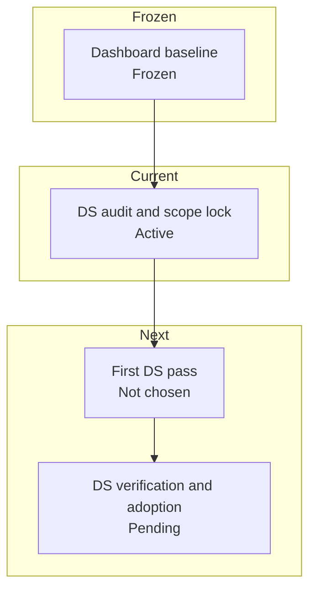

# Krukraft — Active Phase Tracker

Use this file as the single source of truth for active implementation state.

## Plan Snapshot

Parent Plan: `Design system first migration and re-skin plan`

> [!info] Current Phase
> `DS audit and migration scope lock`

> [!success] Completed
> Dashboard-v2 stabilization moved to frozen baseline
> Public marketplace perf baseline remains intact
> Shared theme-switcher groundwork now exists for navbar-level reuse

> [!warning] Active
> Phase 1: DS audit and migration scope lock

> [!todo] Next Decision
> Choose the first deliberate DS migration pass and keep discover/dashboard out of the active lane meanwhile

> [!abstract] Partial
> Phase 2: DS implementation and adoption

## Status Board

| Track            | Status   | Note                                                                                     |
| ---------------- | -------- | ---------------------------------------------------------------------------------------- |
| DS Phase 1       | Active   | lock migration scope, blast radius, and first proof surface before changing shared UI   |
| DS Phase 2       | Pending  | implementation starts only after the first DS pass is chosen intentionally               |
| Discover         | Deferred | discover/browse work is paused while DS-first reprioritization is active                 |
| Dashboard-v2     | Frozen   | stable enough to pause; continue only after another explicit reprioritization change     |
| Public perf base | Kept     | existing `/resources` perf and streaming baseline stays in force during DS migration work |

## Progress

Design system first follow-up
`[█░░░░░░░░░] 10%`

## Daily Workflow

Before starting:
- Read `Current Phase`
- Pick exactly one item from `Next Up`
- Move it to `In Progress`

Before closing:
- Update `In Progress`
- Update `Next Up`
- Fill `Session Close-Out Template`

Rules:
- Keep exactly one `Current Phase`
- Keep `Next Up` to at most 3 items
- Move anything not being worked right now into `Deferred`
- If a phase status changes, update this file in the same session
- If the parent plan status changes, update `Plan Snapshot`, `Current Status Inside Parent Plan`, and `Phase Map` in the same session
- Do not mark work complete in chat until the relevant phase/plan state here is updated
- If this file has an active parent plan, do not recommend or start `Deferred` work as the next step unless the user explicitly changes priorities
- When suggesting follow-up work, state whether it is `in-plan` or `out-of-plan` before recommending it
- If the user says `Next Up`, answer from the active plan's `Next Up` block first and keep the recommendation inside the active plan unless the user explicitly asks to reprioritize

---

## Current Phase

### Name
DS audit and migration scope lock

### Parent Plan
Design system first migration and re-skin plan

### Current Status Inside Parent Plan
- Dashboard-v2 remains intentionally paused at the current stable baseline; it is not the active redesign surface right now
- Discover is no longer the active plan surface; it is now `deferred unless reprioritized`
- The shared design system is now the active plan surface, with the next work focused on migration shape instead of route-family polish
- Existing `/resources` perf, streaming, and viewer-state improvements remain in force and should be preserved during DS migration work
- Canonical DS starting context lives in `krukraft-ai-contexts/06-design-system.md`, `src/design-system/README.md`, `design-system.md`, and `figma-component-map.md`
- The first active task is to lock the DS migration scope before implementation: decide whether the first pass targets tokens, primitives, or shared chrome adoption
- Discover and dashboard work are now `deferred/frozen unless reprioritized`; do not use discover cleanup or dashboard polish as the default next recommendation

### Goal
Lock the first DS migration initiative deliberately, then execute only one narrow design-system pass with matching proof and adoption checks while keeping discover deferred and dashboard frozen.

### Why this is the current phase
- The repo already has a strong DS spine (`@/design-system`) and low legacy `components/ui` dependency, so DS-first work is now practical
- Reprioritizing now avoids polishing discover surfaces on top of a DS layer that may immediately change
- Dashboard is stable enough to stay frozen while shared UI foundations are reconsidered
- A DS-first pass can improve shared primitives and chrome before feature-level redesign resumes

### Definition of Done
- [ ] The first DS migration pass is chosen intentionally
- [ ] That pass stays narrow
- [ ] Matching proof/adoption surfaces are identified before implementation
- [ ] Runtime or route-level verification is rerun on at least one affected consumer surface
- [ ] Relevant context docs are updated in the same work session

### Phase Map

| Phase | Name | Status | Notes |
| --- | --- | --- | --- |
| 0 | Dashboard baseline freeze | done | dashboard-v2 is stable enough to pause and should stay frozen unless reprioritized |
| 1 | DS audit and migration scope lock | active | choose the first DS migration pass and lock proof targets |
| 2 | DS implementation | pending | execute one narrow DS pass only |
| 3 | DS verification and adoption follow-up | pending | prove the chosen DS pass before picking another |

---

## Current Goal

Choose and scope the first DS migration pass without reopening discover or dashboard as the active workstream.

Current recommendation order:
1. Re-lock the DS surface and proof target
2. Pick one narrow next pass:
   - tokens/semantic-layer audit and migration contract
   - primitive refresh pass for `Button` / `Card` / `Input` / `Dropdown`
   - shared chrome adoption pass across public navbar and dashboard shell

---

## In Progress

- [ ] Freeze dashboard-v2 follow-up work at the current stable baseline
- [ ] Freeze discover follow-up work while DS-first reprioritization is active
- [ ] Pick the first DS migration pass deliberately
- [ ] Lock the proof surface for that DS pass before implementation

---

## Next Up

- [ ] Choose whether the first DS pass is `tokens`, `primitives`, or `shared chrome adoption`
- [ ] Read `06-design-system.md`, `src/design-system/README.md`, `design-system.md`, and `figma-component-map.md` for the chosen DS surface before coding
- [ ] Keep discover deferred and dashboard-v2 frozen unless the user explicitly reprioritizes either back into the active plan

---

## Blocked / Waiting

- [ ] None right now

Use this section only for real blockers:
- missing env / credentials
- failing CI unrelated to the current task
- unclear product decision
- waiting on design / business confirmation

---

## Deferred

### Discover / Browse
- [ ] Re-open discover route-family work only after the first DS migration pass settles
- [ ] Choose the first deliberate discover route-family pass when DS-first reprioritization changes again
- [ ] Audit discover/search/filter/creator-profile fallbacks for usable-but-consistent loading states after the DS migration direction is stable

### Dashboard / Perf
- [ ] Revisit route-level perf passes beyond the current rollback baseline only one route at a time
- [ ] Recheck whether `membership`, `settings`, `creator/profile`, or the public creator storefront need additional runtime perf work after visual/runtime feel review
- [ ] Re-open earnings perf only if runtime feel proves it is still a hotspot after rollback baseline

### Public Route / Loading Follow-ups
- [ ] Finish route-family fallback cleanup on public routes so hard refreshes on `/resources` and similar pages stay inside family-specific or neutral shells
- [ ] Verify dashboard/admin hard refreshes no longer show the global app-root fallback before their family loading shells under repeated refresh stress

### Brand / Platform
- [ ] Re-run perf measurements after major listing/detail/search changes and update thresholds intentionally
- [ ] Recheck preview/production LCP after major marketplace image or layout changes
- [ ] Verify favicon and OG logo propagation through `/brand-assets/*` in production browsers and crawlers
- [ ] Recheck that the trimmed first-party brand asset set still covers every metadata/favicon surface

### Ops / Config
- [ ] Replace `XENDIT_SECRET_KEY` test key in production environment
- [ ] Verify `DIRECT_URL` is present and correct for Prisma CLI / migration workflows in production
- [ ] Keep post-deploy warm targets aligned with perf smoke and browser verification coverage

---

## Verification Baseline

Run these before claiming dashboard-v2 stabilization work is complete:

- `npm run typecheck`
- `npm run lint`
- `npm run context:check`
- `npm run test:e2e -- --project=chromium tests/e2e/creator-workspace.spec.ts`
- `npm run test:e2e -- --project=chromium tests/e2e/navigation-shells.spec.ts`
- `npm run test:e2e -- --project=chromium tests/e2e/navigation-sentinels.spec.ts`

If the task touches creator editor flows, also consider:
- `npm run test:e2e -- --project=chromium tests/e2e/dashboard-v2-creator-editor-route-family.spec.ts`
- `npm run test:e2e -- --project=chromium tests/e2e/dashboard-v2-creator-editor-hardening.spec.ts`

---

## Current Baseline Notes

### Dashboard-v2
- `dashboard-v2` is the only canonical dashboard family.
- Old `(dashboard)` and `(dashboard-lite)` route families were hard-cut and removed.
- Active runtime perf baseline keeps the original frozen core at:
  - nav prefetch uplift
  - creator/resources timing cleanup
- plus one new deliberate learner-account follow-up:
- `/dashboard-v2/settings` now streams its sections behind an in-page `Suspense` boundary again instead of awaiting the full combined payload before first in-page HTML
- `/dashboard-v2/settings` now renders a real interactive settings surface inside that streamed shell, and the dashboard-v2 settings route/API no longer accept a page-level language preference
- `/dashboard-v2/membership` now renders its intro shell before the membership payload resolves and streams the summary cards plus plan-status panel behind a route-matched in-page fallback instead of awaiting the full account payload before any in-page content

### Verification
- Warm local `creator-workspace.spec.ts` passed `8/8` after rollback cleanup and short flake stabilization.
- Treat that suite as the main dashboard-v2 regression gate unless a task clearly needs a narrower surface.
- Runtime feel recheck on 2026-04-14 still confirms the dashboard-v2 family suite passes, and the public follow-up that remained after that pass is now green too:
  - `tests/e2e/navigation-shells.spec.ts` passes for `/resources` ↔ `/dashboard-v2/library`
  - `tests/e2e/navigation-sentinels.spec.ts` passes for the public account dropdown contract
- Public account-menu parity pass now mirrors dashboard-v2 IA/UI on the marketplace header, including the redesigned `Membership` entry and creator links, and the follow-up stabilization work closed the remaining public `/resources` auth-viewer and library cold-entry proof failures on the active baseline.
- The `/dashboard-v2/settings` pass is now also green against:
  - `tests/e2e/settings-theme.spec.ts`
  - `tests/e2e/navigation-sentinels.spec.ts` (`dashboard avatar menu reaches home membership and settings`)
  - `tests/e2e/creator-workspace.spec.ts` (`dashboard-v2 account surfaces clear the dashboard overlay after shell readiness`)
- The `/dashboard-v2/membership` pass is green against:
  - `tests/e2e/dashboard-membership.spec.ts`
  - `tests/e2e/creator-workspace.spec.ts` (`dashboard-v2 account surfaces clear the dashboard overlay after shell readiness`)
  - `tests/e2e/navigation-shells.spec.ts`
- One-pass local reruns still surfaced the older public sentinel and creator cold-entry flake classes during this work session, but those failures happened outside the membership route contract itself

### Git / Repo Hygiene
- Local design-tool repos under `.design-tools/*` are intentionally not tracked by the main repo.

---

## Decision Log

Add only short, high-signal entries here.

- 2026-04-14: Keep dashboard-v2 perf baseline frozen after rollback; do not re-open broad streaming refactors.
- 2026-04-14: Remove `.design-tools/awesome-design-md` and `.design-tools/shadcn-examples` from repo tracking; keep them local-only.
- 2026-04-14: Runtime feel recheck shows dashboard-v2 internal route family is stable; next follow-up should target public↔dashboard library handoff/account-menu parity before reopening another perf pass.
- 2026-04-14: Public navbar account menu now follows the dashboard-v2 account-menu contract for IA/UI, but the next active follow-up remains public↔dashboard library handoff stabilization because `navigation-shells` still catches a blank-gap transition sample at that boundary.
- 2026-04-14: The authenticated account dropdown is now a shared public+dashboard component; keep sentinel coverage green when changing trigger shape, featured membership item, or account/creator menu sections.
- 2026-04-15: Marketplace navbar skeleton ownership and dashboard-v2 topbar skeleton geometry were both tightened after the shared dropdown refresh; the next public-nav follow-up is proof cleanliness, not another structural menu rewrite.
- 2026-04-15: The latest public navbar hydration warning sample points to a recoverable SSR/client mismatch around the auth-viewer boundary in dev, but it is not currently an active repro; treat the remaining public dropdown navigation timeout as the main open proof issue.
- 2026-04-15: `navigation-sentinels` is green again after tightening the public account-dropdown sentinel helper to use the real dropdown activation contract instead of an over-forced click path.
- 2026-04-16: Active plan changed from discover-first to DS-first; keep discover deferred and dashboard frozen until the first design-system migration pass is chosen deliberately.

---

## Session Close-Out Template

Copy/update this at the end of a non-trivial task:

- Phase status:
  - `open` / `closed` / `deferred`
- Parent plan status changed?
  - `yes` / `no`
- What changed:
  - ...
- Verification run:
  - ...
- Next recommended task:
  - ...
- Knowledge triage:
  - `no ingest` / `log only` / `update existing wiki` / `new wiki entry`

Close-out rule:
- If `Phase status` changed, update `Plan Snapshot` and `Phase Map` before ending the session
- If the parent plan moved to a new stage or closed, update `Current Phase`, `Current Status Inside Parent Plan`, and `Next Up` before ending the session

### Phase Change Checklist

- [ ] Update `Phase status`
- [ ] Update `Plan Snapshot`
- [ ] Update `Phase Map`
- [ ] Update `Current Status Inside Parent Plan`
- [ ] Update `In Progress`
- [ ] Update `Next Up`
- [ ] Record verification actually run
- [ ] Record the next recommended task before closing the session

---

## Reference Pointers

Use these for deeper context instead of expanding this file again:
- Architecture / route-family behavior: [04-architecture.md](/Users/shanerinen/Projects/krukraft/krukraft-ai-contexts/04-architecture.md)
- Performance notes / rollback baseline: [08-performance-audit.md](/Users/shanerinen/Projects/krukraft/krukraft-ai-contexts/08-performance-audit.md)
- Design-system ownership: [06-design-system.md](/Users/shanerinen/Projects/krukraft/krukraft-ai-contexts/06-design-system.md)
- Layout / UX conventions: [07-layout-ux.md](/Users/shanerinen/Projects/krukraft/krukraft-ai-contexts/07-layout-ux.md)
