# Krukraft — Active Phase Tracker

Use this file as the single source of truth for active implementation state.

## Plan Snapshot

Parent Plan: `Creator delivery preview parser`

> [!info] Current Phase
> `Phase 1 — Preview parser inventory`

> [!success] Completed
> The previous DS-first migration baseline is complete and now acts as the frozen implementation starting point
> The reference-driven DS alignment plan using Primer + Atlassian + Radix Themes is complete and now acts as the foundation-contract baseline
> The DS visual foundation pass is complete and now acts as the frozen visual baseline for route work
> The discover `/resources` visual pilot is complete and now acts as the latest public-route baseline
> Dashboard-v2 stabilization remains frozen
> Public marketplace perf baseline remains intact

> [!warning] Active
> `Creator delivery preview parser` is active. The next narrow job is to inventory the bulk preview URL editor and parser behavior before deciding whether any shared textarea parity change is safe.

> [!todo] Next Up
> Inventory the bulk preview URL editor first, then choose one parser-safe route-scoped slice before patching runtime.

> [!abstract] Partial
> The previous theme refresh, route rollout audits, legacy DS cleanup, marketplace search-shell audit, hero-search cleanup, and Figma DS audits are complete; this new plan is a narrow runtime rollout pass that should not silently reopen broad Figma redesign work.

## Status Board

| Track            | Status   | Note                                                                                     |
| ---------------- | -------- | ---------------------------------------------------------------------------------------- |
| Reference Audit  | Kept     | Primer, Atlassian, and Radix Themes stay as the locked reference stack for the new visual pass |
| DS Baseline      | Frozen   | the previous DS-first migration baseline is complete and should be reused, not repeated |
| Foundation Align | Kept     | the completed reference-driven plan already locked token/component/chrome boundaries |
| Visual Foundation | Frozen   | completed visual baseline stays in force; do not reopen primitive work implicitly |
| Discover         | Frozen   | `/resources` listing-mode shell + fail-soft states landed and passed close-out audit    |
| Theme Refresh    | Complete | brief, playbook, Figma review page, approved surface baseline, cleanup slice, and first runtime slices all passed close-out audit |
| Figma DS Alignment | Complete | canonical Figma source, repo registry, and DS inventory are now aligned enough to close the previous alignment plan; use it as the baseline for this narrower re-audit |
| Figma DS Section Audit | Complete | section-by-section verification pass for the canonical Figma DS file against repo docs, token contracts, and mapped component truth closed cleanly after the Foundation Review + repo close-out audit |
| Runtime DS Adoption | Complete | first runtime slice is landed and closed; use it as the baseline for narrower follow-up rollout plans |
| Admin Table Action Rollout | Complete | inventory, rollout decision, first admin proof slice, runtime verification, and close-out audit are complete |
| Admin Simple Row-Action Rollout | Complete | inventory, rollout decision, follow-up adoption slice, runtime verification, and close-out audit are complete |
| Dense Action Holdout Lockdown | Complete | remaining dense admin/creator action clusters are now explicit compact holdouts, with `/admin/resources` and `/admin/tags` proved at runtime |
| Family-by-family DS Runtime Adoption | Complete | `Badge` runtime adoption and the narrow `SearchInput` runtime parity slice are both closed; the plan-level close-out audit found no in-scope reason to keep this parent plan open |
| Field Shell Runtime Residual Follow-up | Complete | the shared `Input` radius gap and `SearchInput onClear` route-proof gap are both closed after one narrow follow-up slice |
| Select/Textarea Runtime Parity Preparation | Complete | both sibling controls now have canonical Figma slices and the first runtime parity proof passed on `/admin/settings` |
| Select/Textarea Rollout Widening | Complete | `/admin/resources` landed as the first widened follow-up family after `/admin/settings`; close-out audit found no in-scope reason to keep the plan open |
| Select Filter-Shell Widening | Complete | the low-risk `Select`-only admin filter bucket (`activity`, `audit`, `analytics/ranking`) now proves the shared `56px / 8px` shell; creator routes remain a separate optional future plan |
| Creator Select/Textarea Widening | Complete | `/dashboard/creator/profile` now proves the first creator-owned widened follow-up; heavier creator buckets stay deferred to future plans |
| Creator Resource Editor Field-Shell Widening | Complete | `/dashboard/creator/resources/new` and edit now prove the metadata slice; delivery/previews stays deferred as a separate future plan |
| Creator Delivery/Previews Shell Widening | Complete | linked URL editor inputs are widened and proved on `/dashboard/creator/resources/new` and edit; bulk preview parsing and upload controls stay deferred to future plans |
| Creator Delivery Preview Parser | Active | inventory the bulk preview URL editor and parser/apply state inside `/dashboard/creator/resources/*`, then choose one safe slice without reopening upload controls or metadata buckets |
| Route Rollout Audit | Complete | the first proof route (`dashboard navigation + library`) passed runtime verification and the optional rollout audit closed cleanly |
| Legacy DS Cleanup | Complete | `secondary -> quiet`, outline inventory, and search-shell decision closed cleanly |
| Admin / Settings Rollout Audit | Complete | `/dashboard/settings`, `/admin/users`, `/admin/settings`, and `admin/resources` passed runtime proof |
| Marketplace Search Shell Audit | Complete | `/resources`, resource detail, category, and support shells passed; preview shells remain intentional dev-only exceptions |
| Marketplace Hero Search Audit | Complete | discover mode proved `HeroSurface` is live while `HeroSearch variant="hero"` has no runtime mount |
| Marketplace Hero Search Deprecation Cleanup | Complete | hero-only search branch, preview file, bones captures, and story references were removed while live discover/listing/navbar search proofs stayed intact |
| Dashboard-v2     | Frozen   | stable enough to pause; continue only after another explicit reprioritization change     |
| Public perf base | Kept     | existing `/resources` perf and streaming baseline stays in force during DS migration work |

## Progress

Creator delivery preview parser
`[██░░░░░░░░] 20%`

```mermaid
flowchart TB
  subgraph Frozen
    D1[DS baseline + reference alignment<br/>Frozen]
    D2[DS visual foundation baseline<br/>Frozen]
  end

  subgraph Baseline
    T0[Theme refresh plan<br/>Complete]
  end

  subgraph Previous
    R1[Route inventory and rollout order<br/>Done]
    R2[First route proof audit<br/>Done]
    R3[Dashboard avatar menu remediation<br/>Done]
    R4[Route rollout decision<br/>Done]
  end

  subgraph Previous2
    L1[Legacy DS inventory<br/>Done]
    L2[Secondary to quiet normalization<br/>Done]
    L3[Outline inventory<br/>Done]
    L4[Search shell review<br/>Done]
    L5[Cleanup decision<br/>Done]
  end

  subgraph Previous3
    A1[Admin/settings route inventory<br/>Done]
    A2[First proof-route audit<br/>Done]
    A3[Rollout decision<br/>Done]
  end

  subgraph Previous4
    M1[Marketplace search route inventory<br/>Done]
    M2[Marketplace search proof audit<br/>Done]
    M3[Marketplace search rollout decision<br/>Done]
  end

  subgraph Previous5
    H1[Hero route inventory<br/>Done]
    H2[Discover-mode proof audit<br/>Done]
    H3[Hero ownership decision<br/>Done]
  end

  subgraph Current
    P0["Plan open<br/>Done"]
    P1["Preview parser inventory<br/>Pending"]
    P2["First proof-slice decision<br/>Pending"]
    P3["Route-scoped runtime slice<br/>Pending"]
    P4["Close-out audit<br/>Pending"]
  end

  D1 --> D2 --> T0 --> R1 --> R2 --> R3 --> R4 --> L1 --> L2 --> L3 --> L4 --> L5 --> A1 --> A2 --> A3 --> M1 --> M2 --> M3 --> H1 --> H2 --> H3 --> W0 --> W1 --> W2 --> W3 --> W4 --> S0 --> S1 --> S2 --> S3 --> P0 --> P1 --> P2 --> P3 --> P4
```

## Daily Workflow

Before starting:
- Read `Current Phase`
- If `Next Up` has a mandatory item, pick exactly one and move it to `In Progress`
- If `Next Up` says the current parent plan is complete, stop and wait for an explicit new plan or reprioritization

Before closing:
- Update `In Progress`
- Update `Next Up`
- Update the progress percentage to match the real phase / plan status
- Fill `Session Close-Out Template`

Rules:
- Keep exactly one `Current Phase`
- Keep `Next Up` to at most 3 items
- Move anything not being worked right now into `Deferred`
- If a phase status changes, update this file in the same session
- If the parent plan status changes, update `Plan Snapshot`, `Current Status Inside Parent Plan`, and `Phase Map` in the same session
- Do not mark work complete in chat until the relevant phase/plan state here is updated
- If this file has an active parent plan, do not recommend or start `Deferred` work as the next step unless the user explicitly changes priorities
- When suggesting follow-up work, state whether it is `in-plan` or `out-of-plan` before recommending it
- If the user says `Next Up`, answer from the active plan's `Next Up` block first and keep the recommendation inside the active plan unless the user explicitly asks to reprioritize
- If a phase or parent plan is actually complete, update the percentage, phase status, and `Next Up` state to show that it is complete instead of fabricating more required work
- After a parent plan is complete, move any extra ideas into `Deferred` or clearly optional follow-up notes; do not keep the same plan artificially active
- When a parent plan or remediation slice is complete and verification passed, stage and commit that finished slice in the same session by default
- Do not close a completed plan or remediation slice while related tracked changes are still uncommitted, unless the user explicitly says not to commit yet

---

## Current Phase

### Name
Phase 1 — Preview parser inventory

### Parent Plan
Creator delivery preview parser

### Current Status Inside Parent Plan
- Frozen baselines that remain in force:
  - `/admin/settings`
  - `/admin/resources`
  - `/admin/activity`
  - `/admin/audit`
  - `/admin/analytics/ranking`
- `/dashboard/creator/profile` remains the frozen creator baseline:
  - `/dashboard/creator/profile` proves the first creator-owned widened follow-up
  - the status `Select` explicitly opts into `size="field"`
  - the creator bio keeps the shared `Textarea` shell while `min-height` and
    the counter stay route-owned
- This plan isolated the heaviest remaining creator bucket:
  - `creator resource editor`
- The editor metadata slice is now landed and proved:
  - `/dashboard/creator/resources/new`
  - `/dashboard/creator/resources/[id]`
  - the edit-only `status` select plus the shared `type` / `category` selects
    now keep the canonical `56px / 8px` field shell
  - the main `description` textarea stays on the shared multiline shell
- The editor inventory and slice decision that led to this patch remain:
  - shared `Select` candidates live in the `Pricing and visibility` section:
    - `status` (edit mode only)
    - `type`
    - `category`
  - shared `Textarea` candidates split into two behaviors:
    - `description` is the clean multiline shared-shell candidate
    - the bulk preview URL textarea is a route-owned composite editor tied to
      preview-link parsing and should not be widened in the first slice
  - the first proof slice is now `basic info + pricing/visibility metadata`
  - reason:
    - it proves both sibling controls together (`description` + metadata
      selects)
    - it stays on the main form shell
    - it avoids the heavier delivery/upload zone where preview URL lists,
      external file links, file widgets, and AI helper adjacency make the
      rollout riskier
- The close-out audit found no in-scope reason to keep this parent plan open.
- This new parent plan now isolates the next creator bucket:
  - `creator delivery/previews`
- Keep these out of scope for this plan:
  - `creator application`
  - `creator AI draft helpers`
- The known risky surfaces inside the new bucket are:
  - the bulk preview URL textarea, which is still a route-owned composite editor
  - upload/external-link widgets, which remain entangled with preview parsing
    and AI-adjacent authoring behavior
- Frozen baselines that remain in force for this new parent plan:
  - `/dashboard/creator/profile`
  - creator editor metadata slice
  - linked URL editor slice on `/dashboard/creator/resources/new` and edit
- This parent plan isolates the next creator delivery bucket:
  - bulk preview URL parser/editor
- Keep these out of scope for this plan:
  - `FileUploadWidget`
  - delivery-source toggle
  - creator application
  - creator AI draft helpers
- Known risky behavior inside this bucket:
  - the textarea content is parsed into URL rows through `fromPreviewTextarea`
  - `Apply URLs` performs validation + dedupe + cover-order side effects
  - parser state is tied to `previewUrlError`, `bulkPreviewOpen`, and preview ordering
  - the same route still mounts upload/external delivery controls nearby, but they are not part of this plan

### Goal
Inventory the bulk preview URL editor and choose one parser-safe route-scoped widening slice.

### Why this is the current phase
- The linked URL editor slice is already frozen, so the next safe step is to
  isolate the parser-heavy textarea/editor behavior before touching any upload
  controls.

### Definition of Done
- [x] The prior admin and creator profile proof routes stay frozen as baselines
- [x] The creator editor metadata slice stays frozen as a baseline
- [x] The linked URL editor slice stays frozen as a baseline
- [ ] Preview parser/editor behavior is grouped into route-owned sub-buckets
- [ ] One parser-safe proof slice is chosen
- [ ] That preview parser route-scoped runtime slice is landed and verified
- [ ] A close-out audit decides whether the parent plan should continue or close

### Phase Map

| Phase | Name | Status | Notes |
| --- | --- | --- | --- |
| 0 | Plan open | complete | the bulk preview URL parser/editor is now isolated into its own parent plan |
| 1 | Preview parser inventory | pending | group textarea parsing, apply-state, and preview-order side effects inside `/dashboard/creator/resources/*` |
| 2 | First proof-slice decision | pending | choose one parser-safe slice before patching runtime |
| 3 | Route-scoped runtime slice | pending | land and verify the chosen preview parser bucket |
| 4 | Close-out audit | pending | decide whether the parent plan should continue or close |

---

## Current Goal

1. inventory the bulk preview URL parser/editor
2. keep the linked URL editor slice frozen as the baseline beside it
3. choose one parser-safe slice before patching runtime

---

## In Progress

- [x] Open a new parent plan for creator delivery preview parser
- [x] Keep `/dashboard/creator/profile`, creator metadata, and creator linked-URL slices as frozen baselines
- [ ] Group preview parser/editor behavior by route-owned sub-bucket
- [ ] Choose the first parser-safe preview-editor slice
- [ ] Land the next route-scoped preview parser slice

---

## Next Up

- [ ] Inventory the bulk preview URL editor inside the creator resource editor family
- [ ] Choose one parser-safe proof slice before runtime patching
- [ ] Keep `FileUploadWidget` and the delivery-source toggle out of scope for this plan

---

## Blocked / Waiting

- [ ] None right now

Use this section only for real blockers:
- missing env / credentials
- failing CI unrelated to the current task
- unclear product decision
- waiting on design / business confirmation

---

## Deferred

### Discover / Browse
- [ ] Audit discover/search/filter/creator-profile fallbacks for usable-but-consistent loading states after the DS migration direction is stable

### Dashboard / Perf
- [ ] Revisit route-level perf passes beyond the current rollback baseline only one route at a time
- [ ] Recheck whether `membership`, `settings`, `creator/profile`, or the public creator storefront need additional runtime perf work after visual/runtime feel review
- [ ] Re-open earnings perf only if runtime feel proves it is still a hotspot after rollback baseline

### Public Route / Loading Follow-ups
- [ ] Finish route-family fallback cleanup on public routes so hard refreshes on `/resources` and similar pages stay inside family-specific or neutral shells
- [ ] Verify dashboard/admin hard refreshes no longer show the global app-root fallback before their family loading shells under repeated refresh stress

### DS Runtime Follow-ups
- [ ] Open a separate parent plan for `creator delivery upload controls` if the next goal is normalizing `FileUploadWidget` and the delivery-source toggle
- [ ] Open a separate parent plan for `creator application` if the next goal is widening the creator application form
- [ ] Open a separate parent plan for `creator AI draft helpers` if the next goal is widening AI-assisted authoring shells

### Brand / Platform
- [ ] Re-run perf measurements after major listing/detail/search changes and update thresholds intentionally
- [ ] Recheck preview/production LCP after major marketplace image or layout changes
- [ ] Verify favicon and OG logo propagation through `/brand-assets/*` in production browsers and crawlers
- [ ] Recheck that the trimmed first-party brand asset set still covers every metadata/favicon surface

### Ops / Config
- [ ] Replace `XENDIT_SECRET_KEY` test key in production environment
- [ ] Verify `DIRECT_URL` is present and correct for Prisma CLI / migration workflows in production
- [ ] Keep post-deploy warm targets aligned with perf smoke and browser verification coverage

---

## Verification Baseline

Run these before claiming the active reference-audit or DS alignment slice is complete:

- `npm run storybook:smoke` when the plan touches DS primitives, DS components, or their stories
- `npm run typecheck`
- `npm run lint`
- `npm run tokens:audit` when token docs, token files, or token contracts change
- `npm run context:check` when the tracker, DS ownership wording, or agent context changes materially

---

## Current Baseline Notes

### Dashboard
- `/dashboard/*` is now the canonical dashboard family.
- `(dashboard-lite)` stays retired.
- Active runtime perf baseline keeps the original frozen core at:
  - nav prefetch uplift
  - creator/resources timing cleanup
- plus one new deliberate learner-account follow-up:
- `/dashboard/settings` now streams its sections behind an in-page `Suspense` boundary again instead of awaiting the full combined payload before first in-page HTML
- `/dashboard/settings` now renders a real interactive settings surface inside that streamed shell, and the canonical settings route/API no longer accept a page-level language preference
- `/dashboard/membership` now renders its intro shell before the membership payload resolves and streams the summary cards plus plan-status panel behind a route-matched in-page fallback instead of awaiting the full account payload before any in-page content

### Verification
- Warm local `creator-workspace.spec.ts` passed `8/8` after rollback cleanup and short flake stabilization.
- Treat that suite as the main dashboard regression gate unless a task clearly needs a narrower surface.
- Runtime feel recheck on 2026-04-14 still confirms the dashboard family suite passes, and the public follow-up that remained after that pass is now green too:
  - `tests/e2e/navigation-shells.spec.ts` passes for `/resources` ↔ `/dashboard/library`
  - `tests/e2e/navigation-sentinels.spec.ts` passes for the public account dropdown contract
- Public account-menu parity pass now mirrors the dashboard IA/UI on the marketplace header, including the redesigned `Membership` entry and creator links, and the follow-up stabilization work closed the remaining public `/resources` auth-viewer and library cold-entry proof failures on the active baseline.
- The `/dashboard/settings` pass is now also green against:
  - `tests/e2e/settings-theme.spec.ts`
  - `tests/e2e/navigation-sentinels.spec.ts` (`dashboard avatar menu reaches home membership and settings`)
  - `tests/e2e/creator-workspace.spec.ts` (`dashboard account surfaces clear the dashboard overlay after shell readiness`)
- The `/dashboard/membership` pass is green against:
  - `tests/e2e/dashboard-membership.spec.ts`
  - `tests/e2e/creator-workspace.spec.ts` (`dashboard account surfaces clear the dashboard overlay after shell readiness`)
  - `tests/e2e/navigation-shells.spec.ts`
- One-pass local reruns still surfaced the older public sentinel and creator cold-entry flake classes during this work session, but those failures happened outside the membership route contract itself

### Git / Repo Hygiene
- Local design-tool repos under `.design-tools/*` are intentionally not tracked by the main repo.

---

## Decision Log

Add only short, high-signal entries here.

- 2026-04-29: Open a new parent plan `Select/Textarea runtime parity preparation` instead of jumping straight into another runtime rollout. The first inventory pass already shows both primitives are widely used in admin/creator flows but still `pending-figma` in the canonical registry, so the immediate job is to lock the source-of-truth decision before patching runtime shells. That decision is now recorded too: both controls should be treated as `Figma-first DS primitives`, not code-owned exceptions, so the next in-plan work is canonical Figma mapping rather than a blind runtime shell edit.
- 2026-04-29: The first canonical mapping slice of `Select/Textarea runtime parity preparation` is now landed. `Select` now has dedicated light/dark `Select / Foundations` boards plus verified `Select / State` and `Select / Size` sets in the canonical Figma file, intentionally derived from the shared `Input / Search` shell grammar with the explicit caret affordance layered on top. The plan stays open because `Textarea` is still pending, and `/admin/activity` + `/admin/audit` are only route-proof candidates for the later runtime slice, not permission to patch code yet.
- 2026-04-29: The sibling `Textarea` canonical mapping is now landed too. `Textarea / Foundations / Light` (`1019:312`) and `Textarea / Foundations / Dark` (`1019:433`) now exist with verified `Textarea / State` sets (`1019:386`, `1019:507`) and rendered screenshot QA, while rows, counters, max length, and resize behavior stay route-owned instead of turning into a fake size ladder. With both controls mapped, the plan now locks `/admin/settings` as the first proof-route family because it mounts shared `Input`, `Select`, and `Textarea` shells together without product-owned search overrides.
- 2026-04-29: The narrow runtime parity slice is now live too. `Select.tsx` explicitly overrides the shared field shell back to `radius/sm (8px)` at runtime, `Textarea.tsx` now keeps the same `8px` target while preserving route-owned rows / counter / resize behavior, and `/admin/settings` passed route-level geometry proof for both controls. Any wider rollout should now happen in a separate route-family plan, not by silently extending that closed baseline slice.
- 2026-04-29: Open a new parent plan `Select/Textarea rollout widening` instead of jumping to another primitive family. The first inventory pass already shows three widening buckets: `admin/resources` form family, `creator` form family, and lower-risk `admin/activity|audit|analytics` select-only filters. The next in-plan job is to finish that bucket inventory and choose exactly one slice before widening beyond `/admin/settings`.
- 2026-04-29: Route-family inventory for `Select/Textarea rollout widening` is now closed. `admin/resources` is the first widened slice because it stays admin-only like `/admin/settings` while still exercising both sibling controls together; `admin/activity|audit|analytics` remains the lower-risk `Select`-only follow-up bucket, and `creator` stays deferred until after one more admin-side proof slice because its draft/upload behavior is more route-owned.
- 2026-04-29: `Select/Textarea rollout widening` is now closed. The first widened slice landed on `admin/resources`: the resource form, listing filters, move-category modal, and bulk-upload editor now stay on the shared `Select` / `Textarea` shell grammar without local radius drift, and route proof passed across `/admin/resources/new`, `/admin/resources/bulk`, and `/admin/resources`. The close-out audit found no in-scope reason to widen a second bucket inside the same parent plan, so `admin/activity|audit|analytics` and `creator` are now optional new plans rather than hidden continuations.
- 2026-04-29: `Select filter-shell widening` is now closed too. The low-risk admin filter bucket (`/admin/activity`, `/admin/audit`, `/admin/analytics/ranking`) now explicitly opts into the shared `Select` shell through `size="field"`, route proof passed for all three routes at `56px / 8px`, and the close-out audit kept `creator` as a separate optional parent plan because those forms still mount through route-owned creator shells and longer authoring flows.
- 2026-04-29: Open a new parent plan `Creator Select/Textarea widening` instead of stretching the completed admin filter-shell plan. The frozen admin baselines are now sufficient, and creator-owned forms need their own route-family inventory because the resource editor, profile/settings, application flow, and AI draft helpers all mix shared controls with heavier route-owned authoring behavior.
- 2026-04-29: Creator route-family inventory is now closed too. The first creator proof slice is `creator profile/settings` because it proves both sibling controls (`Textarea` + `Select`) on a lower-risk route-owned form than the resource editor, while `creator application` would prove only `Textarea` and the resource editor still mixes uploads, preview URLs, pricing controls, and AI helpers.
- 2026-04-29: `Creator Select/Textarea widening` is now closed. `/dashboard/creator/profile` proved the first creator-owned widened slice at runtime: `creator-status` now opts into `Select size="field"`, the creator bio keeps the shared `Textarea` shell while preserving route-owned `min-height` and counter behavior, and the close-out audit intentionally deferred `creator resource editor`, `creator application`, and `creator AI draft helpers` into future separate plans instead of silently widening them here.
- 2026-04-29: Open a new parent plan `Creator resource editor field-shell widening` instead of stretching the closed creator profile plan. `/dashboard/creator/resources/*` is the heaviest remaining creator bucket and the highest-impact next step, but it mixes shared field shells with upload, preview, pricing, status, and AI-helper behavior, so the first required job is a route-family inventory rather than a blind runtime patch.
- 2026-04-29: Creator editor inventory is now closed too. The clean shared-shell candidates are the `description` textarea plus the `status` (edit only), `type`, and `category` selects inside the metadata sections, while the bulk preview URL textarea belongs to a route-owned composite editor inside the delivery/previews zone. The first proof slice is therefore `basic info + pricing/visibility metadata`, leaving upload, external-link, preview-list, and AI-adjacent behavior for a later follow-up bucket.
- 2026-04-29: `Creator resource editor field-shell widening` is now closed. `/dashboard/creator/resources/new` and `/dashboard/creator/resources/[id]` now prove the metadata slice at runtime: the edit-only `status` select plus the shared `type` / `category` selects all keep the canonical `56px / 8px` field shell, and the main `description` textarea stays on the shared multiline shell. The close-out audit intentionally deferred the delivery/previews zone because the bulk preview URL textarea remains a route-owned composite editor and the upload/external-link widgets still sit too close to preview parsing and AI-adjacent authoring behavior.
- 2026-04-29: Open a new parent plan `Creator delivery/previews shell widening` instead of stretching the closed creator editor metadata plan. The metadata slice is now frozen, but the preview-link editor plus delivery-source/upload controls still form a distinct risk bucket because they combine shared field shells with parsing logic, upload widgets, and AI-adjacent authoring behavior. The next in-plan step is inventory, not runtime patching.
- 2026-04-29: Creator delivery/previews inventory is now closed too. The bucket splits into two safe classes and two deferred composites: per-image preview URL rows and the external file URL editor both still use shared `Input` shells with route-owned surrounding chrome, while the bulk preview URL textarea remains a route-owned parser/apply editor and the upload flow stays inside `FileUploadWidget` plus the delivery-source toggle. The first runtime slice is therefore locked to `linked URL editors`, leaving the parser-heavy textarea and upload controls deferred unless a later close-out audit justifies a separate future plan.
- 2026-04-29: `Creator delivery/previews shell widening` is now closed. `/dashboard/creator/resources/new` and edit now prove the linked URL editor slice: preview image URL rows and the external file URL editor both keep the shared `56px / 8px` `Input` shell, while the close-out audit intentionally defers the bulk preview parser and `FileUploadWidget`/delivery-source controls into separate future plans instead of stretching this parent plan beyond the safe shared-shell slice.
- 2026-04-29: Open a new parent plan `Creator delivery preview parser` instead of stretching the closed linked-URL plan or mixing parser work with upload controls. The new frozen baseline is the creator editor metadata + linked-URL proof routes, while the next in-plan step is to inventory the bulk preview URL textarea as its own parser/apply bucket before any runtime patching.
- 2026-04-29: `Field shell runtime residual follow-up` is now closed. The final shared field-shell drift did not require another broad family rollout: `Input.tsx` now enforces canonical `radius/sm (8px)` directly, `/admin/users` proves that shared field shell, and the old `SearchInput onClear` proof gap narrowed to a route-hydration issue instead of a primitive bug. `/dashboard/library` now proves the hydrated topbar clear action too, so no in-scope blocker remains.
- 2026-04-29: Open a new parent plan `Field shell runtime residual follow-up` instead of silently reopening the closed family-by-family rollout. Scope it tightly to the two known leftovers: `Input.tsx` still carrying the larger comfortable-radius branch and `SearchInput` clear-action visibility still depending on props alone in some controlled consumers.
- 2026-04-29: `Family-by-family DS runtime adoption` is now closed. The second family did not widen into `Input.tsx`; inventory showed that the smallest safe runtime slice was `SearchInput variant="default"` first. Runtime now enforces the canonical `radius/sm (8px)` shell on that shared branch, route proof passed on `/dashboard/library` for both the `56px / 8px` toolbar search and the `44px / 8px` topbar override, and the close-out audit found no in-scope reason to keep the parent plan open. Any wider `Input` parity or product-bound search-shell work should start as a new plan.
- 2026-04-29: `Badge runtime adoption` is now closed inside the family-by-family plan. Inventory narrowed the rollout to the canonical `warning` / `featured` split first, runtime `Badge.tsx` now mirrors that split, and route-level proof passed on `/dashboard/creator/apply` and `/dashboard/creator` before the follow-up cleanup removed the last non-canonical badge aliases from the shared primitive.
- 2026-04-29: A user-directed badge cleanup follow-up closed immediately after the first badge slice. The only live non-canonical badge consumers (`owned` in admin bulk preview counts and `secondary` in the public category hero count) were remapped to canonical `neutral`, the unused alias variants were removed from `Badge.tsx`, and the public category route was added to badge runtime proof. `Input/Search` remains the next in-plan family after that cleanup.
- 2026-04-29: A second user-directed badge follow-up closed the last Figma-side badge gaps without reopening the active `Input/Search` phase. The light/dark `Badge / Variant / Source` wrappers now sit at `cornerRadius=0`, the badge labels now bind to dedicated `type/badge/size` + `type/badge/line` variables instead of local `12/16` overrides, and runtime `Badge.tsx` now consumes the matching `text-badge` size token.
- 2026-04-29: After `Dense action holdout lockdown` closed cleanly, open a new parent plan `Family-by-family DS runtime adoption` instead of another broad repo audit. Lock the rollout order to `Badge runtime adoption` first and `Input/Search runtime parity` second because both families already have stable Figma truth and a safer blast radius than broader button/dropdown/shell rewrites.
- 2026-04-29: `Dense action holdout lockdown` is now closed. Inventory confirmed that `/admin/resources` main table, `/admin/tags`, and creator-side status actions are dense control clusters that should not silently inherit the widened rounded-rect `md` table-action recipe. The follow-up patch now passes `size="sm"` explicitly on those holdouts, runtime proof passed for `/admin/resources` and `/admin/tags`, and `CreatorResourceStatusButton` is recorded as a code-level compact holdout because no live route mount was found during the audit.
- 2026-04-29: `Admin simple row-action rollout` is now closed. Inventory confirmed that `/admin/categories`, `/admin/reviews`, `/admin/resources/trash`, and `/admin/resources/[id]/versions` all behave like simple table-action surfaces rather than dense inline editor clusters, so each now opts into `RowActionButton size="md"`. The close-out audit keeps `/admin/resources` main table, `/admin/tags`, and creator/admin status-action groups as explicit holdouts for a future separate plan.
- 2026-04-29: After `Runtime DS adoption` closed cleanly, open a new parent plan `Admin table action rollout` instead of silently continuing the old plan. Start with inventory of `admin/users`, `admin/tags`, and `TablePagination` consumers so the next row-action / pagination rollout decision is based on real admin surface density.
- 2026-04-29: `Admin table action rollout` is now closed. Inventory confirmed three different densities: `/admin/users` behaves like a spaced row-action column and now adopts `RowActionButton size="md"`, `/admin/audit` behaves like a standalone table footer and now adopts `TablePagination buttonSize="md"`, and `/admin/tags` remains an explicit compact `sm` holdout because its edit/save/delete clusters are denser inline controls. Runtime proof passed for `/admin/users`, `/admin/tags`, and `/admin/audit`, and the close-out audit found no in-scope reason to widen shared defaults further.
- 2026-04-28: After `Figma DS section audit` closed at `100%`, open a new parent plan `Runtime DS adoption` so the next work uses the audited Figma baseline in the app instead of reopening another DS-analysis loop. Start with `DataPanelTable` because its row-action, pagination, and shell posture are the most locked-down runtime targets.
- 2026-04-29: Phase 1 runtime inventory is now complete. `DataPanelTable` itself is live only in `src/components/dashboard/DashboardSections.tsx` (`12` mounts), but the related runtime recipe helpers already exist beyond that route family: `RowActionButton` is live across admin/creator/moderation surfaces and `PaginationButton` is already used by both admin table pagination and dashboard pagination. That makes the first safe adoption slice a shared helper + dashboard-consumer patch, not a `DataPanelTable` shell-only rewrite.
- 2026-04-28: After `Figma DS alignment` closed, open a new parent plan `Figma DS section audit` to re-check the canonical Figma DS file against the repo in a stricter section-by-section order instead of reopening broad DS work implicitly.
- 2026-04-28: Phase 1 of `Figma DS section audit` is now closed. A fresh foundations re-audit confirmed that `Typography / Light`, `Typography / Dark`, `Color Primitives / Light`, `Color Primitives / Dark`, and `Spacing + Radius / Primitives` all stay fully bound for text, fills, strokes, and per-corner radius. The live correction was repo wording drift instead: old notes still implied a `20`-color primitive collection and treated per-corner radius bindings as if they were local radius debt.
- 2026-04-28: Phase 2 has now started with `Button / Foundations`. The live light/dark boards stay fully bound for text family/size/line-height/fill plus shell fills, strokes, and per-corner radius, and the old `wrapper radius debt` + dark `light recipe` subtitle claims are now closed as repo drift. The live `Button recipes` truth is also narrower and clearer now: `Row action` keeps an `Edit / Open` example row plus a compact state strip, `Pagination item` shares the same rounded-rect `radius/sm (8px)` recipe shape, and `Panel CTA` intentionally stays on the bounded-neutral pill candidate instead of inheriting the table posture.
- 2026-04-28: Phase 2 is now closed. A fresh `Input / Search` re-audit confirms that the light/dark boards stay token-bound for text family, text fill, shell fills/strokes, and the shared `radius/sm (8px)` field shells, but two explicit Figma-only gaps remain open by design: the four component-set wrappers still keep local `cornerRadius=5`, and the `Clear` action label in the search-state explainer still uses a local `14/20` type recipe. The repo registry also needed current dark ids for `Input / State`, `Input / Size`, `SearchInput / State`, and `SearchInput / Size`.
- 2026-04-28: Phase 3 has now started with `Card / Foundations`. The live light/dark boards remain bound for font family, line height, text fill, shell fills/strokes, and per-corner radius, and the old wrapper-radius debt on `Card / Size / Source` stays closed. The remaining live Figma gaps are explicit instead: the title/body/footer copy still uses local type sizes, the geometry still keeps intentional local values (`space/20`, `space/10`, preview-stack arrangement), and the repo registry needed current dark ids (`726:156`, `726:171`) for the dark board/source set.
- 2026-04-28: Phase 3 is now halfway through the shell layer. A fresh `Dropdown / Foundations` re-audit confirms both light/dark study boards stay fully bound for all `23/23` text nodes across font family, font size, line height, and text fill, and all painted fills/strokes remain token-bound. The only remaining live Figma debt is narrow and explicit: local `20` radius on `context scene` + `row calibration scene` and local `12` radius on the default/unselected `menu row` shells. `Dropdown` remains a study-board reference rather than a reusable component-set mapping.
- 2026-04-28: Phase 3 is now closed. A fresh `Surface / Foundations` re-audit confirms both light/dark boards stay fully bound for all `26/26` text nodes across font family, font size, line height, and text fill, and all painted fills/strokes remain token-bound. The only remaining live local-radius gap is `shell zone` (`20`) in the hierarchy card, and the repo registry needed current dark source/hierarchy ids (`627:633`, `627:646`). The board copy itself is now partially stale because it still describes a broader token-gap story than the live subtle/muted/popover/support nodes actually show.
- 2026-04-28: Phase 4 has now started with `Badge / Foundations`. A fresh shared-component re-audit confirms the light/dark boards stay fully bound for font family, text fill, and all painted fills/strokes, and the `warning` / `featured` split still matches the tuned canonical recipe. The remaining live badge debt is explicit instead of broad: the seven badge labels still use local `12/16` xs type recipes, and the light/dark source-set wrapper frames keep local `cornerRadius=5`.
- 2026-04-28: Phase 4 is now moving through `FormSection / Foundations`. A fresh shared-component re-audit confirms both light/dark boards stay fully bound for all `24/24` text nodes across font family and text fill plus all painted fills/strokes, and there is no local radius debt. The remaining live gaps are explicit geometry/type gaps instead: local `16/20` section titles, local `14/20` field labels, local `20px` card padding, the local `6px` flat-header gap, and divider/footer separators that still rely on `border/default` until a dedicated `border/subtle` semantic exists. The repo registry also needed the current dark source-set id `746:275`.
- 2026-04-28: Phase 4 now closes its section audits with `DataPanelTable / Foundations`. A fresh shared-component re-audit confirms the live light/dark boards still keep all painted strokes bound and narrow their true drift to explicit Figma-only gaps: the two `Showing latest 2 entries` footer-note copies are still fully local, the current dark source set now lives at `873:1766`, the light/dark source-set wrapper frames still keep local `cornerRadius=5`, and the shell copy itself still relies on local type recipes (`16/20` titles, `14/20` descriptions/columns/row copy, inherited `12/16` badge labels) while runtime still asks for `border-subtle` and route-owned table-head fills.
- 2026-04-28: Phase 5 close-out audit is now complete. `Foundation Review` still behaves as a review-only artifact under `371:29` / `371:30`: all `47/47` text nodes keep text-fill binding, `0/47` bind the font-family variable, and all painted fills/strokes remain bound. No material repo drift or in-scope omission remained after the final section audits, so `Figma DS section audit` closes at `100%` without reopening any section family.
- 2026-04-25: Active plan changed from the completed marketplace hero-search cleanup to `Figma DS alignment`; start by locking the canonical Figma source file and producing a repo-vs-Figma inventory diff before any new parity claim.
- 2026-04-25: `koZEgVUfQhNEQmXISNQx56` (`Krukraft Theme Lab Source-of-Truth`) is now the permanent canonical Figma DS source file; repo references and coverage docs must be migrated to that foundation-first source.
- 2026-04-25: The first repo-side doc drift pass is complete; stale mapping claims from the previous Figma file were downgraded, so the next active slice is `Input` / `SearchInput` foundation parity.
- 2026-04-25: The `Input` / `SearchInput` foundation parity pass is now landed in the canonical file through first-pass light/dark component sets; the next active slice is shared-library mapping starting with `Card`, `Dropdown`, and `Surface`.
- 2026-04-25: `Badge vs Chip` is now a locked DS contract decision from repo usage evidence: `Badge` stays non-interactive and semantic, while `Chip` is the interactive/removable/filter token surface that should absorb route-owned chip patterns over time.
- 2026-04-25: `Badge` is now explicitly part of the shared-library mapping pass too; it should be remapped in Figma as the non-interactive label primitive before the new `Chip` surface expands.
- 2026-04-25: `Card` is now landed in the canonical file through `Card / Size` and `Card / Size / Dark`; it becomes the first shared-library shell proof point, so the next active slice is `Dropdown`, `Surface`, then `Badge`.
- 2026-04-25: `Dropdown / Foundations / Light` (`499:110`) and `Dropdown / Foundations / Dark` (`499:181`) are now landed as verified study boards in the canonical file; reusable dropdown mapping remains pending, so the next active slice is `Surface`, then `Badge`.
- 2026-04-27: The canonical Figma semantic layer now includes `state/selected-fill`, `state/selected-stroke`, and `state/selected-text`, aliased to `primary/mist`, `primary/lift`, and `primary/base` so selected rows, selected chips, and other selected surfaces can share a stable theme-aware state contract before `Badge` remapping resumes.
- 2026-04-28: `Badge / Foundations / Light` (`736:156`) and `Badge / Foundations / Dark` (`736:184`) are now landed as canonical boards, with `Badge / Variant / Source` (`736:178`) and the current dark source set (`746:208`) as the live reusable sets. The canonical set stays non-interactive, covers `neutral`, `info`, `success`, `warning`, `featured`, `destructive`, and `outline`, and records one explicit token gap: badge labels still rely on a local `12/16` xs recipe until the typography scale grows an xs label token.
- 2026-04-28: The canonical `Color Primitives / Light` (`2:1269`) and `Color Primitives / Dark` (`158:177`) boards now surface the support-status primitives too. `support/success/*` and `support/warning/*` are no longer visible only in variables or badge recipes; they now appear as dedicated `Success` and `Warning` cards on the primitive boards with bound fills and live hex labels, and the support family now runs `base / dust / soft` in both modes.
- 2026-04-28: The follow-up badge tuning now keeps the warm semantics intentionally split in the canonical file: `warning` stays crisp on `bg/inset` via `support/warning/base|dust`, while `featured` uses `accent/sand/wash` fill plus `accent/sand/base` border/text so it reads as an editorial highlight instead of a second warning-like badge.
- 2026-04-28: `FormSection / Foundations / Light` (`759:156`) and `FormSection / Foundations / Dark` (`759:184`) are now landed as canonical boards, with `FormSection / Variant / Source` light/dark sets (`759:251`, `759:252`) covering `variant=flat|card`. The board keeps its runtime geometry gaps explicit: `16/20` section-title rhythm, `20px` card padding, the `6px` flat-header gap, and the missing `border/subtle` semantic still sit outside the current token scales.
- 2026-04-28: The earlier `36px` footer-button study has now been folded into the canonical Figma `Button / Foundations` boards as a bounded neutral `soft` tone that sits beside `ghost`, plus a Figma-first `sm=36` step. Treat that as source-of-truth design direction only for now; runtime still stays on `primary | quiet | ghost` and the current size ladder until a separate button adoption pass lands.
- 2026-04-28: The follow-up button-ladder audit is now recorded too: if the `36px` posture is promoted later, the current safest trial path is `xs=32 / sm=36 / md=40 / lg=48`, keep `density=\"compact\" -> xs` during the first rollout proof, and leave `Input` / `SearchInput` on the current field ladder. The impact map is concentrated in `dashboard` (~60 `size=\"sm\"` button uses) and `admin` (~34), while live `density=\"compact\"` usage is still narrow (`public-resources` 3, `creator` 1).
- 2026-04-28: The button-family decision rule is now locked in repo docs too: keep `primary | quiet | ghost` as the approved runtime family, treat Figma-side `soft` as a bounded-neutral candidate only, and keep `row action`, `pagination item`, and `panel CTA` as recipes on top of existing button variants until cross-context reuse proves a new family member is warranted.
- 2026-04-28: The follow-up recipe pass now locks the `DataPanelTable`-style action controls in the canonical Figma file too: `row action` and `pagination item` stay recipes, not new families, but they now use the rounded-rect `radius/sm (8px)` posture you preferred from the live table instead of inheriting the core pill shape.
- 2026-04-28: The final recipe cleanup restored the canonical `Button recipes / Row action` card to an `Edit / Open` example row plus a compact `Default|Hover|Focus|Pressed|Disabled` state strip, and `DataPanelTable` now mirrors that same outline recipe posture in its light/dark foundations.
- 2026-04-28: The optional `Dropdown` promotion decision is now closed for this parent plan: keep `Dropdown` as a verified study-board reference for now rather than forcing a reusable component-set mapping before the shell recipe is proven broader. The shared-library close-out audit found no remaining in-plan issue after syncing the final Figma truth back into repo docs/context, so `Figma DS alignment` closes at `100%`.
- 2026-04-27: A full-canvas repo-sync audit of `koZEgVUfQhNEQmXISNQx56` is now landed; repo docs now reflect the actual two-page file (`DS Foundations` + `Foundation Review`), the live section inventory, the clean paint-binding posture of `DS Foundations`, the review-only status of `Foundation Review`, and the current live `Button` / `Card` component-set ids after earlier Figma rebuilds.
- 2026-04-26: The canonical Figma radius collection now includes `radius/xs = 4px`, and the `Spacing + Radius / Primitives` board was expanded to six rows to keep the visual audit surface aligned with the variable truth; repo runtime tokens still do not expose `radius/xs` yet.
- 2026-04-26: Text across `DS Foundations` now binds `font/family/base` by default; four glyph-only nodes were intentionally left on symbol-font rendering so carets/chevrons do not break during the typography-variable pass.
- 2026-04-26: `font/family/base` in the canonical Figma file now points to `IBM Plex Sans Thai`; representative `DS Foundations` screenshots were rerun and the current typography plus dropdown boards remained visually stable after the family switch.
- 2026-04-26: The `Button` / `Input` size contract is now explicitly locked for Figma handoff: typography scale stays in variables, while control size stays in component variants (`Button`: `xs|sm|md|lg|icon`; fields: `sm|md|lg|field`) with the current density defaults carried forward from code.
- 2026-04-26: The canonical Figma foundations now reflect that control-size contract more directly: `Button / Size` light/dark were rebuilt to include `xs|sm|md|lg`, while `Input` / `SearchInput` gained explicit light/dark `... / Size` component sets for the shared field ladder.
- 2026-04-27: A detailed re-audit of the canonical `Input / Search` boards confirmed that `Input / State`, `SearchInput / State`, `Input / Size`, and `SearchInput / Size` now use `radius/sm (8px)` consistently across light and dark. Repo context is synced to that Figma truth; runtime code still carries the older larger comfortable-radius branch and should be treated as drift until adoption.
- 2026-04-27: A detailed `Button / Foundations` re-audit confirmed that the light/dark boards stay semantically token-bound at the section-shell level and logged the live design-vs-runtime gap: canonical Figma now uses more explicit `quiet` / `ghost` foreground shifts by state than the current runtime `Button.tsx` recipe exposes. The older `wrapper radius debt` and dark `light recipe` subtitle caveats from that audit were later cleared by the 2026-04-28 control re-audit and should now be treated as superseded repo drift, not live Figma debt.
- 2026-04-28: `Card` repo adoption has now started too: runtime `Card.tsx` uses `surface` for the root shell and `inset` for the footer band, and the canonical `Card / Size / Source` light/dark component sets no longer carry wrapper-radius debt after the latest Figma cleanup. Remaining card debt is now explicit token-gap / preview-polish work only.
- 2026-04-28: Runtime `card` semantics now follow the same Figma base as `Card`: `bg-card` resolves to the `surface` layer, while shared shell chrome that should stay on the outer shell now has to use `bg-shell` explicitly. The first shared consumers normalized in that slice were the sidebar, navbar/account chrome, theme switcher menu, and notification chrome.
- 2026-04-28: A user-directed follow-up audit of `bg-card` consumers closed the first nested-surface remediation slice after the semantic shift. The creator editor family had the first material holdouts, so preview/icon chips, delivery-source segmented controls, and profile/banner preview wrappers now use `bg-shell` explicitly inside creator `bg-card` sections. Public `/resources`, `/resources/[slug]`, and `/creators/[slug]` stayed on the `surface` posture, and the local `creator-editor-refresh-shell` browser probe passed after the local DB was restarted.
- 2026-04-28: A second user-directed `bg-card` remediation slice closed on `admin resources`. The route-family audit confirmed that data-table/list shells remain valid `surface` consumers, while the admin editor needed narrower subordinate-shell remaps only: the file-upload subpanel, preview-image rows, dropzones, and owner-picker trigger now use `bg-shell` / `bg-background`. Repo-owned Playwright sentinels for the create route, edit route, and lazy preview uploader all passed after that patch.
- 2026-04-26: Runtime adoption has started on the shared search field too: the default `SearchInput` branch now resolves `size` / `density` through the same field recipe as `Input`, while `hero` remains the one intentional exception branch.
- 2026-04-26: `Surface / Foundations / Light` (`573:143`) and `Surface / Foundations / Dark` (`573:182`) are now landed and screenshot-verified in the canonical file; each board now carries a `Surface / Variant / Source` block plus a hierarchy card, and the remaining gaps are explicit token gaps (`border/subtle`, `bg-muted`, `radius/12`, `space/20`) rather than silent local styling.
- 2026-04-25: The reviewed light palette from `Theme Lab` frame `464:545` is now promoted into the canonical Figma primitive variables (`primary`, `Rust`, `Sand`, `neutral/*`, and `neutral/ink*`) while dark-mode values and semantic alias chains stay unchanged.
- 2026-04-25: The reviewed dark palette from `Theme Lab` frame `477:479` is now promoted into the canonical Figma primitive variables (`primary`, `Rust`, `Sand`, `neutral/*`, and `neutral/ink*`); the canonical `Color Primitives / Dark` board was updated so its displayed hex labels match the promoted values.
- 2026-04-25: `Surface` now exists as a distinct primitive in the canonical Figma variable system too; `neutral/surface` was added under `Color / Primitives` and `bg/surface` now aliases to it instead of piggybacking on older shell/inset values.
- 2026-04-17: Lock `Paper B` as the neutral direction, `#4338CA` as the primary accent, and `Rust` + `Sand` as the support accents for the Krukraft theme refresh plan; the next mandatory decision is the first narrow implementation slice.
- 2026-04-14: Keep dashboard perf baseline frozen after rollback; do not re-open broad streaming refactors.
- 2026-04-14: Remove `.design-tools/awesome-design-md` and `.design-tools/shadcn-examples` from repo tracking; keep them local-only.
- 2026-04-14: Runtime feel recheck shows the canonical dashboard route family is stable; next follow-up should target public↔dashboard library handoff/account-menu parity before reopening another perf pass.
- 2026-04-14: Public navbar account menu now follows the dashboard account-menu contract for IA/UI, but the next active follow-up remains public↔dashboard library handoff stabilization because `navigation-shells` still catches a blank-gap transition sample at that boundary.
- 2026-04-14: The authenticated account dropdown is now a shared public+dashboard component; keep sentinel coverage green when changing trigger shape, featured membership item, or account/creator menu sections.
- 2026-04-15: Marketplace navbar skeleton ownership and dashboard topbar skeleton geometry were both tightened after the shared dropdown refresh; the next public-nav follow-up is proof cleanliness, not another structural menu rewrite.
- 2026-04-15: The latest public navbar hydration warning sample points to a recoverable SSR/client mismatch around the auth-viewer boundary in dev, but it is not currently an active repro; treat the remaining public dropdown navigation timeout as the main open proof issue.
- 2026-04-15: `navigation-sentinels` is green again after tightening the public account-dropdown sentinel helper to use the real dropdown activation contract instead of an over-forced click path.
- 2026-04-16: Active plan changed from discover-first to DS-first; keep discover deferred and dashboard frozen until the first design-system migration pass is chosen deliberately.
- 2026-04-17: Active plan changed from the completed DS-first baseline to reference-driven DS alignment using Primer for token taxonomy, Atlassian for product-system rigor, and Radix Themes for implementation-level theming and primitive guidance.
- 2026-04-17: DS-first baseline is complete; the new active plan is reference-driven DS alignment using Primer for token taxonomy, Atlassian for product-system rigor, and Radix Themes for implementation-level theming/primitive guidance.
- 2026-04-17: The discover `/resources` listing-mode pilot passed close-out audit with request-level runtime proof and aligned fail-soft/loading shells; do not extend discover further inside the same parent plan.
- 2026-04-17: Active plan changed from the completed discover visual pilot to `Krukraft theme refresh plan`; start by locking theme direction and scope before any new implementation slice.
- 2026-04-17: The Krukraft theme direction brief is now locked from the completed DS/discover baseline; the next mandatory step is choosing one narrow implementation slice, not reopening direction work.
- 2026-04-17: The attempted `shared surface + neutral palette calibration` slice was rolled back because palette values were chosen too early; theme training and user-approved color posture now come before any new runtime theme slice.
- 2026-04-17: `src/design-system/theme-playbook.md` is now the canonical theme-training artifact; palette posture must be trained and approved there before any new runtime color slice is landed.
- 2026-04-17: the `Theme Lab` page inside the live Figma file `Krukraft Design System` is now the visual review surface for theme training; it may use temporary candidate colors for discussion, but it must not be treated as shipped DS theme output.
- 2026-04-17: the temporary `/dev/theme-playbook` route was removed after moving theme training into Figma so palette review is no longer tied to the Krukraft app shell.
- 2026-04-18: legacy `/dashboard-v2*` URLs were fully retired; canonical protected dashboard routes now live only under `/dashboard/*`, and old bookmarks/links should be updated because the legacy paths now return `404`.
- 2026-04-19: the remaining repo-owned `dashboard-v2` component filenames were retired too; canonical auth callbacks, admin fallback redirects, Stripe membership success returns, and dashboard skeleton/page-shell imports now point only at `/dashboard/*` plus `src/components/layout/dashboard/*`.
- 2026-04-18: public `/resources` shell stabilization is green again on the active baseline: `tests/e2e/resources.smoke.spec.ts` and `tests/e2e/navigation-shells.spec.ts` now pass together against canonical dashboard destinations after the shared account-menu/auth-helper cleanup; creator profile media upload proof remains a separate creator-surface follow-up, not part of the public-shell batch.
- 2026-04-19: admin routes and shared admin controls now normalize on the repo-owned `@/lib/icons` adapter too; direct `lucide-react` imports were retired from the active admin route/component surface.
- 2026-04-19: auth recovery routes, creator/settings account surfaces, and shared resources fallback shells now normalize on the same `@/lib/icons` adapter too; those account-facing feature files no longer import `lucide-react` directly.
- 2026-04-19: the repo-owned ops baseline now includes first-pass Sentry wiring
  (`instrumentation*.ts`, `sentry.*.config.ts`, `withSentryConfig(...)`,
  `.env.example` keys), plus canonical docs for plugin rollout and Supabase DB
  incident workflow under `docs/agent-plugin-workflows.md`,
  `docs/supabase-db-workflow.md`, and `docs/supabase-incident-playbook.md`.
- 2026-04-17: the `Theme Lab` page now includes a blank component sandbox so component studies can happen before palette, spacing, and radius decisions are committed into the DS.
- 2026-04-17: the neutral posture decision is now locked to `Paper B`; after approving `Rust` and `Sand` as support accents, the next mandatory decision is the first narrow implementation slice.
- 2026-04-23: the first cleanup slice landed in repo code; shared DS import surfaces were tightened, `ResourceCard` ownership/export boundaries were clarified, `Button` gained a canonical `primary | quiet | ghost` tone set for new work, `Input` and `SearchInput` now share a base field recipe direction, and `Dropdown` shell posture was normalized toward the approved surface baseline.

---

## Session Close-Out Template

Copy/update this at the end of a non-trivial task:

- Phase status:
  - `open` / `closed` / `deferred`
- Parent plan status changed?
  - `yes` / `no`
- What changed:
  - ...
- Verification run:
  - ...
- Next recommended task:
  - ...
- Knowledge triage:
  - `no ingest` / `log only` / `update existing wiki` / `new wiki entry`

Close-out rule:
- If `Phase status` changed, update `Plan Snapshot` and `Phase Map` before ending the session
- If the parent plan moved to a new stage or closed, update `Current Phase`, `Current Status Inside Parent Plan`, and `Next Up` before ending the session

### Phase Change Checklist

- [ ] Update `Phase status`
- [ ] Update `Plan Snapshot`
- [ ] Update `Phase Map`
- [ ] Update `Current Status Inside Parent Plan`
- [ ] Update `In Progress`
- [ ] Update `Next Up`
- [ ] Record verification actually run
- [ ] Record the next recommended task before closing the session

---

## Reference Pointers

Use these for deeper context instead of expanding this file again:
- Architecture / route-family behavior: [04-architecture.md](/Users/shanerinen/Projects/krukraft/krukraft-ai-contexts/04-architecture.md)
- Performance notes / rollback baseline: [08-performance-audit.md](/Users/shanerinen/Projects/krukraft/krukraft-ai-contexts/08-performance-audit.md)
- Design-system ownership: [06-design-system.md](/Users/shanerinen/Projects/krukraft/krukraft-ai-contexts/06-design-system.md)
- Layout / UX conventions: [07-layout-ux.md](/Users/shanerinen/Projects/krukraft/krukraft-ai-contexts/07-layout-ux.md)
